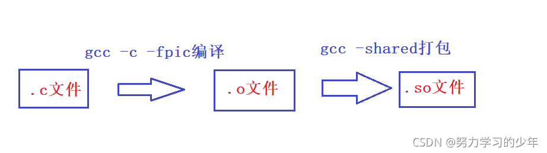
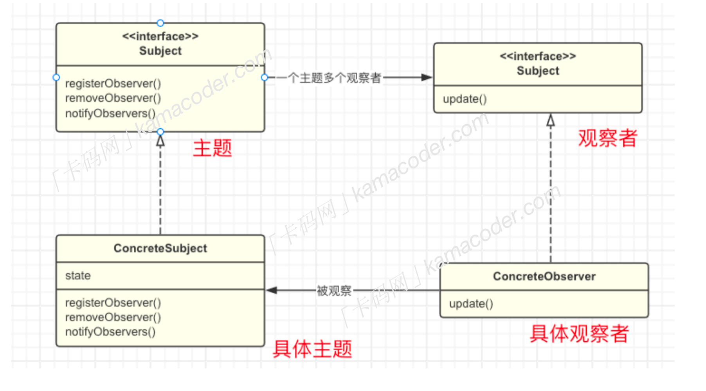
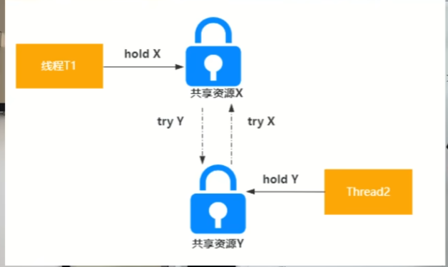
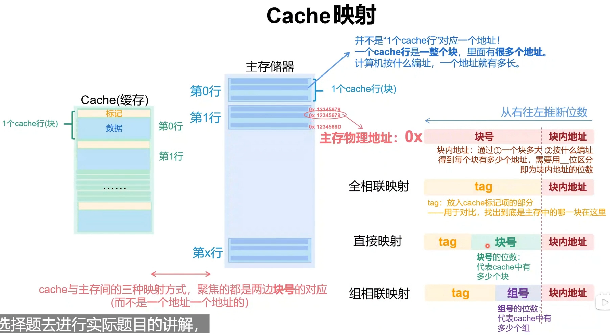
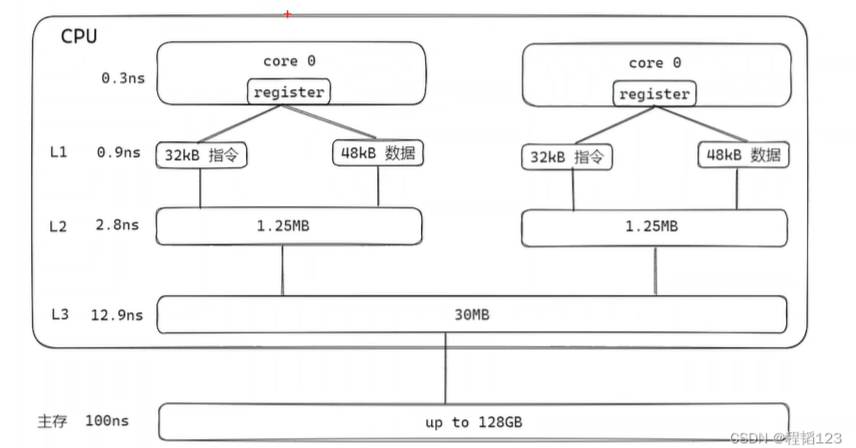
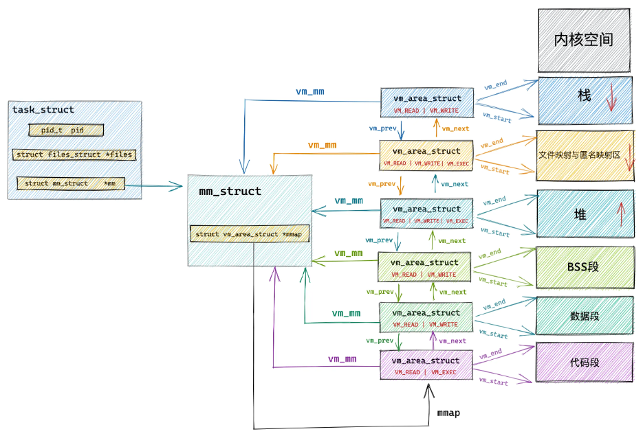

## C++ 基础知识点

1. 生产消费者模型?
* 生产消费者模型通过容器/缓存区域(阻塞队列), 解决生产消费者的强耦合问题。生产者和消费者之间通过阻塞队列来进行通信。生产者产生数据直接扔进缓冲区中，消费者每次取时上锁，避免冲突，取完解锁处理业务逻辑。具体情况，视于队列空和满的条件决定。
```C++
#include <thread>
#include <queue>
#include <iostream>
#include <mutex>
#include <condition_variable>

//生产者消费者模式
template <typename T>
class Queue
{
public:
    //  指定队列能够存放的最大元素个数
    Queue(int maxn = 20) : thread_maxnum(maxn) {}

    //生产者
    void Push(const T &val)
    {
        // 将锁视为一种资源, 通过 unique_lock 来看管
        std::unique_lock<std::mutex> locker(m_mtx);
        m_cond_Full.wait(locker, [this]() { return mq.size() < thread_maxnum; });  // 使用条件变量等待队列有空间
        
        mq.push(val);
        std::cout << "Pushed: " << val << "\n";

        m_cond_Empty.notify_all();      //解锁互斥量，唤醒消费者线程
    }

    //消费者
    T Pop()
    {
        std::unique_lock<std::mutex> locker(m_mtx);
        m_cond_Empty.wait(locker, [this]() { return !mq.empty(); });  // 使用条件变量等待队列不为空

        T val = mq.front();
        mq.pop();
        std::cout << "Popped: " << val << "\n";

        m_cond_Full.notify_all(); //解锁互斥量，唤醒生产者线程

        return val;
    }

private:
    std::queue<T> mq;                     // 容器/缓冲区解决生产者消费者的强耦合问题
    std::mutex m_mtx;                     // 互斥锁, 一个共享资源对应一个锁
    int thread_maxnum;                    // 缓冲区最大数量
    std::condition_variable m_cond_Empty; // 条件变量，对应消费者线程
    std::condition_variable m_cond_Full;  // 条件变量，对应生产者线程
};

void producer(Queue<int> *q)
{
    for (int i = 0; i < 1000; i++)
    {
        q->Push(i);
    }
}

void consumer(Queue<int> *q)
{
    for (int i = 0; i < 500; i++)
    {
        auto t = q->Pop();
    }
}

int main()
{
    Queue<int> q(20);
    std::thread t1(producer, &q);
    std::thread t2(consumer, &q);

    t1.join();
    t2.join();

    return 0;
}
```
* 条件变量(std::condition_variable): 允许一个线程或者多个线程等待某个条件的发生, 而其他线程可以在条件满足后通过条件变量通知等待线程继续执行。`notify_one()` 是唤醒一个正在等待条件变量的线程, 如果有多个线程正在等待条件变量, 只会唤醒其中一个线程, 如果没有线程在等待，这个通知会被忽略。`notify_all()` 是唤醒所有正在等待条件变量的线程, 所有被唤醒的线程会尝试重新获取与条件变量关联的互斥锁, 只有获取到锁的线程才能继续执行，其它线程会继续等待锁。
* 相当于当前线程不满足条件变量, 就会让其睡眠(阻塞)。如果满足了条件要求, 但是没拿到锁, 线程仍然会进入阻塞状态，但它不是再检查条件，而是等待锁变得可用。这种状态下，线程不会忙等待，仍然是睡眠等待锁的释放（这类似于阻塞）。

2. 程序链接和装入的步骤是什么样的呢？
* 链接: 编译之后, 每个文件都是单独的一个模块, 都是分开的逻辑地址, 链接的目的就是 `分开的逻辑地址->统一的逻辑地址(整合)`。链接的方法分为以下几种:
    - 静态链接: 装入之前, 把所有的目标模块整合成一个目标模块, 以后不再拆开。
    - 装入时动态链接: 每个模块都装入, 边装入边链接, 便于修改和更新。
    - 运行时动态链接: 运行时用到的模块, 调入内存并连接到装入模块。能够加快程序装入过程, 节省存储空间。
* 装入: 装入的目的, 其实就是实现逻辑地址到物理地址的转换(因为要真正的装入内存中了)。
    - 绝对装入: 编译时就转换, 产生绝对的物理地址, 后序不再修改。
    - 可重定位装入(静态重定位): 
        - 装入内存时才转换为物理地址; 必须一整个作业一起装入, 并分配连续的内存空间; 运行期间在内存中不能移动。
    - 动态运行时装入(动态重定位):
        - 装入内存后不立即转换地址, 而是推迟到程序执行时(用到了那一块再转换); 可以只装入部分代码就能运行; 便于程序段共享; 可以分配到不连续的存储区, 可以发生移动。
3. 动态库和静态库的区别？[原文](https://blog.csdn.net/sjp11/article/details/121086026#:~:text=%E7%A8%8B%E5%BA%8F%E5%9C%A8%E8%BF%90%E8%A1%8C%E6%97%B6%EF%BC%8C%E5%BD%93%E7%A8%8B%E5%BA%8F)
* 函数库是一个非常重要的东西, 很多程序都会互相使用彼此的库来使用其特殊的功能。函数库本质是一堆非包含 `main函数` 的 .c 文件, 通过编译后形成的相对应的 .o 文件, 然后将所有的代码打包到一个文件下, 这个文件就是库, 也就是说库函数是一堆 .o 文件的集合。当我们使用该库的某些功能时, 我们只需要将我们的程序和库中的某些.o文件链接起来就可以了。库函数依据使用类型分为`静态库(libxxx.a)` 和 `动态库(libxxx.so)`。
    - 静态库: 在编译链接的时候, 直接将库中的所有二进制的代码整合到程序中(其实是被映射到了程序地址空间的`代码区`上, 每个进程都映射一份, 是彼此独立的), 所以编译成功的可执行文件是可以独立运行的, 不需要依赖任何外界的库。
    - 动态库: 程序中用到了动态库中的函数, 在编译的时候, 程序中只会保留一个指针。动态函数中的文件并没有将所有的代码整合到程序中, 而是在该程序运行时, 用到该库函数的内容, 才通过指针去读取函数库来使用, 由于程序中只包含动态库的指针, 所以该程序的文件会比较小。链接动态库的可执行程序不能够独立运行, 它的运行必须依赖动态库, 所以动态库必须存在才行。当程序在运行时需要动态库的功能时，程序会去某个路径下去读取动态库，所以动态库不能够随便的删除或者移动，它将会影响很多个程序。程序运行时需要动态库时候, 系统会将动态库加载到内存中, 映射到程序地址空间的`共享区`中, 也就是说一个动态库在内存中可以被若干个进程给共享着，当有很多个进程的时候，只需要有一份动态库的代码就可以维持这些进程的运行，所以动态库是可以节省内存空间的。当进程需要的时候就去动态库里面找就可以了。所以当动态库从内存中移除的时候，可能会有很多个进程给挂掉。对于共享库中的代码, 多个进程可以共享这部分代码。对于共享库中的数据, 有些数据是只读的, 可以像共享代码一样共享这些只读数据。也有一些数据是可写的, 对于可写的数据, 操作系统通常会采用写时复制(copy-on-Write)技术。当一个进程试图修改共享数据时，操作系统会先为该进程创建一个副本，然后该进程在副本上进行修改，而其他进程仍然继续访问原来的共享数据。这样既保证了数据的共享性，又保证了每个进程对数据修改的独立性。
* 静态库和动态库的优缺点是:
    - 静态库:
        - 缺点: 编译形成的可执行程序大, 当有多个静态库连接的可执行程序在内存中运行时, 也会消耗大量的内存空间。
        - 优点: 可以独立运行, 不需要读取其他库的文件内容就能运行。
    - 动态库:
        - 缺点: 不能够独立运行, 必须依赖动态库, 如果没有动态库时，则相关的所有的动态链接的可执行程序都不能运行。
        - 优点: 编译链接形成的可执行程序小, 当有多个动态库链接形成的可执行程序在内存中运行时，可以节省大量的内存空间，因为只需要加载一份动态库的内容，就能维持相关的可执行程序。
* 静态库和动态库的生成方法:
    * 生成静态库的方法:
    ```Shell
    $ gcc -c add.c sub.c              // 将会生成 add.o 和 sub.o
    $ ar -rc libmymath.a add.o sub.o  // 将 add.o 和 sub.o 打包形成静态库
    ```
    * 使用静态库的方法:
    ```Shell
    // 其中 -I 使编译器到指定的路径下寻找头文件  -L 指明编译器到./mathlib/lib的路径下寻找有add实现的库  -l 指明要链接哪一个库（注意-l后面加的是库的名称，而不是库的扩展名）
    $ gcc test.c -I ./mathlib/include   -L ./mathlib/lib    -l mymath
    ```
    
    * 生成动态库的方法:
    ```Shell
    // 生成 .o 文件, -fpic选项作用于编译阶段, 告诉编译器产生与位置无关代码, 则产生的代码中，没有绝对地址，全部使用相对地址，故而代码可以被加载器加载到内存的任意位置，都可以正确的执行(共享库被加载进去, 在内存中的位置是不固定的)。
    $ gcc -c -fpic add.c
    $ gcc -c -fpic sub.c
    // 将 .o 文件打包, 形成动态库
    $ gcc -shared -o libmymath.so add.o sub.o
    ```
    * 使用动态库的方法:
    ```Shell
    $ gcc test.c -I ./mathlib/include   -L ./mathlib/lib    -l mymath
    // 此时编译是没有问题的, 但是要是想运行起来, 还要告诉操作系统动态库的位置(静态库都包含进去啦, 所以没有这个问题)。`LD_LIBRARY_PATH` 是系统搜索动态库的路径, 操作系统会默认到该环境变量下的路径查找动态库。
    ```
    

4. 同一个进程的多个线程堆栈共享情况？
* 各个线程私有的: 栈, 寄存器, 状态寄存器(Flags), 程序计数器(PC)。
* 各个线程共享的: 堆, 数据段(全局变量和静态变量), 代码段, 内核空间。
* 同一区域的各变量按声明的顺序在内存的中依次由低到高分配空间。
* 父进程和子进程与两个无亲缘关系的线程没有本质的区别, 基本上是一样的。

5. 多个进程的通信方式有哪些？
* 进程通信的用处:
    - 数据传输: 一个进程需要将它的数据发送给另一个进程。
    - 共享数据: 多个进程间要操作共享数据, 一个进程对共享数据的修改, 别的进程应该能够立刻看到。
    - 通知事件: 一个进行需要向另一个或者另一组进程发送消息, 通知他们发生了某种事件。
    - 进程控制: 一个进程希望控制另一个进程的运行。
* 进程通信的方式有那些:
    - 管道: 匿名管道和命名管道。匿名管道可用于具有父进程和子进程之间的通信。 命名管道克服了匿名管道的没有名字的限制, 除了匿名管道具有的功能外, 它还允许无亲缘关系进程间的通信。
        - 详细原理: 管道是一种在两个进程间进行单向通信的机制。传输数据是单向的, 所以是半双工管道。数据只能由一个进程流向另一个进程（其中一个读管道，一个写管道）；如果要进行全双工通信，需要建立两个管道。管道是由内核管理的一个缓冲区, 管道的一端连接一个进程的输出。这个进程会向管道中放入信息。管道的另一端连接一个进程的输入，这个进程取出被放入管道的信息。缓冲区通常被设计为环形的数据结构, 以便管道可以被循环利用。当两个进程都终结的时候，管道也自动消失。
        - 环形队列的优点(需要频繁的进行入队、出队操作且需要高效的利用内存空间的场景):
            - 节省内存空间: 普通队列在执行出队操作时, 队头会向队尾方向移动, 导致前面的空间无法再利用。环形队列可以再利用这一段内存空间。
            - 避免移动元素: 普通队列中每次出队时, 都能需要移动大量的数据, 而环形队列只需要更新队头和队尾的指针，效率更高。
    - 消息队列: 进程可以向队列中添加消息，其它的进程则可以读取队列中的消息。
    - 共享内存: 多个进程可以访问同一块内存空间。
    - socket通信: 可以同一台计算机间进程的通信, 也可以用于不同计算之间进程的通信。
* `管道`, `消息队列` 都是在内核开辟一块缓冲区, 进程1把数据从用户空间拷到内核缓冲区,进程2再从内核缓冲区把数据读走。这种通信方式涉及到了数据的 copy 和 `用户态->内核态` 的转变。
* 共享机制是通过 `映射函数mmap` 把要共享的文件内容映射到进程的虚拟内存上, 通过对这段内存的读取和修改实现对文件的读取和修改。共享内存分配在用户空间中, 所以进程可以以访问的方式对文件进行访问, 不需要其他系统调用去操作。优点如下:
    - 对文件的读取操作跨过了页缓存，减少了数据的拷贝次数，用内存读写取代I/O读写，提高了文件读取效率(可以利用缓存机制)。
    - 实现了用户空间和内核空间的高效交互方式。两空间的各自修改操作可以直接反映在映射的区域内，从而被对方空间及时捕捉(不需要用户空间和内核空间的切换)。
    - 提供进程间共享内存及相互通信的方式。不管是父子进程还是无亲缘关系的进程，都可以将自身用户空间映射到同一个文件或匿名映射到同一片区域。从而通过各自对映射区域的改动，达到进程间通信和进程间共享的目的。如果进程A和进程B都映射了区域C，当A第一次读取C时通过缺页从磁盘复制文件页到内存中；但当B再读C的相同页面时，虽然也会产生缺页异常，但是不再需要从磁盘中复制文件过来，而可直接使用已经保存在内存中的文件数据。进程即可对这片主存进行读或者写的操作，如果写操作改变了其内容，一定时间后系统会自动回写脏页面到对应磁盘地址，也即完成了写入到文件的过程。
```C++
// $ ipcs  -m                    查看系统的共享内存都有那些
// $ ipcrm -m 共享内存的 shmid   手动删除共享内存
#include <stdio.h>
#include <string.h>
#include <unistd.h>

// 这两个库是共享内存的专用库
#include <sys/ipc.h>
#include <sys/shm.h>

int main()
{
    int shmid; // 共享内存标识符

    // 依据键值得到共享内存, 找不到的话则创建，键值为0x5005，共1024字节。
    if ((shmid = shmget((key_t)0x5005, 1024, 0640 | IPC_CREAT)) == -1)
    {
        printf("shmat(0x5005) failed\n");
        return -1;
    }

    char *ptext = 0; // 用于指向共享内存的指针

    // 将共享内存连接到当前进程的地址空间，由ptext指针指向它
    // 第二个参数是定共享内存连接到当前进程中的地址位置，通常为空，表示让系统来选择共享内存的地址
    // 第三个参数是是一组标志位，通常为0
    ptext = (char *)shmat(shmid, 0, 0);

    // 操作本程序的ptext指针，就是操作共享内存
    printf("写入前：%s\n", ptext);
    sprintf(ptext, "本程序的进程号是：%d", getpid());
    printf("写入后：%s\n", ptext);

    // 把共享内存从当前进程中分离, 相当于shmat函数的反操作
    shmdt(ptext);

    // 删除共享内存, 后两个参数都是默认值
    // if (shmctl(shmid, IPC_RMID, 0) == -1)
    // {
    //     printf("shmctl(0x5005) failed\n");
    //     return -1;
    // }
}
```
6. 设计模式之观察者模式
* 观察者模式 (发布-订阅模式) 属于行为型模式, 定义了一种一对多的依赖关系, 让多个观察者对象同时监听同一个主题对象, 当主题对象的状态发生变化时，所有依赖于它的观察者都得到通知并被自动更新。观察者模式依赖两个模块:
    - Subject(主题): 被观察的对象, 它可以维护一组观察者, 当主题本身发生改变时就会通知观察者。
    - Observer(观察者): 观察主题的对象, 当 `被观察` 的主题发生变化时, 观察者就会得到通知并执行相应的处理。
* 观察者实现方式(有4个组成部分):
    - `主题Subject`: 一般会定义成一个接口, 提供方法用于注册、删除和通知观察者。
    - `具体主题ConcreteSubject`: 主题的具体实现, 维护一个观察者列表和状态, 具体观察者的注册、删除和通知方法, 当状态发生改变时, 通知所有的观察者。
    - `观察者Observer`: 观察者也需要实现一个接口, 包含更更新方法, 在接受到主题通知时执行对应的操作。
    - `具体观察者ConcreteObserver`: 观察者更新方法的具体实现。
    
```C++
#include <iostream>
#include <vector>
#include <algorithm> 

// 观察者接口, 定义更新方法接口, 抽象类, 所以要有虚析构函数
class Observer {
public:
    virtual void update(int hour) = 0;
    virtual ~Observer() = default; // 添加虚析构函数
};

// 主题接口, 定义注册观察者、移除观察者、通知观察者的方法, 抽象类, 要有虚析构函数
class Subject {
public:
    virtual void registerObserver(Observer* observer) = 0;
    virtual void removeObserver(Observer* observer) = 0;
    virtual void notifyObservers() = 0;
    virtual ~Subject() = default; // 添加虚析构函数
};

// 具体主题实现
class Clock : public Subject {
private:
    // 观察者列表
    std::vector<Observer*> observers;
    // 维护一个状态, 状态变化通知观察者
    int hour;

public:
    Clock() : hour(0) {}

    // 注册观察者
    void registerObserver(Observer* observer) override {
        observers.push_back(observer);
    }

    // 移除观察者
    void removeObserver(Observer* observer) override {
        auto it = std::find(observers.begin(), observers.end(), observer);
        if (it != observers.end()) {
            observers.erase(it);
        }
    }

    // 通知观察者, 就是一个遍历操作
    void notifyObservers() override {
        for (Observer* observer : observers) {
            observer->update(hour);  // 根据状态进行更新
        }
    }

    // 添加获取观察者的函数
    const std::vector<Observer*>& getObservers() const {
        return observers;
    }

    void tick() {
        hour = (hour + 1) % 24; // 模拟时间的推移
        notifyObservers();
    }
};

// 具体观察者实现
class Student : public Observer {
private:
    std::string name;

public:
    Student(const std::string& name) : name(name) {}

    void update(int hour) override {
        std::cout << name << " " << hour << std::endl;
    }
};

int main() {
    // 读取学生数量
    int N;
    std::cin >> N;

    // 创建时钟
    Clock clock;

    // 注册学生观察者
    for (int i = 0; i < N; i++) {
        std::string studentName;
        std::cin >> studentName;
        clock.registerObserver(new Student(studentName));
    }

    // 读取时钟更新次数
    int updates;
    std::cin >> updates;

    // 模拟时钟每隔一个小时更新一次
    for (int i = 0; i < updates; i++) {
        clock.tick();
    }

    // 释放动态分配的观察者对象
    for (Observer* observer : clock.getObservers()) {
        delete observer;
    }

    return 0;
}
```
* 观察者模式特别适用于一个对象的状态变化会影响到其他对象，并且希望这些对象在状态变化时能够自动更新的情况。图形用户界面中，按钮、滑动条等组件的状态变化可能需要通知其他组件更新，这使得观察者模式被广泛应用于GUI框架。在分布式系统中，观察者模式可以用于实现节点之间的消息通知机制，节点的状态变化将通知其他相关节点。

7. 死锁相关的问题？
* 死锁是两个或者两个以上的线程在执行的过程中去争夺同一组共享资源导致的互相等待的一个现象。在没有外部的干预的情况下, 线程会一直处于阻塞状态, 无法往下去执行。

* 死锁的四个必备条件:
    - 资源互斥: 共享资源 x 和 y 只能被一个线程所占有(都要用菜刀, 但是菜刀只有一个)。
    - 持续占有: 线程 t1 获得了 x, 再等待 y 的时候不释放共享资源 x(我拿着菜刀, 菜没做完, 不交出去)。
    - 不可抢占: 其他线程不能强行去抢占线程 t1 占用的资源(我拿着菜刀的时候，不允许别人抢走我手上的菜刀)。
    - 循环等待: 线程 t2 等待线程 t1 占有的资源, 线程 t1 等待线程 t2 占有的资源(我切菜需要菜刀和菜板，我拿着菜刀，你拿着菜板，我没有菜板用，你没有刀用)。
* 必须同时具备上述四个条件能是死锁，其中任何一条不满足都无法构成死锁。解决死锁也很简单——破坏掉其中任意一个条件即可。
* 解决死锁的方法:
    - 破坏资源互斥: 提供多个共享资源(这个一般没有办法避免)。
    - 破坏持续占用: 线程等待一段时候后, 释放手上的资源。
    - 破坏不可抢占: 在当前线程等待资源时，允许其他现成抢占当前线程持有的资源。
    - 破坏循环等待: 给资源编号, 如果有A，B，C资源，需要按照顺序持有资源。必须持有A才能持有B，必须持有B才能持有C。

8. Cache 的映射原理？
* Cache 与主存的区别是什么？
    - 主存是 DRAM(动态随机存储器), 存储元的结构由一个电容和一个晶体管组成。由于电容会逐渐漏电，因此需要定期刷新来保持数据。DRAM 的结构更简单，因此密度更高，存储容量更大，但访问速度较慢。
    - Cache 是 SRAM(静态随机存储器), 存储元的结构是`双稳态触发器`, 由6个晶体管组成。SRAM 是一种高性能的存储器，其数据存储不需要刷新周期(每个存储元都有一个VDD供电)，速度极快。
* Cache 与主存的映射方式?
    - 全相联映射: 允许主存中的任何一个Cache行(块)可以映射到缓存中的任何一个块。存中的每个块都与一个有效的标记（tag）进行比较，以确定是否命中。
        - 优点: 主存的任何块都可以放到缓存的任意位置, 避免缓存冲突问题, 缓存利用率高。
        - 缺点: 比较时间长, 因为要依据 tag 逐一的查找cache中是否有对应的主存数据, 比较的位数也多。
    - 直接映射: 每个主存块只能映射到缓存中的一个特定的位置。
        - 优点: 查找时间短, 只需要比较很少的标志位, 不要查找每个缓存行。
        - 缺点: 当多个主存块映射到同一个缓存块时，会频繁发生替换操作。某些缓存块可能频繁被替换，而其他块可能很少被利用，缓存空间的利用率不高。
    - 组相联映射: 介于全相联映射和直接映射之间的一种折中方案, 缓存分成若干个组, 每组包含若干个块。主存块可以映射到特定组中的任何一块。
        - 优点: 较少的冲突缺失的发生, 主存块在一定范围内选择缓存位置, 提升了缓存的利用率。


9. 进程和线程的区别？
* 本质区别: 进程是资源分配的基本单位, 线程是 CPU 调度的基本单位。进程是包含线程的, 一个进程可以由一个或者多个线程组成。
* 其余区别: 
    - 资源占用: 每个进程都有自己独立的地址空间和资源, 同一进程内的线程共享进程的资源。
    - 信息通信: 进程之间相互独立, 彼此不共享内存, 进程通信(IPC)可以通过管道、消息队列、共享内存来实现。同一进程内线程共享进程的所有资源, 能直接访问相同的内存空间, 通信更高的高效。
    - 并发性(切换效率): 进程间切换开销较大(需要在内存管理上, 保存和恢复更多的状态), 线程间切换信息较小。
* 每个进程都有一个 PCB, PCB 中包含的属性有 PID, 内存指针, 文件描述符, 状态, 优先级, 记账信息, 上下文信息:
    - PID: 进程标识符, 进程的身份证号, 不允许重复出现。
    - 内存指针: 描述一个进程都能使用哪些内存资源(指定了进程使用内存资源的范围)。
    - 文件描述符表: 描述进程占用的资源及一些属性。
    - 状态: 描述进程的状态, 运行态、就绪态、阻塞态。
    - 优先级: 优先级高的进程会优先进入CPU进行执行。
    - 记账信息: 对每一个进程占据了多少CPU时间的统计, 根据这个统计结果来进一步的调整调度的策略。
    - 上下文信息: 当进程进入 CPU 执行后被调度走时，会将当前处理的数据放在上下文中，当下一次重新被调度回来时在通过读取上下文信息进行继续执行。

10. 页面置换算法都有那些？
* 页面置换算法是操作系统内存管理中，用于决定在内存不足时，应将哪一个页面替换出内存，以便为新页面腾出空间。
    - 先进先出(FIFO): 按照页面进入内存的顺序进行置换，最早进入内存的页面最先被置换。缺点是: 无法根据页面使用的实际情况进行优化，可能会将频繁使用的页面置换掉，导致性能下降。
    - 最近最久未使用(LRU): 将最近最久未被使用的页面置换出内存。假设如果一个页面最近没有被访问过，那么它在未来也不大可能会被访问。性能优于 FIFO, 但是需要计数器来跟踪页面的使用时间。
    - 时钟置换算法(Clock Algorithm): 为每个页面设置一个访问位, 再将内存中的页面都通过链接指针连接成一个循环队列。当某页被访问时, 其访问为被置为1(指针不移动的)。当要淘汰一个页面时, 只需检查页面的访问位。如果是 0, 就选择该页换出,将新加入的页的访问位置为1, 如果是 1, 将它置为0, 暂不换出, 继续检查下一个页面。

11. 为什么 C++ 的成员函数模板不能是 `vitual` ?
```C++
class Animal{
  public:
      template<typename T>
      virtual void make_sound(){
        //...
      }
};
```
* 以上的代码编译会报错, 其实与C++的编译链接方式是有关的。
    - 一个 C/C++ 程序被分开编译, 然后用链接器链接起来, 这就会导致每个编译单元对另一个编译单元知之甚少。所以一个 `function template` 要被实例成多少个函数, 要等到整个程序所有编译单元全部被编译完成才能知道。
    - `virtual function` 的实现大多利用 `虚函数表`, 而虚函数表的内存布局(或者说大小)需要在这个类编译完成时就被完全确定, 与 `function template` 全部编译完成再决定是冲突的。
    - 所以当一个虚函数是模板函数时, 编译器无法为其生成一个确定条目的虚函数表。因此 C++ 规定成员函数不能既是 template 又是 virtual。

12. Python 中浅拷贝和深拷贝？[文章](https://zhuanlan.zhihu.com/p/57893374)
* Python 中使用 `=` 进行赋值的时候, 大部分情况下都是引用操作。赋值语句将右侧表达式的对象绑定到左侧的变量名，而不是创建一个新的独立对象。要是想使用拷贝操作, 有 `深拷贝` 和 `浅拷贝` 两种操作。
```Python
import copy
a = [1, 2, 3]
b = a  # 引用, 将 = 右侧的对象绑定到 = 左侧
c = copy.copy(a)  # 浅拷贝, 只拷贝第一层
d = deepcopy.copy(a)  # 深拷贝, 递归拷贝
```
* Python 不可变对象的内存管理是`引用计数的机制`, 对于不可变的对象, 赋值, 浅拷贝, 深拷贝的作用是一致的。原始对象内部的不可变对象的改变, 不影响到复制对象(其实只是改变了引用那个对象, 并未改变值)。所以 Python 不会对值相同的不可变对象, 申请单独的内存空间。只会记录它的引用次数
* 对于可变对象来说。赋值, 浅拷贝, 深拷贝就有区别了。赋值操作就是引用; 浅拷贝只是复制了一层(只拷贝最外层, 里面的层如果是不可变就是计数, 如何可变就是引用, 类似指针); 深拷贝是递归拷贝, 是新建了一个副本, 所以不管内部元素如何变化, 都不会影响到原来的可变对象。
* python 中常见的可变对象和不可变对象:
    - 不可变对象: 整数(int), 浮点数(float), 字符串(str), 元组(tuple), 布尔值(bool), 复数(c=1+2j)
    - 可变对象: 列表(list), 字典(dict), 集合(set)

13. CPU 中指令流水线过长的好处和缺点?
* 流水线是指将指令执行过程分成多个阶段, 来提高处理器的指令吞吐量的技术。长流水线的好处和缺点如下:
    - 优点:
        - 提高指令吞吐量: 长流水线可以让更多的指令在不同的流水线阶段被处理。
        - 提高CPU频率: 流水线的每个阶段只需要一个较小的任务, 缩短每个阶段的时钟周期, 从而可以提高CPU的时钟频率, 进而提高处理器的性能。
        - 更好的利用硬件资源: 多个指令在不同阶段同时处理, CPU的各种硬件单元(ALU、寄存器、控制单元)可以得到更加充分的利用, 减少闲置时间。
    - 缺点:
        - 增加延迟: 虽然指令吞吐量增加了, 但是单条指令的执行时间增加(因为需要更多的阶段来完成), 这称为流水线延迟。
        - 流水线冒险:
            - 数据冒险: 当一个指令需要使用前一条指令的输出结果时，如果前一条指令尚未完成，可能会导致数据依赖问题。
            - 控制冒险: 由于分支指令（如条件跳转）可能改变程序的执行路径，分支的预测失误可能导致流水线中的指令无效，从而需要清空流水线，影响效率。
            - 结构冒险: 当多个指令同时争用同一硬件资源（如寄存器或内存），如果硬件资源不足，可能导致冲突。

14. 多线程编程中锁的原理？
* 互斥量(mutex) 是锁的一种实现方式, 它是基于原子操作或者操作系统提供的原子指令。当一个线程获得互斥量之后, 其他线程需要等待, 直到该线程释放互斥量, 确保了多共享资源的独占性访问。常用的两种使用方法:
    - 互斥锁: 互斥锁是最基本的锁机制, 用于保护临界区, 确保同一时间只能有一个线程进入, 对应到 C++ 标准库中的 `std::mutex`。
```C++
#include <iostream>
#include <mutex>
 
std::mutex myMutex;
 
void criticalSection() {
    std::lock_guard<std::mutex> lock(myMutex);
    // 访问共享资源的代码
}
 
int main() {
    std::thread t1(criticalSection);
    std::thread t2(criticalSection);
 
    t1.join();
    t2.join();
 
    return 0;
}
```
    - 读写锁: 允许多个线程同时读取共享资源,l 但是只允许一个线程写入(读与读不冲突, 写与写冲突, 读与写冲突)。C++ 中可以使用 std::shared_mutex 实现。
```C++
#include <iostream>
#include <shared_mutex>
 
std::shared_mutex mySharedMutex;  // 一个全局数据对应一个互斥量, 互斥量, 提供的独占锁通常用于写操作, 提供的共享锁, 通常用于读操作

// std::mutex 只提供独占锁, 即 std::unique_lock 或 std::lock_guard
// std::shared_mutex 提供独占锁 std::unique_lock 或 std::lock_guard; 提供共享锁 std::shared_lock, 允许多个线程同时持有锁
// 对于 readOperation(), 使用的是共享锁 std::shared_lock, 允许多个线程同时持有锁, 当一个或多个线程正在进行读操作时，其他线程也可以同时获取共享锁，进行读操作。这样，读操作是可以并发进行的，不会相互阻塞。
// 对于 writeOperation(), 使用的是 std::unique_lock, 是独占锁, 意味着当一个线程持有独占锁时, 其他线程都无法获取锁(无论是读线程, 还是写线程)。当一个线程在进行写操作时，其他线程的读操作和写操作都会被阻塞，直到写操作完成。
 
void readOperation() {
    std::shared_lock<std::shared_mutex> lock(mySharedMutex);
    // 读取共享资源的代码
}
 
void writeOperation() {
    std::unique_lock<std::shared_mutex> lock(mySharedMutex);
    // 写入共享资源的代码
}
 
int main() {
    std::thread t1(readOperation);
    std::thread t2(readOperation);
    std::thread t3(writeOperation);
 
    t1.join();
    t2.join();
    t3.join();
 
    return 0;
}
```
* 互斥锁的底层实现主要分成几个步骤:
    - 利用阻塞队列记录想要获取临界资源却得不到的线程, 等锁释放完之后依次获取临界资源(线程排队)。
    - 屏蔽中断。防止其他核心或硬件中断被锁住的区域的代码的执行, 令锁住的区域的操作具有原子性(防止中断)。

15. 屏蔽中断与自旋锁的区别？
    * 自旋锁: 自旋锁是当一个线程尝试获取锁时，如果发现锁已经被其他线程占用，它不会进入睡眠等待，而是不断循环（自旋）检查锁是否可用。
    * 屏蔽中断: 关闭系统中的中断，防止当前执行的代码被中断打断，从而确保当前代码段不会被其他中断服务程序或线程干扰。

16. 原子操作的原理？
* 多核心的原子操作除了涉及到屏蔽中断(保证在执行某段指令的时候, 其他设备不会抢占 CPU, 保证这一段区域的原子性)。还有注意缓存一致性的问题(其他核心操作相关的内存空间)。

* 要保证缓存一致的特性: 一个 cache line 的容量是 64 字节, 通常是写回策略, 尽可能地推迟更新, 只有当替换算法要驱逐这个更新过的块的时候才把它写回低一层中。由于局部性, 写回能显著减少总线的流量; 缺点是增加了复杂性, 告诉高速缓存必须为每个缓存行维护一个额外的修改位, 表明这个是否修改过。
* CPU 多核属性和缓存的写回策略, 导致了不同的核心里面缓存不一致的问题。解决的办法是嗅探机制, 如果发生了修改那么该核心将修改事件和数据发布给其他核心，其他核心监听到事件发生之后做出相应的修改和操作(MESI一致性协议)。还有就是串行化事务, 通过锁指令锁住相应的内存区域, 让修改时间按照时间的先后顺序发生。

17. 线程是如何保证内存安全的呢？
* 隔离法(不共享): 将共享数据复制线程个数的份数, 每个线程处理一份, 自己玩自己的, 数据不共享
* 只能读不能写(使用 const 限制): 每个线程都只能读取, 不能修改, 这样也是安全的。
* 互斥锁(悲观): 假设我们的数据一定会被意外修改, 修改概率比较多, 干脆直接加锁。
* 失败重试CAS(乐观锁): 假设我们的数据不会被意外篡改, 即使被篡改, 概率也是很小的

18. 内存序相关的问题汇总 [原文](https://zhuanlan.zhihu.com/p/684144062)
* 缓存一致性与内存一致是两个不同的问题, 前一个是对同一个块内存区域的读取问题, 后者讨论的是内存的 `load` 和 `store` 的顺序问题。`CPP` 为我们提供了六种内存序, 默认情况下都是 `memory_order_seq_cst`, 但是最追求极致的性能的情况下, 给 CPU 最大的宽松度来增加程序的性能(提供这几种内存序的目的, 就是为了极致地提升程序的性能)。使用场景: 多线程场景中, 发现某个变量的操作与之前或者之后的变量的排列顺序对程序性能不产生影响时, 就可以提示编译器, 此处可以进行指令重排。
```C++
typedef enum memory_order {
  memory_order_relaxed = __mo_relaxed,
  memory_order_consume = __mo_consume,
  memory_order_acquire = __mo_acquire,
  memory_order_release = __mo_release,
  memory_order_acq_rel = __mo_acq_rel,
  memory_order_seq_cst = __mo_seq_cst,
} memory_order;
```
* `memory_order_seq_cst` 最强的内存序, 该变量之前的 load 和 store 不能排在该变量操作结束之后, 该变量之后的 Load 和 store 不能排在该变量结束操作之前。
* `memory_order_acquire` 用于 `load` 操作(std::atomic<T>::load), 保证所有在当前线程中, 所有后续的读写操作, 都不会重排到这个 load 操作之前。
* `memory_order_release` 用于 `store` 操作(std::atomic<T>::store), 保证所有在当前线程中, 所有之前的读写操作, 都不会重排到这个 store 操作之后。
* `memory_order_acq_rel` 同时具备 `memory_order_acquire` 和 `memory_order_release` 的性质, 适用于读-修改-写操作(std::atomic<T>::fetch_add)。它确保所有之前的操作不会被重排到这个操作之后，同时所有后续的操作也不会被重排到这个操作之前
* `memory_order_relaxed` 是最弱内存序, 不会引入任何同步或者顺序约束, 只能保证原子操作本身的原子性。
```C++
#include <iostream>
#include <thread>
#include <atomic>

std::atomic<int> data(0);
std::atomic<bool> ready(false);

void provider() {
    // 准备数据
    data.store(42, std::memory_order_relaxed);
    // 发送信号，表示数据已准备好
    ready.store(true, std::memory_order_release);
}

void consumer() {
    // 等待数据准备好
    while (!ready.load(std::memory_order_acquire)) {
        std::this_thread::yield();
    }
    // 加载数据并打印
    std::cout << "data: " << data.load(std::memory_order_relaxed) << std::endl;
}

int main() {
    // 创建生产者线程
    std::thread t1(provider);
    // 创建消费者线程
    std::thread t2(consumer);

    // 等待线程结束
    t1.join();
    t2.join();

    return 0;
}
```

19. 无锁队列的相关问题
* 有锁队列相比于无锁队列性能更高的点, 主要是是有锁队列更容易引起线程切换, 而线程切换是需要时间的。所以如果线程切换的时间远小于拿到锁后任务执行的时间, 那么有锁无锁性能都差不多的, 但是如果线程切换的时间和拿到锁后任务执行的时间, 那么无锁的性能通常比有锁的性能要高很多。
* 一般来说, 无锁队列的底层容器都是数据, 基于链表的无锁队列会出现 ABA 问题。
* 实现无锁队列的一些细节: 针对原子变量的 `load()` 方法, 通常的内存序是 `memory_order_relaxed` 和 `memory_order_acquire`。具体用哪个是要看, 这个原子变量是否只在本函数中使用, 因为 `acquire` 一定是从内存中读取, 而 `relaxed` 允许从寄存器或者缓存中读取。将后面的指令, 重排到这条指令之前是否有影响结果。`acquire()` 通常的内存序是 `memory_order_relaxed` 和 `memory_order_release`, 注意事项是一样的。
* `compare_exchange_weak()` 和 `compare_exchange_strong()` 的比较:
    - `compare_exchange_weak()`: 可能会发生伪失败, 即使目标值等于预期值, 也可能返回 false; 通常需要在循环中多次尝试，直到操作成功; 弱式操作可以利用更高效的指令，实现更好的性能。
    - `compare_exchange_strong()`: 不发生伪失败, 只有当目标值不等于预期值时, 操作才会返回 false; 通常不需要循环重试; 需要确保操作的确定性, 可能在某些架构上性能略逊于弱式版本。
* 单线程的循环队列的代码如下所示:
```C++
template<typename ELEM_T, std::size_t size=1024>
class ArrayQueue {
public:
    // 均初始化为 0 就可以了
    ArrayQueue()
        : m_count(0),
          m_writeIndex(0),
          m_readIndex(0)
    {
    }

    virtual ~ArrayQueue() {}

    // 返回队列中的元素个数
    std::size_t size() const {
        return m_count;
    }

    // push 需要判断队列是否满了, 下一个位置的索引是否等于 head, 等于的话就满了
    bool push(const ELEM_T& a_data) {
        std::size_t nextTail = (m_writeIndex + 1) % size;
        if (nextTail == m_readIndex) {
            // 队列已满
            return false;
        }
        m_queue[m_writeIndex] = a_data;
        m_writeIndex = nextTail;  // push 完更新 tail 和 count
        ++m_count;
        return true;
    }

    // pop 需要判断队列是否空了, head==tail 时, 队列就空了
    bool pop(ELEM_T& a_data) {
        if (m_readIndex == m_writeIndex) {
            // 队列为空
            return false;
        }
        a_data = m_queue[m_readIndex];
        m_readIndex = (m_readIndex + 1) % size;  // pop 完更新 head 和 count
        --m_count;
        return true;
    }

private:
    ELEM_T m_queue[size];      // 底层使用数组来实现
    std::size_t m_count;       // 队列中的元素数量
    std::size_t m_writeIndex;  // 当前写到的元素的位置, 也就是 tail
    std::size_t m_readIndex;   // 当前读到的元素的位置, 也就是 head
};
```
* 使用原子变量, 多线程的循环队列:
```C++
#include <atomic>

template<typename ELEM_T, std::size_t size=1024>
class ArrayLockFreeQueue {
public:
    ArrayLockFreeQueue()
        : m_count(0),
          m_writeIndex(0),
          m_readIndex(0),
          m_maximumReadIndex(0)
    {
    }

    virtual ~ArrayLockFreeQueue() {}

    std::size_t size(){
        return m_count.load(std::memory_order_relaxed);
    }

    bool push(const ELEM_T& a_data) {
        std::size_t tail;
        std::size_t head;
        std::size_t nextTail;

        while (true) {
            // 先将原子变量存储到普通变量中
            tail = m_writeIndex.load(std::memory_order_relaxed);  // 前线程自己维护的读取索引, 不需要与其他线程同步
            // 1) 防止读到过期的 m_readIndex, 如果不适用 acquire, 而是使用 relaxed, 可能从自己的缓存或者寄存器中读取到旧的 m_readIndex 值
            // 2) 可能会将后面的指令重排到其之前, 可能会出现未判断队列状态, 就进行插入的操作
            head = m_readIndex.load(std::memory_order_acquire);   
            nextTail = (tail + 1) % size;  // 得到下一个要写入的位置

            if (nextTail == head) {
                // 队列已满
                return false;
            }

            if (m_writeIndex.compare_exchange_weak(tail, nextTail, std::memory_order_acq_rel)) {
                // 预留位置成功，开始写入数据
                m_queue[tail % size] = a_data;

                // 更新最大读取索引，通知消费者数据已准备好, 注意这里是 release 操作
                while (!m_maximumReadIndex.compare_exchange_weak(tail, nextTail, std::memory_order_release)) {
                    // 如果失败，说明其他线程还未更新，继续尝试
                    sched_yield();  // 让调用线程主动放弃当前的处理器时间片, 使操作系统调度器可以调度其他线程（具有相同或更高优先级的）运行。
                }

                // 更新计数器
                // 高并发的情况下, 出现轻微的不一致性是可以忍受的, 这是一个近似值
                // m_count 的修改和读取与其他原子变量的修改和读取没有直接的依赖关系
                m_count.fetch_add(1, std::memory_order_relaxed);

                return true;
            }
            // 其他线程更新了 m_writeIndex，重试
        }
    }

    bool pop(ELEM_T& a_data) {
        std::size_t head;
        std::size_t maxReadIndex;
        std::size_t nextHead;

        while (true) {
            // m_readIndex 的修改由自身完成, 与 push 没关系, push 只有对 m_readIndex 的读取操作
            // 先将原子变量读取到普通变量中
            head = m_readIndex.load(std::memory_order_relaxed);
            maxReadIndex = m_maximumReadIndex.load(std::memory_order_acquire);

            if (head == maxReadIndex) {
                // 当前没有可读元素了
                return false;
            }

            nextHead = (head + 1) % size;

            if (m_readIndex.compare_exchange_weak(head, nextHead, std::memory_order_acq_rel)) {
                // 读取数据
                a_data = m_queue[head % size];

                // 更新计数器
                m_count.fetch_sub(1, std::memory_order_relaxed);

                return true;
            }
            // 其他线程更新了 m_readIndex，重试
        }
    }

private:
    ELEM_T m_queue[size];
    std::atomic<std::size_t> m_count;
    std::atomic<std::size_t> m_writeIndex;
    std::atomic<std::size_t> m_readIndex;
    std::atomic<std::size_t> m_maximumReadIndex;  // 相对于单线程多了这个共享变量, 用于记录那些数据已经写完了, 最大可读的 index 是什么
};
```
20. CPU 指令多发射的相关技术。
* CPU 指令多发射是现代处理器体系结构中的一种技术, 用于在多个时钟周期同时发射(启动执行)多条指令, 从而提高指令级并行性并提高处理器的执行效率。CPU 指令多发射的核心原理是通过 `指令发射`, `指令调度`, `并行流水线`, `分支预测`。
    - `指令发射`: CPU 从指令队列中取出多个指令, 分析他们是否可以同时发射。发射的条件时: 各个指令之间没有数据依赖关系, 处理器资源充足, 允许指令并行。
    - `指令调度`: 为了最大化并行效果, CPU 内部的指令调度器会对指令进行重新排序, 使得更多的指令可以在统一时钟周期内发射。还有一些寄存器重命名的方式来消除指令之间的假依赖性, 使得更多指令能够并发执行。
    - `并行流水线`: CPU 通常配备了多个流水线, 每个流水线专门处理某一类指令, 通过多条并行流水线, 处理器可以同时发射和处理多个不同类型的指令。
    - `分支预测`: 分支预测来猜测条件分支的结果, 从而提前发射指令到执行单元, 如果预测正确，则提高了并行执行的效率；如果预测错误，则需要回滚并重启正确的指令。
21. C++ 的变量内存释放和析构函数顺序？
* 一个进程的内存空间主要有：内核空间、用户空间(栈空间, 文件映射与匿名映射空间, 堆空间, BSS段, 数据段, 代码段)。BSS 段存放未初始化的静态数据(全局变量和 static 修饰的变量), 数据段存放已经初始化的静态数据和只读数据(字符串, 字符常量)。代码段用来存储用户程序代码和给每个可执行程序自动添加的初始化代码(环境变量准备, 命令行参数组织)。

* 变量的初始化顺序。变量的初始化顺序是 `全局空间变量 先于 局部空间变量`, 各自的空间内部按照 `先声明先初始化` 的方法来进行变量的初始化。
```C++
// 以下代码的初始化顺序是:  D, A, C, B, A
D d;

A* a_ptr = new A;

int main(){
    C c;
    static B b;
    A* aptr = new A;
    delete aptr;

    return 0;
}
```
* 变量的析构顺序。变量的析构顺序是 `局部空间变量 > 全局空间变量`。对于全局空间(全局变量, static 变量按照先声明后析构的顺序), 对于局部空间(局部变量按照先声明后析构的顺序, static 析构在局部变量之后(因为这个是程序结束前才析构的))。有一点特别的是, 堆上的内存, 在 delete 后立刻析构释放。
```C++
// 以下代码的析构顺序是: A, C, B, D
D d;

int main(){
    C c;
    static B b;
    A* aptr = new A;
    delete aptr;

    return 0;
}
```