## C++ 基础知识点
1. 生产消费者模型?
* 生产消费者模型通过容器/缓存区域(阻塞队列), 解决生产消费者的强耦合问题。生产者和消费者之间通过阻塞队列来进行通信。生产者产生数据直接扔进缓冲区中，消费者每次取时上锁，避免冲突，取完解锁处理业务逻辑。具体情况，视于队列空和满的条件决定。
```C++
#include <thread>
#include <queue>
#include <iostream>
#include <mutex>
#include <condition_variable>

//生产者消费者模式
template <typename T>
class Queue
{
public:
    //  指定队列能够存放的最大元素个数
    Queue(int maxn = 20) : thread_maxnum(maxn) {}

    //生产者
    void Push(const T &val)
    {
        // 将锁视为一种资源, 通过 unique_lock 来看管
        std::unique_lock<std::mutex> locker(m_mtx);
        m_cond_Full.wait(locker, [this]() { return mq.size() < thread_maxnum; });  // 使用条件变量等待队列有空间
        
        mq.push(val);
        std::cout << "Pushed: " << val << "\n";

        m_cond_Empty.notify_all();      //解锁互斥量，唤醒消费者线程
    }

    //消费者
    T Pop()
    {
        std::unique_lock<std::mutex> locker(m_mtx);
        m_cond_Empty.wait(locker, [this]() { return !mq.empty(); });  // 使用条件变量等待队列不为空

        T val = mq.front();
        mq.pop();
        std::cout << "Popped: " << val << "\n";

        m_cond_Full.notify_all(); //解锁互斥量，唤醒生产者线程

        return val;
    }

private:
    std::queue<T> mq;                     // 容器/缓冲区解决生产者消费者的强耦合问题
    std::mutex m_mtx;                     // 互斥锁, 一个共享资源对应一个锁
    int thread_maxnum;                    // 缓冲区最大数量
    std::condition_variable m_cond_Empty; // 条件变量，对应消费者线程
    std::condition_variable m_cond_Full;  // 条件变量，对应生产者线程
};

void producer(Queue<int> *q)
{
    for (int i = 0; i < 1000; i++)
    {
        q->Push(i);
    }
}

void consumer(Queue<int> *q)
{
    for (int i = 0; i < 500; i++)
    {
        auto t = q->Pop();
    }
}

int main()
{
    Queue<int> q(20);
    std::thread t1(producer, &q);
    std::thread t2(consumer, &q);

    t1.join();
    t2.join();

    return 0;
}
```
* 条件变量(`std::condition_variable`): 允许一个线程或者多个线程等待某个条件的发生, 而其他线程可以在条件满足后通过条件变量通知等待线程继续执行。`notify_one()` 是唤醒一个正在等待条件变量的线程, 如果有多个线程正在等待条件变量, 只会唤醒其中一个线程, 如果没有线程在等待，这个通知会被忽略。`notify_all()` 是唤醒所有正在等待条件变量的线程, 所有被唤醒的线程会尝试重新获取与条件变量关联的互斥锁, 只有获取到锁的线程才能继续执行，其它线程会继续等待锁。
* 相当于当前线程不满足条件变量, 就会让其睡眠(阻塞)。如果满足了条件要求, 但是没拿到锁, 线程仍然会进入阻塞状态，但它不是再检查条件，而是等待锁变得可用。这种状态下，线程不会忙等待，仍然是睡眠等待锁的释放（这类似于阻塞）。

2. 程序链接和装入的步骤是什么样的呢？
* 链接: 编译之后, 每个文件都是单独的一个模块, 都是分开的逻辑地址, 链接的目的就是 `分开的逻辑地址->统一的逻辑地址(整合)`。链接的方法分为以下几种:
    - 静态链接: 装入之前, 把所有的目标模块整合成一个目标模块, 以后不再拆开。
    - 装入时动态链接: 每个模块都装入, 边装入边链接, 便于修改和更新。
    - 运行时动态链接: 运行时用到的模块, 调入内存并连接到装入模块。能够加快程序装入过程, 节省存储空间。
* 装入: 装入的目的, 其实就是实现逻辑地址到物理地址的转换(因为要真正的装入内存中了)。
    - 绝对装入: 编译时就转换, 产生绝对的物理地址, 后序不再修改。
    - 可重定位装入(静态重定位): 
        - 装入内存时才转换为物理地址; 必须一整个作业一起装入, 并分配连续的内存空间; 运行期间在内存中不能移动。
    - 动态运行时装入(动态重定位):
        - 装入内存后不立即转换地址, 而是推迟到程序执行时(用到了那一块再转换); 可以只装入部分代码就能运行; 便于程序段共享; 可以分配到不连续的存储区, 可以发生移动。
3. 动态库和静态库的区别？[原文](https://blog.csdn.net/sjp11/article/details/121086026#:~:text=%E7%A8%8B%E5%BA%8F%E5%9C%A8%E8%BF%90%E8%A1%8C%E6%97%B6%EF%BC%8C%E5%BD%93%E7%A8%8B%E5%BA%8F)
* 函数库是一个非常重要的东西, 很多程序都会互相使用彼此的库来使用其特殊的功能。函数库本质是一堆非包含 `main函数` 的 .c 文件, 通过编译后形成的相对应的 .o 文件, 然后将所有的代码打包到一个文件下, 这个文件就是库, 也就是说库函数是一堆 .o 文件的集合。当我们使用该库的某些功能时, 我们只需要将我们的程序和库中的某些.o文件链接起来就可以了。库函数依据使用类型分为`静态库(libxxx.a)` 和 `动态库(libxxx.so)`。
    - 静态库: 在编译链接的时候, 直接将库中的所有二进制的代码整合到程序中(其实是被映射到了程序地址空间的`代码区`上, 每个进程都映射一份, 是彼此独立的), 所以编译成功的可执行文件是可以独立运行的, 不需要依赖任何外界的库。
    - 动态库: 程序中用到了动态库中的函数, 在编译的时候, 程序中只会保留一个`指针`。动态函数中的文件并没有将所有的代码整合到程序中, 而是在该程序运行时, 用到该库函数的内容, 才通过指针去读取函数库来使用, 由于程序中只包含动态库的指针, 所以该程序的文件会比较小。链接动态库的可执行程序不能够独立运行, 它的运行必须依赖动态库, 所以动态库必须存在才行。当程序在运行时需要动态库的功能时，程序会去某个路径下去读取动态库，所以动态库不能够随便的删除或者移动，它将会影响很多个程序。程序运行时需要动态库时候, 系统会将动态库加载到内存中, 映射到程序地址空间的`共享区`中, 也就是说一个动态库在内存中可以被若干个进程给共享着，当有很多个进程的时候，只需要有一份动态库的代码就可以维持这些进程的运行，所以动态库是可以节省内存空间的。当进程需要的时候就去动态库里面找就可以了。所以当动态库从内存中移除的时候，可能会有很多个进程给挂掉。对于共享库中的代码, 多个进程可以共享这部分代码。对于共享库中的数据, 有些数据是只读的, 可以像共享代码一样共享这些只读数据。也有一些数据是可写的, 对于可写的数据, 操作系统通常会采用写时复制(copy-on-Write)技术。当一个进程试图修改共享数据时，操作系统会先为该进程创建一个副本，然后该进程在副本上进行修改，而其他进程仍然继续访问原来的共享数据。这样既保证了数据的共享性，又保证了每个进程对数据修改的独立性。
* 静态库和动态库的优缺点是:
    - 静态库:
        - 缺点: 编译形成的可执行程序大, 当有多个静态库连接的可执行程序在内存中运行时, 也会消耗大量的内存空间。
        - 优点: 可以独立运行, 不需要读取其他库的文件内容就能运行。
    - 动态库:
        - 缺点: 不能够独立运行, 必须依赖动态库, 如果没有动态库时，则相关的所有的动态链接的可执行程序都不能运行。
        - 优点: 编译链接形成的可执行程序小, 当有多个动态库链接形成的可执行程序在内存中运行时，可以节省大量的内存空间，因为只需要加载一份动态库的内容，就能维持相关的可执行程序。
* 静态库和动态库的生成方法:
    * 生成静态库的方法:
    ```Shell
    $ gcc -c add.c sub.c              // 将会生成 add.o 和 sub.o
    $ ar -rc libmymath.a add.o sub.o  // 将 add.o 和 sub.o 打包形成静态库
    ```
    * 使用静态库的方法:
    ```Shell
    // 其中 -I 使编译器到指定的路径下寻找头文件  -L 指明编译器到./mathlib/lib的路径下寻找有add实现的库  -l 指明要链接哪一个库（注意-l后面加的是库的名称，而不是库的扩展名）
    $ gcc test.c -I ./mathlib/include   -L ./mathlib/lib    -l mymath
    ```
    
    * 生成动态库的方法:
    ```Shell
    // 生成 .o 文件, -fpic选项作用于编译阶段, 告诉编译器产生与位置无关代码, 则产生的代码中，没有绝对地址，全部使用相对地址，故而代码可以被加载器加载到内存的任意位置，都可以正确的执行(共享库被加载进去, 在内存中的位置是不固定的)。
    $ gcc -c -fpic add.c
    $ gcc -c -fpic sub.c
    // 将 .o 文件打包, 形成动态库
    $ gcc -shared -o libmymath.so add.o sub.o
    ```
    * 使用动态库的方法:
    ```Shell
    $ gcc test.c -I ./mathlib/include   -L ./mathlib/lib    -l mymath
    // 此时编译是没有问题的, 但是要是想运行起来, 还要告诉操作系统动态库的位置(静态库都包含进去啦, 所以没有这个问题)。`LD_LIBRARY_PATH` 是系统搜索动态库的路径, 操作系统会默认到该环境变量下的路径查找动态库。
    ```
    

4. 同一个进程的多个线程堆栈共享情况？
* 各个线程私有的: 栈, 寄存器, 状态寄存器(Flags), 程序计数器(PC)。
* 各个线程共享的: 堆, 数据段(全局变量和静态变量), 代码段, 内核空间。
* 同一区域的各变量按声明的顺序在内存的中依次由低到高分配空间。
* 父进程和子进程与两个无亲缘关系的线程没有本质的区别, 基本上是一样的。

5. 多个进程的通信方式有哪些？
* 进程通信的用处:
    - 数据传输: 一个进程需要将它的数据发送给另一个进程。
    - 共享数据: 多个进程间要操作共享数据, 一个进程对共享数据的修改, 别的进程应该能够立刻看到。
    - 通知事件: 一个进行需要向另一个或者另一组进程发送消息, 通知他们发生了某种事件。
    - 进程控制: 一个进程希望控制另一个进程的运行。
* 进程通信的方式有那些:
    - 管道: 匿名管道和命名管道。匿名管道可用于具有父进程和子进程之间的通信。 命名管道克服了匿名管道的没有名字的限制, 除了匿名管道具有的功能外, 它还允许无亲缘关系进程间的通信。
        - 详细原理: 管道是一种在两个进程间进行单向通信的机制。传输数据是单向的, 所以是半双工管道。数据只能由一个进程流向另一个进程（其中一个读管道，一个写管道）；如果要进行全双工通信，需要建立两个管道。管道是由内核管理的一个缓冲区, 管道的一端连接一个进程的输出。这个进程会向管道中放入信息。管道的另一端连接一个进程的输入，这个进程取出被放入管道的信息。缓冲区通常被设计为环形的数据结构, 以便管道可以被循环利用。当两个进程都终结的时候，管道也自动消失。
        - 环形队列的优点(需要频繁的进行入队、出队操作且需要高效的利用内存空间的场景):
            - 节省内存空间: 普通队列在执行出队操作时, 队头会向队尾方向移动, 导致前面的空间无法再利用。环形队列可以再利用这一段内存空间。
            - 避免移动元素: 普通队列中每次出队时, 都能需要移动大量的数据, 而环形队列只需要更新队头和队尾的指针，效率更高。
    - 消息队列: 进程可以向队列中添加消息，其它的进程则可以读取队列中的消息。
    - 共享内存: 多个进程可以访问同一块内存空间。
    - socket通信: 可以同一台计算机间进程的通信, 也可以用于不同计算之间进程的通信。
* `管道`, `消息队列` 都是在内核开辟一块缓冲区, 进程1把数据从用户空间拷到内核缓冲区,进程2再从内核缓冲区把数据读走。这种通信方式涉及到了数据的 copy 和 `用户态->内核态` 的转变。
* 共享机制是通过 `映射函数mmap` 把要共享的文件内容映射到进程的虚拟内存上, 通过对这段内存的读取和修改实现对文件的读取和修改。共享内存分配在用户空间中, 所以进程可以以访问的方式对文件进行访问, 不需要其他系统调用去操作。优点如下:
    - 对文件的读取操作跨过了页缓存，减少了数据的拷贝次数，用内存读写取代I/O读写，提高了文件读取效率(可以利用缓存机制)。
    - 实现了用户空间和内核空间的高效交互方式。两空间的各自修改操作可以直接反映在映射的区域内，从而被对方空间及时捕捉(不需要用户空间和内核空间的切换)。
    - 提供进程间共享内存及相互通信的方式。不管是父子进程还是无亲缘关系的进程，都可以将自身用户空间映射到同一个文件或匿名映射到同一片区域。从而通过各自对映射区域的改动，达到进程间通信和进程间共享的目的。如果进程A和进程B都映射了区域C，当A第一次读取C时通过缺页从磁盘复制文件页到内存中；但当B再读C的相同页面时，虽然也会产生缺页异常，但是不再需要从磁盘中复制文件过来，而可直接使用已经保存在内存中的文件数据。进程即可对这片主存进行读或者写的操作，如果写操作改变了其内容，一定时间后系统会自动回写脏页面到对应磁盘地址，也即完成了写入到文件的过程。
```C++
// $ ipcs  -m                    查看系统的共享内存都有那些
// $ ipcrm -m 共享内存的 shmid   手动删除共享内存
#include <stdio.h>
#include <string.h>
#include <unistd.h>

// 这两个库是共享内存的专用库
#include <sys/ipc.h>
#include <sys/shm.h>

int main()
{
    int shmid; // 共享内存标识符

    // 依据键值得到共享内存, 找不到的话则创建，键值为0x5005，共1024字节。
    if ((shmid = shmget((key_t)0x5005, 1024, 0640 | IPC_CREAT)) == -1)
    {
        printf("shmat(0x5005) failed\n");
        return -1;
    }

    char *ptext = 0; // 用于指向共享内存的指针

    // 将共享内存连接到当前进程的地址空间，由ptext指针指向它
    // 第二个参数是定共享内存连接到当前进程中的地址位置，通常为空，表示让系统来选择共享内存的地址
    // 第三个参数是是一组标志位，通常为0
    ptext = (char *)shmat(shmid, 0, 0);

    // 操作本程序的ptext指针，就是操作共享内存
    printf("写入前：%s\n", ptext);
    sprintf(ptext, "本程序的进程号是：%d", getpid());
    printf("写入后：%s\n", ptext);

    // 把共享内存从当前进程中分离, 相当于shmat函数的反操作
    shmdt(ptext);

    // 删除共享内存, 后两个参数都是默认值
    // if (shmctl(shmid, IPC_RMID, 0) == -1)
    // {
    //     printf("shmctl(0x5005) failed\n");
    //     return -1;
    // }
}
```
6. 设计模式之观察者模式
* 观察者模式 (发布-订阅模式) 属于行为型模式, 定义了一种一对多的依赖关系, 让多个观察者对象同时监听同一个主题对象, 当主题对象的状态发生变化时，所有依赖于它的观察者都得到通知并被自动更新。观察者模式依赖两个模块:
    - Subject(主题): 被观察的对象, 它可以维护一组观察者, 当主题本身发生改变时就会通知观察者。
    - Observer(观察者): 观察主题的对象, 当 `被观察` 的主题发生变化时, 观察者就会得到通知并执行相应的处理。
* 观察者实现方式(有4个组成部分):
    - `主题Subject`: 一般会定义成一个接口, 提供方法用于注册、删除和通知观察者。
    - `具体主题ConcreteSubject`: 主题的具体实现, 维护一个观察者列表和状态, 具体观察者的注册、删除和通知方法, 当状态发生改变时, 通知所有的观察者。
    - `观察者Observer`: 观察者也需要实现一个接口, 包含更更新方法, 在接受到主题通知时执行对应的操作。
    - `具体观察者ConcreteObserver`: 观察者更新方法的具体实现。
    
```C++
#include <iostream>
#include <vector>
#include <algorithm> 

// 观察者接口, 定义更新方法接口, 抽象类, 所以要有虚析构函数
class Observer {
public:
    virtual void update(int hour) = 0;
    virtual ~Observer() = default; // 添加虚析构函数
};

// 主题接口, 定义注册观察者、移除观察者、通知观察者的方法, 抽象类, 要有虚析构函数
class Subject {
public:
    virtual void registerObserver(Observer* observer) = 0;
    virtual void removeObserver(Observer* observer) = 0;
    virtual void notifyObservers() = 0;
    virtual ~Subject() = default; // 添加虚析构函数
};

// 具体主题实现
class Clock : public Subject {
private:
    // 观察者列表
    std::vector<Observer*> observers;
    // 维护一个状态, 状态变化通知观察者
    int hour;

public:
    Clock() : hour(0) {}

    // 注册观察者
    void registerObserver(Observer* observer) override {
        observers.push_back(observer);
    }

    // 移除观察者
    void removeObserver(Observer* observer) override {
        auto it = std::find(observers.begin(), observers.end(), observer);
        if (it != observers.end()) {
            observers.erase(it);
        }
    }

    // 通知观察者, 就是一个遍历操作
    void notifyObservers() override {
        for (Observer* observer : observers) {
            observer->update(hour);  // 根据状态进行更新
        }
    }

    // 添加获取观察者的函数
    const std::vector<Observer*>& getObservers() const {
        return observers;
    }

    void tick() {
        hour = (hour + 1) % 24; // 模拟时间的推移
        notifyObservers();
    }
};

// 具体观察者实现
class Student : public Observer {
private:
    std::string name;

public:
    Student(const std::string& name) : name(name) {}

    void update(int hour) override {
        std::cout << name << " " << hour << std::endl;
    }
};

int main() {
    // 读取学生数量
    int N;
    std::cin >> N;

    // 创建时钟
    Clock clock;

    // 注册学生观察者
    for (int i = 0; i < N; i++) {
        std::string studentName;
        std::cin >> studentName;
        clock.registerObserver(new Student(studentName));
    }

    // 读取时钟更新次数
    int updates;
    std::cin >> updates;

    // 模拟时钟每隔一个小时更新一次
    for (int i = 0; i < updates; i++) {
        clock.tick();
    }

    // 释放动态分配的观察者对象
    for (Observer* observer : clock.getObservers()) {
        delete observer;
    }

    return 0;
}
```
* 观察者模式特别适用于一个对象的状态变化会影响到其他对象，并且希望这些对象在状态变化时能够自动更新的情况。图形用户界面中，按钮、滑动条等组件的状态变化可能需要通知其他组件更新，这使得观察者模式被广泛应用于GUI框架。在分布式系统中，观察者模式可以用于实现节点之间的消息通知机制，节点的状态变化将通知其他相关节点。

7. 死锁相关的问题？
* 死锁是两个或者两个以上的线程在执行的过程中去争夺同一组共享资源导致的互相等待的一个现象。在没有外部的干预的情况下, 线程会一直处于阻塞状态, 无法往下去执行。

* 死锁的四个必备条件:
    - 资源互斥: 共享资源 x 和 y 只能被一个线程所占有(都要用菜刀, 但是菜刀只有一个)。
    - 持续占有: 线程 t1 获得了 x, 再等待 y 的时候不释放共享资源 x(我拿着菜刀, 菜没做完, 不交出去)。
    - 不可抢占: 其他线程不能强行去抢占线程 t1 占用的资源(我拿着菜刀的时候，不允许别人抢走我手上的菜刀)。
    - 循环等待: 线程 t2 等待线程 t1 占有的资源, 线程 t1 等待线程 t2 占有的资源(我切菜需要菜刀和菜板，我拿着菜刀，你拿着菜板，我没有菜板用，你没有刀用)。
* 必须同时具备上述四个条件能是死锁，其中任何一条不满足都无法构成死锁。解决死锁也很简单——破坏掉其中任意一个条件即可。
* 解决死锁的方法:
    - 破坏资源互斥: 提供多个共享资源(这个一般没有办法避免)。
    - 破坏持续占用: 线程等待一段时候后, 释放手上的资源。
    - 破坏不可抢占: 在当前线程等待资源时，允许其他线程抢占当前线程持有的资源。
    - 破坏循环等待: 给资源编号, 如果有A，B，C资源，需要按照顺序持有资源。必须持有A才能持有B，必须持有B才能持有C。

8. Cache 的映射原理？
* Cache 与主存的区别是什么？
    - 主存是 DRAM(动态随机存储器), 存储元的结构由一个电容和一个晶体管组成。由于电容会逐渐漏电，因此需要定期刷新来保持数据。DRAM 的结构更简单，因此密度更高，存储容量更大，但访问速度较慢。
    - Cache 是 SRAM(静态随机存储器), 存储元的结构是`双稳态触发器`, 由6个晶体管组成。SRAM 是一种高性能的存储器，其数据存储不需要刷新周期(每个存储元都有一个VDD供电)，速度极快。
* Cache 与主存的映射方式?
    - 全相联映射: 允许主存中的任何一个Cache行(块)可以映射到缓存中的任何一个块。缓存中的每个块都与一个有效的标记（tag）进行比较，以确定是否命中。
        - 优点: 主存的任何块都可以放到缓存的任意位置, 避免缓存冲突问题, 缓存利用率高。
        - 缺点: 比较时间长, 因为要依据 tag 逐一的查找cache中是否有对应的主存数据, 比较的位数也多。
    - 直接映射: 每个主存块只能映射到缓存中的一个特定的位置。
        - 优点: 查找时间短, 只需要比较很少的标志位, 不要查找每个缓存行。
        - 缺点: 当多个主存块映射到同一个缓存块时，会频繁发生替换操作。某些缓存块可能频繁被替换，而其他块可能很少被利用，缓存空间的利用率不高。
    - 组相联映射: 介于全相联映射和直接映射之间的一种折中方案, 缓存分成若干个组, 每组包含若干个块。主存块可以映射到特定组中的任何一块。
        - 优点: 较少的冲突缺失的发生, 主存块在一定范围内选择缓存位置, 提升了缓存的利用率。


9. 进程和线程的区别？
* 本质区别: 进程是资源分配的基本单位, 线程是 CPU 调度的基本单位。进程是包含线程的, 一个进程可以由一个或者多个线程组成。
* 其余区别: 
    - 资源占用: 每个进程都有自己独立的地址空间和资源, 同一进程内的线程共享进程的资源。
    - 信息通信: 进程之间相互独立, 彼此不共享内存, 进程通信(IPC)可以通过管道、消息队列、共享内存来实现。同一进程内线程共享进程的所有资源, 能直接访问相同的内存空间, 通信更高的高效。
    - 并发性(切换效率): 进程间切换开销较大(需要在内存管理上, 保存和恢复更多的状态), 线程间切换信息较小。
* 每个进程都有一个 PCB, PCB 中包含的属性有 PID, 内存指针, 文件描述符, 状态, 优先级, 记账信息, 上下文信息:
    - PID: 进程标识符, 进程的身份证号, 不允许重复出现。
    - 内存指针: 描述一个进程都能使用哪些内存资源(指定了进程使用内存资源的范围)。
    - 文件描述符表: 描述进程占用的资源及一些属性。
    - 状态: 描述进程的状态, 运行态、就绪态、阻塞态。
    - 优先级: 优先级高的进程会优先进入CPU进行执行。
    - 记账信息: 对每一个进程占据了多少CPU时间的统计, 根据这个统计结果来进一步的调整调度的策略。
    - 上下文信息: 当进程进入 CPU 执行后被调度走时，会将当前处理的数据放在上下文中，当下一次重新被调度回来时在通过读取上下文信息进行继续执行。

10. 页面置换算法都有那些？
* 页面置换算法是操作系统内存管理中，用于决定在内存不足时，应将哪一个页面替换出内存，以便为新页面腾出空间。
    - 先进先出(FIFO): 按照页面进入内存的顺序进行置换，最早进入内存的页面最先被置换。缺点是: 无法根据页面使用的实际情况进行优化，可能会将频繁使用的页面置换掉，导致性能下降。
    - 最近最久未使用(LRU): 将最近最久未被使用的页面置换出内存。假设如果一个页面最近没有被访问过，那么它在未来也不大可能会被访问。性能优于 FIFO, 但是需要计数器来跟踪页面的使用时间。
    - 时钟置换算法(Clock Algorithm): 为每个页面设置一个访问位, 再将内存中的页面都通过链接指针连接成一个循环队列。当某页被访问时, 其访问为被置为1(指针不移动的)。当要淘汰一个页面时, 只需检查页面的访问位。如果是 0, 就选择该页换出,将新加入的页的访问位置为1, 如果是 1, 将它置为0, 暂不换出, 继续检查下一个页面。

11. 为什么 C++ 的成员函数模板不能是 `virtual`?
```C++
class Animal{
  public:
      template<typename T>
      virtual void make_sound(){
        //...
      }
};
```
* 以上的代码编译会报错, 其实与C++的编译链接方式是有关的。
    - 一个 C/C++ 程序被分开编译, 然后用链接器链接起来, 这就会导致每个编译单元对另一个编译单元知之甚少。所以一个 `function template` 要被实例成多少个函数, 要等到整个程序所有编译单元全部被编译完成才能知道。
    - `virtual function` 的实现大多利用 `虚函数表`, 而虚函数表的内存布局(或者说大小)需要在这个类编译完成时就被完全确定, 与 `function template` 全部编译完成再决定是冲突的。
    - 所以当一个虚函数是模板函数时, 编译器无法为其生成一个确定条目的虚函数表。因此 C++ 规定成员函数不能既是 template 又是 virtual。

12. Python 中浅拷贝和深拷贝？[文章](https://zhuanlan.zhihu.com/p/57893374)
* Python 中使用 `=` 进行赋值的时候, 大部分情况下都是引用操作。赋值语句将右侧表达式的对象绑定到左侧的变量名，而不是创建一个新的独立对象。要是想使用拷贝操作, 有 `深拷贝` 和 `浅拷贝` 两种操作。
```Python
import copy
a = [1, 2, 3]
b = a  # 引用, 将 = 右侧的对象绑定到 = 左侧
c = copy.copy(a)  # 浅拷贝, 只拷贝第一层
d = deepcopy.copy(a)  # 深拷贝, 递归拷贝
```
* Python 不可变对象的内存管理是`引用计数的机制`, 对于不可变的对象, 赋值, 浅拷贝, 深拷贝的作用是一致的。原始对象内部的不可变对象的改变, 不影响到复制对象(其实只是改变了引用那个对象, 并未改变值)。所以 Python 不会对值相同的不可变对象, 申请单独的内存空间。只会记录它的引用次数。
* 对于可变对象来说。赋值, 浅拷贝, 深拷贝就有区别了。赋值操作就是引用; 浅拷贝只是复制了一层(只拷贝最外层, 里面的层如果是不可变就是计数, 如何可变就是引用, 类似指针); 深拷贝是递归拷贝, 是新建了一个副本, 所以不管内部元素如何变化, 都不会影响到原来的可变对象。
* python 中常见的可变对象和不可变对象:
    - 不可变对象: 整数(int), 浮点数(float), 字符串(str), 元组(tuple), 布尔值(bool), 复数(c=1+2j)
    - 可变对象: 列表(list), 字典(dict), 集合(set)

13. CPU 中指令流水线过长的好处和缺点?
* 流水线是指将指令执行过程分成多个阶段, 来提高处理器的指令吞吐量的技术。长流水线的好处和缺点如下:
    - 优点:
        - 提高指令吞吐量: 长流水线可以让更多的指令在不同的流水线阶段被处理。
        - 提高CPU频率: 流水线的每个阶段只需要一个较小的任务, 缩短每个阶段的时钟周期, 从而可以提高CPU的时钟频率, 进而提高处理器的性能。
        - 更好的利用硬件资源: 多个指令在不同阶段同时处理, CPU的各种硬件单元(ALU、寄存器、控制单元)可以得到更加充分的利用, 减少闲置时间。
    - 缺点:
        - 增加延迟: 虽然指令吞吐量增加了, 但是单条指令的执行时间增加(因为需要更多的阶段来完成), 这称为流水线延迟。
        - 流水线冒险:
            - 数据冒险: 当一个指令需要使用前一条指令的输出结果时，如果前一条指令尚未完成，可能会导致数据依赖问题。
            - 控制冒险: 由于分支指令（如条件跳转）可能改变程序的执行路径，分支的预测失误可能导致流水线中的指令无效，从而需要清空流水线，影响效率。
            - 结构冒险: 当多个指令同时争用同一硬件资源（如寄存器或内存），如果硬件资源不足，可能导致冲突。

14. 多线程编程中锁的原理？
* 互斥量(mutex) 是锁的一种实现方式, 它是基于原子操作或者操作系统提供的原子指令。当一个线程获得互斥量之后, 其他线程需要等待, 直到该线程释放互斥量, 确保了多共享资源的独占性访问。常用的两种使用方法:
    - 互斥锁: 互斥锁是最基本的锁机制, 用于保护临界区, 确保同一时间只能有一个线程进入, 对应到 C++ 标准库中的 `std::mutex`。
```C++
#include <iostream>
#include <mutex>
 
std::mutex myMutex;
 
void criticalSection() {
    std::lock_guard<std::mutex> lock(myMutex);
    // 访问共享资源的代码
}
 
int main() {
    std::thread t1(criticalSection);
    std::thread t2(criticalSection);
 
    t1.join();
    t2.join();
 
    return 0;
}
```
    - 读写锁: 允许多个线程同时读取共享资源,l 但是只允许一个线程写入(读与读不冲突, 写与写冲突, 读与写冲突)。C++ 中可以使用 std::shared_mutex 实现。
```C++
#include <iostream>
#include <shared_mutex>
 
std::shared_mutex mySharedMutex;  // 一个全局数据对应一个互斥量, 互斥量, 提供的独占锁通常用于写操作, 提供的共享锁, 通常用于读操作

// std::mutex 只提供独占锁, 即 std::unique_lock 或 std::lock_guard
// std::shared_mutex 提供独占锁 std::unique_lock 或 std::lock_guard; 提供共享锁 std::shared_lock, 允许多个线程同时持有锁
// 对于 readOperation(), 使用的是共享锁 std::shared_lock, 允许多个线程同时持有锁, 当一个或多个线程正在进行读操作时，其他线程也可以同时获取共享锁，进行读操作。这样，读操作是可以并发进行的，不会相互阻塞。
// 对于 writeOperation(), 使用的是 std::unique_lock, 是独占锁, 意味着当一个线程持有独占锁时, 其他线程都无法获取锁(无论是读线程, 还是写线程)。当一个线程在进行写操作时，其他线程的读操作和写操作都会被阻塞，直到写操作完成。
 
void readOperation() {
    std::shared_lock<std::shared_mutex> lock(mySharedMutex);
    // 读取共享资源的代码
}
 
void writeOperation() {
    std::unique_lock<std::shared_mutex> lock(mySharedMutex);
    // 写入共享资源的代码
}
 
int main() {
    std::thread t1(readOperation);
    std::thread t2(readOperation);
    std::thread t3(writeOperation);
 
    t1.join();
    t2.join();
    t3.join();
 
    return 0;
}
```
* 互斥锁的底层实现主要分成几个步骤:
    - 利用`阻塞队列`记录想要获取临界资源却得不到的线程, 等锁释放完之后依次获取临界资源(线程排队)。
    - 屏蔽中断。防止其他核心或硬件中断被锁住的区域的代码的执行, 令锁住的区域的操作具有原子性(防止中断)。

15. 屏蔽中断与自旋锁的区别？
    * 自旋锁: 自旋锁是当一个线程尝试获取锁时，如果发现锁已经被其他线程占用，它不会进入睡眠等待，而是不断循环（自旋）检查锁是否可用。
    * 屏蔽中断: 关闭系统中的中断，防止当前执行的代码被中断打断，从而确保当前代码段不会被其他中断服务程序或线程干扰。

16. 原子操作的原理？
* 多核心的原子操作除了涉及到屏蔽中断(保证在执行某段指令的时候, 其他设备不会抢占 CPU, 保证这一段区域的原子性)。还有注意缓存一致性的问题(其他核心操作相关的内存空间)。

* 要保证缓存一致的特性: 一个 cache line 的容量是 64 字节, 通常是写回策略, 尽可能地推迟更新, 只有当替换算法要驱逐这个更新过的块的时候才把它写回低一层中。由于局部性, 写回能显著减少总线的流量; 缺点是增加了复杂性, 告诉高速缓存必须为每个缓存行维护一个额外的修改位, 表明这个是否修改过。
* CPU 多核属性和缓存的写回策略, 导致了不同的核心里面缓存不一致的问题。解决的办法是嗅探机制, 如果发生了修改那么该核心将修改事件和数据发布给其他核心，其他核心监听到事件发生之后做出相应的修改和操作(`MESI`一致性协议)。还有就是串行化事务, 通过锁指令锁住相应的内存区域, 让修改时间按照时间的先后顺序发生。

17. 线程是如何保证内存安全的呢？
* 隔离法(不共享): 将共享数据复制线程个数的份数, 每个线程处理一份, 自己玩自己的, 数据不共享
* 只能读不能写(使用 const 限制): 每个线程都只能读取, 不能修改, 这样也是安全的。
* 互斥锁(悲观): 假设我们的数据一定会被意外修改, 修改概率比较多, 干脆直接加锁。
* 失败重试CAS(乐观锁): 假设我们的数据不会被意外篡改, 即使被篡改, 概率也是很小的

18. 内存序相关的问题汇总 [原文](https://zhuanlan.zhihu.com/p/684144062)
* 缓存一致性与内存一致是两个不同的问题, 前一个是对同一个块内存区域的读取问题, 后者讨论的是内存的 `load` 和 `store` 的顺序问题。`CPP` 为我们提供了六种内存序, 默认情况下都是 `memory_order_seq_cst`, 但是最追求极致的性能的情况下, 给 CPU 最大的宽松度来增加程序的性能(提供这几种内存序的目的, 就是为了极致地提升程序的性能)。使用场景: 多线程场景中, 发现某个变量的操作与之前或者之后的变量的排列顺序对程序性能不产生影响时, 就可以提示编译器, 此处可以进行指令重排。
```C++
typedef enum memory_order {
  memory_order_relaxed = __mo_relaxed,
  memory_order_consume = __mo_consume,
  memory_order_acquire = __mo_acquire,
  memory_order_release = __mo_release,
  memory_order_acq_rel = __mo_acq_rel,
  memory_order_seq_cst = __mo_seq_cst,
} memory_order;
```
* `memory_order_seq_cst` 最强的内存序, 该变量之前的 load 和 store 不能排在该变量操作结束之后, 该变量之后的 Load 和 store 不能排在该变量结束操作之前。
* `memory_order_acquire` 用于 `load` 操作(std::atomic<T>::load), 保证所有在当前线程中, 所有后续的读写操作, 都不会重排到这个 load 操作之前。
* `memory_order_release` 用于 `store` 操作(std::atomic<T>::store), 保证所有在当前线程中, 所有之前的读写操作, 都不会重排到这个 store 操作之后。
* `memory_order_acq_rel` 同时具备 `memory_order_acquire` 和 `memory_order_release` 的性质, 适用于读-修改-写操作(std::atomic<T>::fetch_add)。它确保所有之前的操作不会被重排到这个操作之后，同时所有后续的操作也不会被重排到这个操作之前
* `memory_order_relaxed` 是最弱内存序, 不会引入任何同步或者顺序约束, 只能保证原子操作本身的原子性。
```C++
#include <iostream>
#include <thread>
#include <atomic>

std::atomic<int> data(0);
std::atomic<bool> ready(false);

void provider() {
    // 准备数据
    data.store(42, std::memory_order_relaxed);
    // 发送信号，表示数据已准备好
    ready.store(true, std::memory_order_release);
}

void consumer() {
    // 等待数据准备好
    while (!ready.load(std::memory_order_acquire)) {
        std::this_thread::yield();
    }
    // 加载数据并打印
    std::cout << "data: " << data.load(std::memory_order_relaxed) << std::endl;
}

int main() {
    // 创建生产者线程
    std::thread t1(provider);
    // 创建消费者线程
    std::thread t2(consumer);

    // 等待线程结束
    t1.join();
    t2.join();

    return 0;
}
```

19. 无锁队列的相关问题
* 有锁队列相比于无锁队列性能更高的点, 主要是是有锁队列更容易引起线程切换, 而线程切换是需要时间的。所以如果线程切换的时间远小于拿到锁后任务执行的时间, 那么有锁无锁性能都差不多的, 但是如果线程切换的时间和拿到锁后任务执行的时间, 那么无锁的性能通常比有锁的性能要高很多。
* 一般来说, 无锁队列的底层容器都是数组, 基于链表的无锁队列会出现 ABA 问题。
* 实现无锁队列的一些细节: 针对原子变量的 `load()` 方法, 通常的内存序是 `memory_order_relaxed` 和 `memory_order_acquire`。具体用哪个是要看, 这个原子变量是否只在本函数中使用, 因为 `acquire` 一定是从内存中读取, 而 `relaxed` 允许从寄存器或者缓存中读取。将后面的指令, 重排到这条指令之前是否有影响结果。`acquire()` 通常的内存序是 `memory_order_relaxed` 和 `memory_order_release`, 注意事项是一样的。
* `compare_exchange_weak()` 和 `compare_exchange_strong()` 的比较:
    - `compare_exchange_weak()`: 可能会发生伪失败, 即使目标值等于预期值, 也可能返回 false; 通常需要在循环中多次尝试，直到操作成功; 弱式操作可以利用更高效的指令，实现更好的性能。
    - `compare_exchange_strong()`: 不发生伪失败, 只有当目标值不等于预期值时, 操作才会返回 false; 通常不需要循环重试; 需要确保操作的确定性, 可能在某些架构上性能略逊于弱式版本。
* 单线程的循环队列的代码如下所示:
```C++
template<typename ELEM_T, std::size_t size=1024>
class ArrayQueue {
public:
    // 均初始化为 0 就可以了
    ArrayQueue()
        : m_count(0),
          m_writeIndex(0),
          m_readIndex(0)
    {
    }

    virtual ~ArrayQueue() {}

    // 返回队列中的元素个数
    std::size_t size() const {
        return m_count;
    }

    // push 需要判断队列是否满了, 下一个位置的索引是否等于 head, 等于的话就满了
    bool push(const ELEM_T& a_data) {
        std::size_t nextTail = (m_writeIndex + 1) % size;
        if (nextTail == m_readIndex) {
            // 队列已满
            return false;
        }
        m_queue[m_writeIndex] = a_data;
        m_writeIndex = nextTail;  // push 完更新 tail 和 count
        ++m_count;
        return true;
    }

    // pop 需要判断队列是否空了, head==tail 时, 队列就空了
    bool pop(ELEM_T& a_data) {
        if (m_readIndex == m_writeIndex) {
            // 队列为空
            return false;
        }
        a_data = m_queue[m_readIndex];
        m_readIndex = (m_readIndex + 1) % size;  // pop 完更新 head 和 count
        --m_count;
        return true;
    }

private:
    ELEM_T m_queue[size];      // 底层使用数组来实现
    std::size_t m_count;       // 队列中的元素数量
    std::size_t m_writeIndex;  // 当前写到的元素的位置, 也就是 tail
    std::size_t m_readIndex;   // 当前读到的元素的位置, 也就是 head
};
```
* 使用原子变量, 多线程的循环队列:
```C++
#include <atomic>

template<typename ELEM_T, std::size_t size=1024>
class ArrayLockFreeQueue {
public:
    ArrayLockFreeQueue()
        : m_count(0),
          m_writeIndex(0),
          m_readIndex(0),
          m_maximumReadIndex(0)
    {
    }

    virtual ~ArrayLockFreeQueue() {}

    std::size_t size(){
        return m_count.load(std::memory_order_relaxed);
    }

    bool push(const ELEM_T& a_data) {
        std::size_t tail;
        std::size_t head;
        std::size_t nextTail;

        while (true) {
            // 先将原子变量存储到普通变量中
            tail = m_writeIndex.load(std::memory_order_relaxed);  // 前线程自己维护的读取索引, 不需要与其他线程同步
            // 1) 防止读到过期的 m_readIndex, 如果不适用 acquire, 而是使用 relaxed, 可能从自己的缓存或者寄存器中读取到旧的 m_readIndex 值
            // 2) 可能会将后面的指令重排到其之前, 可能会出现未判断队列状态, 就进行插入的操作
            head = m_readIndex.load(std::memory_order_acquire);   
            nextTail = (tail + 1) % size;  // 得到下一个要写入的位置

            if (nextTail == head) {
                // 队列已满
                return false;
            }

            if (m_writeIndex.compare_exchange_weak(tail, nextTail, std::memory_order_acq_rel)) {
                // 预留位置成功，开始写入数据
                m_queue[tail % size] = a_data;

                // 更新最大读取索引，通知消费者数据已准备好, 注意这里是 release 操作
                while (!m_maximumReadIndex.compare_exchange_weak(tail, nextTail, std::memory_order_release)) {
                    // 如果失败，说明其他线程还未更新，继续尝试
                    sched_yield();  // 让调用线程主动放弃当前的处理器时间片, 使操作系统调度器可以调度其他线程（具有相同或更高优先级的）运行。
                }

                // 更新计数器
                // 高并发的情况下, 出现轻微的不一致性是可以忍受的, 这是一个近似值
                // m_count 的修改和读取与其他原子变量的修改和读取没有直接的依赖关系
                m_count.fetch_add(1, std::memory_order_relaxed);

                return true;
            }
            // 其他线程更新了 m_writeIndex，重试
        }
    }

    bool pop(ELEM_T& a_data) {
        std::size_t head;
        std::size_t maxReadIndex;
        std::size_t nextHead;

        while (true) {
            // m_readIndex 的修改由自身完成, 与 push 没关系, push 只有对 m_readIndex 的读取操作
            // 先将原子变量读取到普通变量中
            head = m_readIndex.load(std::memory_order_relaxed);
            maxReadIndex = m_maximumReadIndex.load(std::memory_order_acquire);

            if (head == maxReadIndex) {
                // 当前没有可读元素了
                return false;
            }

            nextHead = (head + 1) % size;

            if (m_readIndex.compare_exchange_weak(head, nextHead, std::memory_order_acq_rel)) {
                // 读取数据
                a_data = m_queue[head % size];

                // 更新计数器
                m_count.fetch_sub(1, std::memory_order_relaxed);

                return true;
            }
            // 其他线程更新了 m_readIndex，重试
        }
    }

private:
    ELEM_T m_queue[size];
    std::atomic<std::size_t> m_count;
    std::atomic<std::size_t> m_writeIndex;
    std::atomic<std::size_t> m_readIndex;
    std::atomic<std::size_t> m_maximumReadIndex;  // 相对于单线程多了这个共享变量, 用于记录那些数据已经写完了, 最大可读的 index 是什么
};
```
20. CPU 指令多发射的相关技术。
* CPU 指令多发射是现代处理器体系结构中的一种技术, 用于在多个时钟周期同时发射(启动执行)多条指令, 从而提高指令级并行性并提高处理器的执行效率。CPU 指令多发射的核心原理是通过 `指令发射`, `指令调度`, `并行流水线`, `分支预测`。
    - `指令发射`: CPU 从指令队列中取出多个指令, 分析他们是否可以同时发射。发射的条件时: 各个指令之间没有数据依赖关系, 处理器资源充足, 允许指令并行。
    - `指令调度`: 为了最大化并行效果, CPU 内部的指令调度器会对指令进行重新排序, 使得更多的指令可以在统一时钟周期内发射。还有一些寄存器重命名的方式来消除指令之间的假依赖性, 使得更多指令能够并发执行。
    - `并行流水线`: CPU 通常配备了多个流水线, 每个流水线专门处理某一类指令, 通过多条并行流水线, 处理器可以同时发射和处理多个不同类型的指令。
    - `分支预测`: 分支预测来猜测条件分支的结果, 从而提前发射指令到执行单元, 如果预测正确，则提高了并行执行的效率；如果预测错误，则需要回滚并重启正确的指令。
21. C++ 的变量内存释放和析构函数顺序？
* 一个进程的内存空间主要有：内核空间、用户空间(栈空间, 文件映射与匿名映射空间, 堆空间, BSS段, 数据段, 代码段)。BSS 段存放未初始化的静态数据(全局变量和 static 修饰的变量), 数据段存放已经初始化的静态数据和只读数据(字符串, 字符常量)。代码段用来存储用户程序代码和给每个可执行程序自动添加的初始化代码(环境变量准备, 命令行参数组织)。

* 变量的初始化顺序。变量的初始化顺序是 `全局空间变量 先于 局部空间变量`, 各自的空间内部按照 `先声明先初始化` 的方法来进行变量的初始化。
```C++
// 以下代码的初始化顺序是:  D, A, C, B, A
D d;

A* a_ptr = new A;

int main(){
    C c;
    static B b;
    A* aptr = new A;
    delete aptr;

    return 0;
}
```
* 变量的析构顺序。变量的析构顺序是 `局部空间变量 > 全局空间变量`。对于全局空间(全局变量, static 变量按照先声明后析构的顺序), 对于局部空间(局部变量按照先声明后析构的顺序, static 析构在局部变量之后(`因为这个是程序结束前才析构的`))。有一点特别的是, 堆上的内存, 在 delete 后立刻析构释放。
```C++
// 以下代码的析构顺序是: A, C, B, D
D d;

int main(){
    C c;
    static B b;
    A* aptr = new A;
    delete aptr;

    return 0;
}
```
22. 多级反馈队列调度算法？
* 进程调度算法也称为 CPU 调度算法, 分为 `抢占式调度算法` 和 `非抢占式调度算法`。抢占式调度算法是进程正在运行时, 可以被打断, 使其把 CPU 让给其他进程。非抢占式调度算法就是当进程正在运行时, 它就会一直运行, 直到该进程完成或被阻塞时, 才会把 CPU 让给其他进程。
* 多级反馈队列是 `时间片轮转算法` 和 `最高优先级算法`的综合和发展。`多级`: 表示有多个队列, 每个队列优先级从高到低, 同时优先级越高时间片越短。`反馈`: 如果有新的线程加入优先级高的队列, 立刻停止正在运行的进程, 转而去运行优先级高的队列。
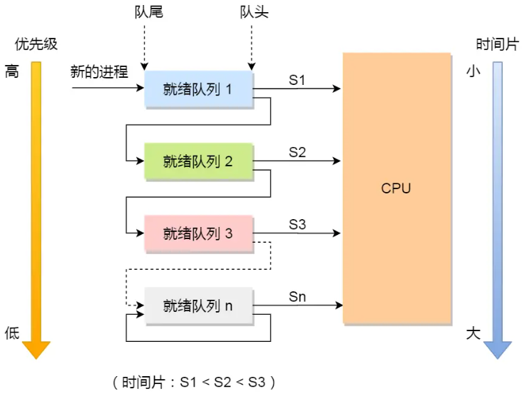
* 工作流程:
    - 新的进程都会被放到第一级的队列的末尾, 按照先来先服务的原则排队等待被调度, 如果进程在第一队列规定的时间片未运行完, 将其转入第二级队列的末尾。如果已经到了最后一级队列还没运行完, 那就再次放到最后一级队列的队尾。
    - 当高优先级队列的队列为空的时候, 才调度较低的优先级队列中的进程执行。如果进程运行时, 有新进程进入较高优先级的队列, 则停止当前运行的进程并将其移入到`原队列末尾`(注意这里是原队列的末尾)，接着让较高优先级的进程运行；
    - 其实总体来讲, 所有进程第一次都被放到第一级队列中, 都能够迅速的先响应。如果某个进程时间片用完, 程序还没执行完, 其就被放到下一级队列中。如果某个进程是被踢出来了, 那就放到原始的队列中。
* 优缺点:
    - 对各类进程相对公平, 每个新到的进程都可以很快得到响应; 
    - 短进程只需要少的时间就可以完成
    - 不必估计进程的运行时间(程序很容易欺骗操作系统, 让其估计错运行时间)
    - 可能会造成饥饿现象。

23. 基本分页存储管理？
* 程序中访问的地址是进程的逻辑地址, 逻辑地址首先要转换为实际的物理地址。采用基本的分页存储管理, 将进程分成多个同样大小的块(页), 将主存也分成同样大小的块(页框, 物理页)。逻辑地址和物理地址的页内地址部分是相同的, 只是逻辑地址中的页号是自己的进程逻辑地址的页号, 物理地址的页号是主存的页号。首先会去内存中找这个进程的 PCB, PCB 存放着这个进程的页表的起始地址和页表长度(每个进程对应一个页表, 页表是放在内存空间中的), 然后将这两个值读取到页表寄存器中, 然后依据逻辑地址的页号去查找对应的物理地址的页号, 然后与页内地址拼接, 得到最终的物理地址。
* 页表中只有对应的块号, 去除了索引, 默认就是逻辑地址从 0 开始, 但是 TLB 快表中是有页号的。这里的分块与 Cache 映射是一样的, 但是分块的大小与Cache分块的大小是没有关系的。
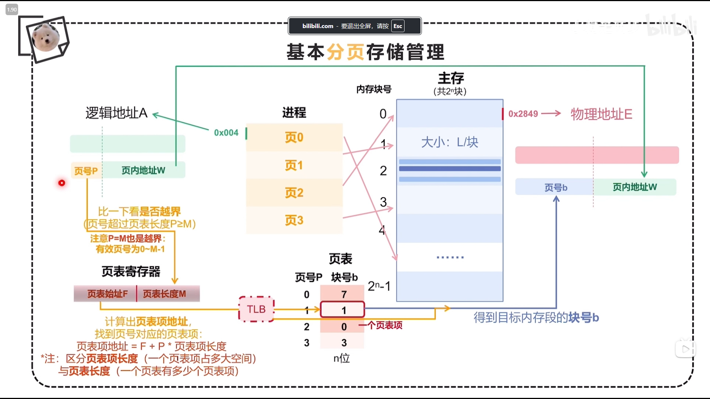
23. 多级页表存储管理？
* 单级页表存在的问题, 比如 `4GB` 主存且按照字节寻址, 每个页框是 4KB, 那就有 `4G/4K=2^20` 个页表项。而每个页表项占用 `4B`, 那么一共需要占用 `2^22` 字节的内存空间, 也就是占用连续的 `(2^22)/(2^12)=2^10=1024` 个页表项(要求连续是因为只提供了`页表起始地址`和`页表长度`)。这些页表项也是在内存空间中占用了很大的连续空间, 所以也要给其再次分页, 这就是多级分页存储管理。注意每一次分页都是`页表中的一项对应内容中的一块`。
* 多级页表一般遵循的原则是各级页表的大小一般不能超过一个页面(`超过了就打散`), 然后加一个页表来找他们。
    - 假设一个页面大小为 4KB, 一个页表项为 4B, 那么地址中表示一个页表的部分就不能超过 `10bit`(一个页面的能放下的页表项的个数为 `2^12/2^2=2^10`), 超过了就要新加一级。
    - 按照字节编址, 逻辑地址是 `40bit`, 页面大小为 4KB, 页表项大小为 4B。用几级页表合适呢？地址结构是什么样的呢？一个页表中页表项的个数为 `2^12/2^2=2^10`, 那就是每个页表项中的位数不能超过 10, 页内地址占用位数 12bit(4KB)。整体的结构形式为, `8bit | 10bit | 10bit | 12bit`。这是用了三级页表, 需要 4 次访存(N 级页表需要 N+1 次访存)。
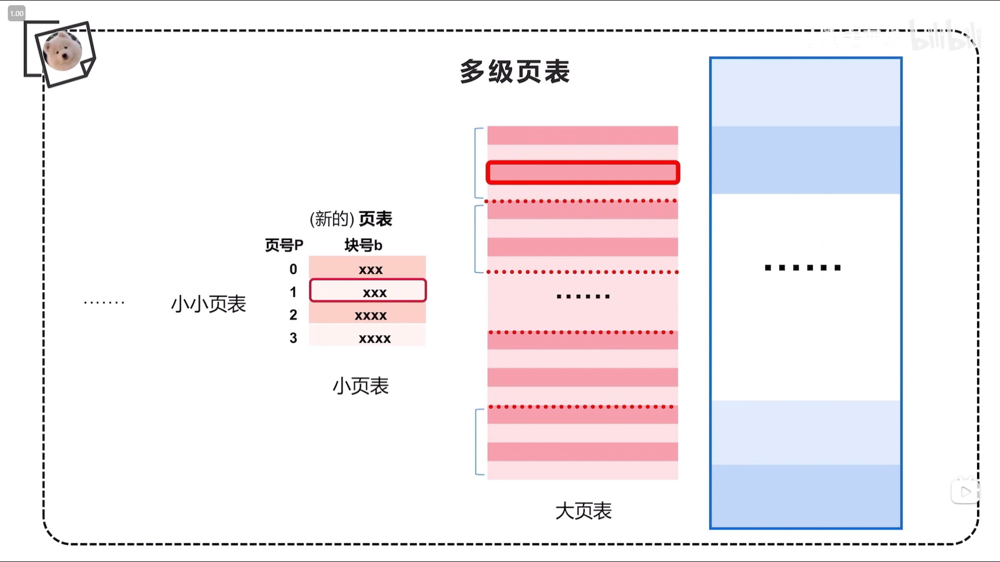
23. 分段存储管理?
* 分段存储管理是按照程序上的逻辑分成多个段, 这种方式相对于分页存储管理的优势就是每个段都有逻辑上的结构, 这种结构不会被拆分, 更好的实现段的保护与共享。注意其逻辑地址是一个二维坐标的形式, 而不是逻辑上连续的地址。依据程序所处的段确定段号, 依据其在段中的相对位置来确定段内地址, 所以说一个进程的分成的各个段之间并没有什么顺序的。其查找的就是段表, 段表中应然是隐藏了段号, 但是包含的信息是指定段的`基址`和`段长`。先依据逻辑地址的段号看是否越界, 不越界就找到段表起始地址然后查到对应到段表项, 依据段表项中存放的段长和基址得到最终的物理地址。
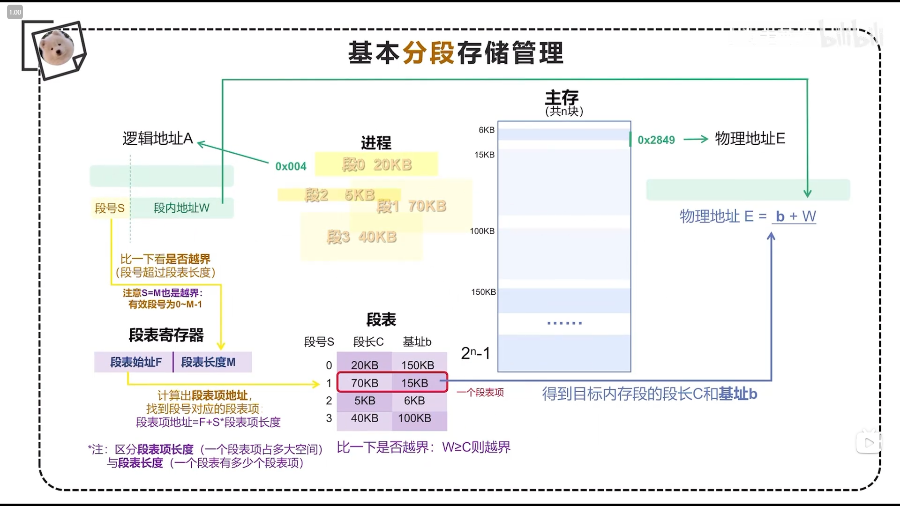
23. 分页存储管理与分段存储管理的区别？
* 逻辑地址的概念不同, 对于分页存储管理来说, 进程中的各个页都是连续的, 所以可以依据逻辑地址得到每个页的起始地址。而对于分段存储管理来说, 每个段都是独立的, 不能依据逻辑地址得到每个段的起始地址。
* 页表和段表是不同的。对于页表和段表来说, 都隐藏了进程页号和进程段号(因为每个页表项的大小相同, 每个段表项的大小相同)。但是页表中指存放了进程的页号对应的主存的块号, 而段表中每一项存放了对应的段号存放的段长和基址。
* 越界判断次数。页表只需要进行一次越界判断, 即页号是否超过了页表长度。而段表需要进行两次越界判断, 第一次是判断段号是否超过了段表长度, 第二次是判断段内地址是否超过了段长的大小。
* 得到物理地址的方式。分页存储管理是可以通过拼接的方式得到真正的物理地址。而分段存储管理只能通过`基址+段内地址`的方式得到。
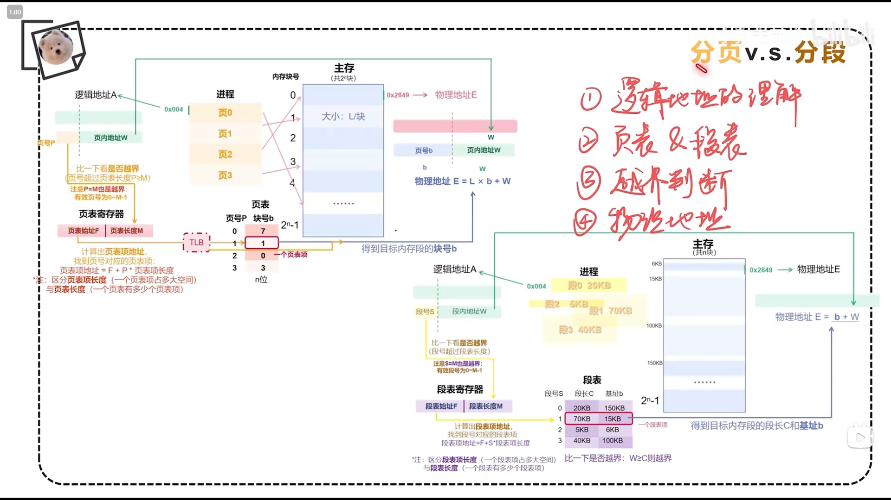
23. 段页式存储管理？
* 其实是先依据程序进行分段, 然后在每个段内进行分页。相当于将分段的段内地址再进行分页管理, 分成 `页号 | 页内地址`。这样就能保证放入进程中的每块和主存中的每块大小是相等的。此时段表中存放的就是`页表的长度`和`页表存放的块号`两部分内容。然后读取对应页表, 找到对应的放入主存中的页号。一个进程对应一个段表, 而一个段对应一个页表。一共需要 3 次访存(都是一级页表)。
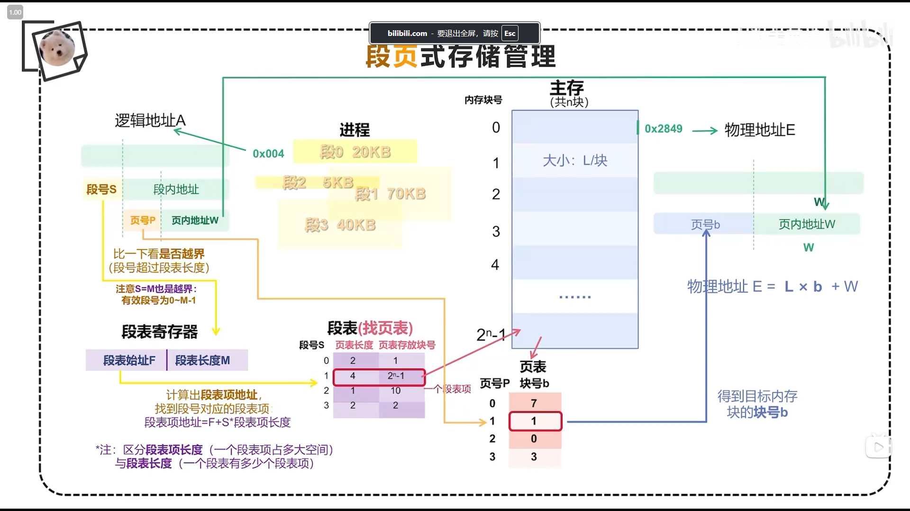
24. 缺页中断与一般中断的区别？
* 缺页中断一般在指令执行期间产生和处理中断信号, 而一般的中断是在一条指令执行完成后检查和处理中断信号。
* 缺页中断返回到该指令的开始重新执行该指令, 而一般中断返回回到该指令的下一个指令的执行。
25. 手写 String 类
```C++
#include<string>
#include<iostream>

class myString
{
public:
	myString(const char *str = nullptr);			//构造, 这个是默认参数, 头文件声明就可以了
	myString(const myString& str);					//拷贝构造
	myString& operator=(const myString& str);		//重载=
	myString operator+(const myString& str) ;		//重载+
	myString& operator+=(const myString& str) ;		//重载+=
	bool operator==(const myString& str) const;		//重载==
	char& operator[](int index);					//重载[]
	
	~myString();									//析构
	friend std::ostream& operator<<(std::ostream &os, const myString &str);//输出
private:
	char *m_data;
};

// 这里要注意, 默认构造的时候, 其实传入的是默认参数, 并不是啥也没有
// 这里是 const, 是防止 pstr 被修改
// 声明中给定一个默认实参, 但是在定义中不能带默认实参
myString::myString(const char* pstr)
{
	if (pstr)
	{
		m_data = new char[strlen(pstr) + 1];  // strlen 不包含  '\0'
		strcpy(m_data, pstr);                 // 用于把pstr指针指向的字符串拷贝到m_data指向的字符串。
	}
	else  // 默认分配一个字节的空间, 再把指针指向的值设为字符串结束符'\0', 相当于统一释放的方式
	{
		m_data = new char[1];
		*m_data = '\0';
	}
}

// 拷贝构造, 实现深拷贝, 分配内存空间再进行深拷贝
myString::myString(const myString& str)
{
	m_data = new char[strlen(str.m_data) + 1];
	strcpy(m_data,str.m_data);
}

// 赋值构造, 拷贝构造函数是构造函数, 对象需要被创建; 而拷贝赋值函数只是赋值, 也就是说拷贝赋值只能用在对象已经创建的基础上。
myString& myString::operator=(const myString& str)
{
	if (this == &str) return *this;  // 防止自我赋值, 避免delete自己后没法分配与赋值的问题
	delete []m_data;                 // 释放自己拥有的资源
	m_data = new char[strlen(str.m_data) + 1];  // 开辟新的空间
	strcpy(m_data, str.m_data);
	return *this;  // 注意返回值为引用, 不然多了一次拷贝构造
}

// 注意不能加&，不能返回本地变量的地址
myString myString::operator+(const myString & str) 
{
    //新建一个长度为自身+连接字符的字符串，逐段拷贝
	myString newString;
	newString.m_data = new char[strlen(m_data) + strlen(str.m_data) + 1];
	strcpy(newString.m_data, m_data);      // 目标地址大于也能拷贝
	strcat(newString.m_data, str.m_data);  // 拼接字符串, 相当于忽略第一个的 '\0'

	return newString;  // 以拷贝的形式返回过去
}

// +=在原来字符串实现, 所以新建char *, 全部拷贝过去, 再把m_data指向
myString& myString::operator+=(const myString & str)
{
	char *newData = new char[strlen(m_data) + strlen(str.m_data) + 1];
	strcpy(newData,m_data);
	strcat(newData,str.m_data);
	delete[]m_data;
	m_data = newData;
	return *this;
}

// 比较是否相同, 如果个数不同就不用比了, 个数相同再比较
bool myString::operator==(const myString& str) const
{
	if(strlen(m_data) != strlen(str.m_data))
		return false;
	return strcmp(m_data, str.m_data) ? false : true;
}

// 返回的是引用, 为了能够就地修改, 注意要有越界保护
char & myString::operator[](int index)
{
	if (index > strlen(m_data))
		throw "invalid index";
	else
		return m_data[index];
}

// 析构函数只需要delete掉分配的内存，再把指针置空即可
myString::~myString()
{

	delete []m_data;
	m_data = NULL;
	
}

// 不能作为成员函数, 如果是成员函数, 需要通过对象进行调用, c1 << cout 与平时使用不习惯, 所以其是非成员函数。
// 但是非成员函数也想要访问成员变量 m_data, 可以定义一个成员函数, 也可以把函数定义为类的友元。
// 返回值是引用, 因为会出现连续输出的情况。
// 第一个参数不能加 const, 因为 << 会改变 os 状态
std::ostream& operator<<(std::ostream &os, const myString &str)//输出
{
	os << str.m_data << std::endl;
	return os;
}

int main(){
	//以下都为测试函数
	myString s1;
	myString s2 = "123";
	myString s3("456");
	myString s4 = s2;
	myString s5(s3);
	s5 = s2;
	myString s6 = s2 + s3;
	s6 += s2;
	std::cout << (s2 == s3) << std::endl;
	std::cout <<(s4 == s2) << std::endl;
	s6[8] = '5';
	std::cout <<"s6[8]: " <<s6[8]<< std::endl;
	
	std::cout << s2;

	return 0;
}
```
26. 一个 warp 中的所有 `thread` 在实际底层硬件中, 也不一定是并行执行的。
* warp 中的线程确实可能确实按照某些顺序调度, 这主要与 GPU 的硬件资源以及线程的执行逻辑有关。从宏观的角度来说, warp 中的线程是并行执行的, 但是实际的底层硬件实现中, 可能会有一些细微的顺序执行和调度机制。以下是一些可能的原因：
    * 硬件资源限制: 一个 SM 上有一定数量的执行单元, 这些执行单元负责执行 warp 中的线程。当执行单元数量不足以同时处理 warp 中的所有线程时, GPU 会分批调度线程。比如, 一个 warp 可能被分成几组线程，分别在不同的时钟周期中执行，这种方式叫分时执行。
    * 分支发散: 比如遇到 if-else 语句, 线程会分支发散。GPU 只能在一个时钟周期内执行 warp 中同一指令的线程组, 所以分支发散, GPU 会按照顺序处理不同路径上的线程。这会导致一些线程暂时“停滞”，等待其他线程执行完特定的分支代码后，再继续并行执行。假设一个 warp 中有 32 个线程，其中 16 个线程满足 if 条件，另外 16 个线程满足 else 条件。在遇到 if-else 分支时，GPU 会首先调度满足 if 条件的 16 个线程，执行 if 分支代码，而剩下满足 else 条件的 16 个线程在此期间停滞不动。等 if 分支执行完之后，GPU 会切换到执行 else 条件下的线程，而之前执行过 if 的线程在此时等待。
27. 超标量与超流水线的区别与联系？
* 超标量和超流水线都是 CPU 架构中用于提高处理器性能的技术。
* 超标量: 超标量处理器能够在一个时钟周期内同时发射和执行多条指令。为了实现这一点, 处理器内部包含多个执行单元, 如算术逻辑单元（ALU）、浮点单元、加载/存储单元等。这些硬件资源的复制允许处理器在硬件层面实现指令级并行。
* 超流水线: 超流水线处理器是通过增加流水线的深度, 将指令的执行过程分解为更多更细的阶段。
* 超标量与超流水线的区别和联系:
    - 超标量通过在同一时钟周期内并行执行多条指令来提高性能。超流水线通过加深流水线、提高时钟频率来提高性能。
    - 超标量侧重于指令级并行性，旨在同时处理多条指令。超流水线侧重于提高时钟频率，通过更细的流水线阶段来加速指令执行。
    - 超标量需要更多的执行单元和复杂的指令调度逻辑。超流水线需要更精细的流水线设计，并对分支预测和数据相关提出了更高的要求。
    - 两者都旨在提高处理器的性能，但方式不同。
    - 现代处理器常常同时采用超标量和超流水线技术。
28. CPU 指令的乱序发射是什么意思？
* 乱序发射 是指处理器可以不按照程序中指令的原始顺序来执行，而是根据指令之间的依赖关系和资源可用性动态地重排指令执行顺序。
* 减少由于数据相关或资源冲突导致的停顿。通过提前执行不相关的指令，隐藏长延迟操作（如内存访问）的影响。
* 超标量和乱序发射常常结合使用。超标量提供了同时执行多条指令的硬件能力，而乱序发射确保这些硬件资源被高效利用。
```C++
// 假设有以下指令序列：

// LOAD R1, [MEM] （从内存加载数据到寄存器 R1）
// ADD R2, R1, R3 （将 R1 和 R3 相加，结果存入 R2）
// MUL R4, R5, R6 （将 R5 和 R6 相乘，结果存入 R4）
// 顺序执行：必须等待第1条指令完成，才能执行第2条，然后执行第3条。
// 超标量但顺序执行：即使有多个执行单元，由于指令依赖，仍需按顺序执行。
// 乱序发射加超标量：处理器可以在等待第1条指令完成的同时，先执行第3条指令，因为它与前面的指令无依赖关系，从而提高执行效率。
```
29. 解释下 Strong Scaling 和 Weak Scaling 的概念？
* Strong Scaling 和 Weak Scaling 是并行计算中常用的两个概念, 用来评估一个并行算法在多个处理器环境下的性能表现。
* Strong Scaling(强扩展性): 当你保持问题的规模固定不变, 增加处理器数量, 并观察算法的加速效果。理论上，如果问题规模不变，处理器数翻倍，计算时间应减少一半（理想线性加速）。在实际中，由于通信开销和其他并行化的非理想因素，强扩展性通常会在一定数量的处理器之后逐渐下降。公式如下, 其中 $T(1)$ 是使用一个处理器的运行时间, $T(P)$ 是使用 P 个处理器的运行时间。
$$SpeedUp = \frac{T(1)}{T(P)}$$
* Weak Scaling(弱扩展性): 观察在每个处理器的负载不变的情况下，增加处理器能否有效处理更大的问题规模。如果每个处理器处理相同数量的数据，并且随着处理器数量的增加，总问题规模线性增加，理想情况下，执行时间应保持不变。由于通信开销的增长，随着处理器数量增加，实际的执行时间可能也会有所增加。公式如下, 其中 $T(P)$ 是使用 P 个处理器的运行时间, 而问题规模也相应增加, $T(1)$ 是使用一个处理的运行时间。
$$Efficiency = \frac{T(P)}{T(1)}$$
* Strong scaling 关注的是在固定问题规模下, 增加处理器的效率; Weak scaling 关注的是随着问题规模增加, 处理器数量能否有效扩展。
30. IEEE 754 标准？
* 前置知识:
    - 移码: 补码的基础上将符号位取反。例如, `+19`->原: 00010011, 补: 00010011, 移: 10010011。但是实际使用中通常用这个定义 `移码=真值+偏置值`(一般情况下, 偏置值取 $2^{n-1}$, 机器字长为 n 位)。
    - 此处的真值+偏置值, 可以用十进制+十进制, 也可以用二进制加二进制。如果是十进制+十进制, 所得结果要向无符号整数转化, 但是视为移码。相当于阶数这个移码就是始终认为是无符号整数, 再做计算。
    - 例如: 将 +19 转换为移码, 机器字长为 8 位。`移码=真值+偏置值`。$2^{8-1}=128$, $19+128=147$, 147 转换为8位的无符号整数为 `1001 0011`。
* IEEE754 标准规定常用的浮点数格式有短浮点数(单精度浮点数), 长浮点数(双精度浮点数), 临时浮点数, 基数隐含都为 `2`。并且规定其中阶码都用移码表示, 尾数都用原码表示。计算阶码时候的偏置值为 $2^{n-1}-1$。并且此标准下的规格化的形式是 `1.xxx....`, 为了能使尾数多表示1位有效数字, 将这个 `1` 隐藏。

| 类型 | 数符 | 阶码 | 尾数 | 总位数 | 偏置 |
| :----: | :----: | :----: | :----: | :----: | :----: |
| 单精度浮点数(float) | 1 | 8 | 23 | 32 | 127($2^7$-1) |
| 双精度浮点数(double) | 1| 11| 52 | 64 | 1023($2^{10}$-1) |
| 临时浮点数 | 1 | 15 | 64 | 80 | 16383($2^{14}$-1) |

* IEEE 754 浮点数的特殊规定如下:
    - 当阶码与尾数均全为 0 时, 表示的真值为 0。且当符号位为 0 时, 表示正 0, 符号位为 1 时, 表示负 0。
    - 当阶码全为1, 尾数全为 0 时, 表示真值为无穷大。且当符号位为 0 时, 表示为 $+\infty$, 当符号位为 1 时, 表示 $-\infty$。
    - 当阶码全为1, 尾数不全为 0 时, 则这不是一个数。
* 十进制数->IEEE 754。将十进制数 `-0.75` 转换为 IEEE 754 的单精度浮点数格式表示。
    - 十进制转换为 IEEE 754, 其实就是确定 IEEE 754 的阶码和尾数。`-0.75` 先规格化 `-0.11 -> -1.1*2^(-1)`, 阶数为 `-1+127=126, 为 0111 1110`, 尾数为 `1000 0000 0000 0000 0000 000`。所以浮点数为 `1 0111 1110 1000 0000 0000 0000 0000 000`。
* IEEE 754->十进制。例如 IEEE 754 的单精度浮点数为 `C0 A0 00 00`, 那么十进制的值为多少呢？
    - `C0 A0 00 00` 转换为二进制为 `1 100 0000 1010 0000 0000 0000 0000 0000`。移码部分为 `1000 0001` 为 129, 真值为 `129-127=2`。尾数为 `1.01`, 所以最终的结果为 `-1.01*2^2=-101=-5`。

30. int 转换为 float 有精度损失的问题？
* 以下代码中 `f1` 和 `f2` 是为了计算 $f(n)=2^{n+1}-1$, 从 `f(24)` 以及之后, `f1` 和 `f2` 结果开始不相等。float 存储的是 `一位数符+8位阶码+23位尾数`, f(23) 的最低位数是 $2^{-23}$, 而 f(24) 的最低位数是 $2^{-24}$。因为float只有23位尾码，所以f(23)可以正常存储，而f(24)需要舍弃2^-24，因此便出现了精度损失。
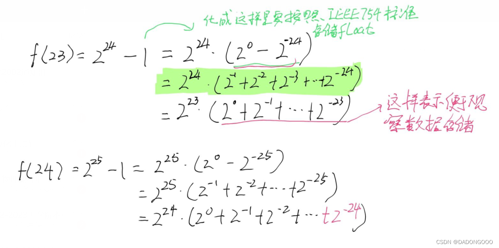
C语言的舍入规则是, 舍1进1, 舍0进0, 因此f(24)因为舍去了2^-24, 因此要向高位进1, 结果便比f1(24)大1。
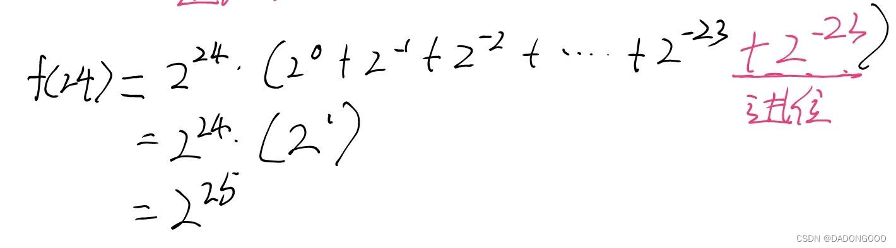
```C++
// f1 是用 int 类型存储结果
int f1(unsigned n)
{
	int sum = 1;
	int pow = 1;
	for (unsigned i = 0; i <n; i++)
	{
		pow *= 2;
		sum += pow;
	}
	return sum;
}
 
// f2 是用 float 类型存储结果
float f2(unsigned n)
{
	float sum = 1;
	float pow = 1;
	for (unsigned i = 0; i < n; i++)
	{
		pow *= 2;
		sum += pow;
	}
	return sum;
}
 
// 比较 f1 和 f2 的运行结果
int main()
{
	for (int i = 0; i < 32; i++)
	{
		printf("%d\t%-20d %.1f\n",i ,f1(i), f2(i));
	}
    return 0;
}
```
31. int 与 float 之间进行转换？[原文](https://zhuanlan.zhihu.com/p/494422594)
```C++
union FloatInt
{
    int32_t    i;
    float      f;
};

int32_t FloatToInt(float f)
{
    FloatInt ret, bias;
    ret.f = f;                                                // 保存下 f 的数值
    bias.i = (23 + 127) << 23;                                // 构建 bias 是核心, 此时 f 对的浮点数为 1.0*2^23
    if(f < 0.0f){bias.i = ((23 + 127) << 23) + (1 << 22);}
    ret.f += bias.f;                                          // 这个操作会迫使 ret 的尾数部分向右移动足够的尾数, 此时尾数就是结果
    ret.i -= bias.i;                                          // 做一个减法就是最终的结果

    return ret.i;
}

float IntToFloat(int32_t i)
{
    FloatInt ret, bias;
    ret.i = i;                                                 // 保存下 int 的数值
    bias.i = (23 + 127) << 23;                                 // 构建 bias
    if(i < 0){bias.i = ((23 + 127) << 23) + (1 << 22);}
    ret.i += bias.i;                                           // 迫使其移位
    ret.f -= bias.f;                                           // 把阶码干掉

    return ret.f;
}
```
32. 原码, 反码, 补码(`定点整数`)之间的转换关系?(`原码->反码->补码`)
* 正数的原码、反码和补码都是一样的; 计算机使用补码来表示数字的二进制; 二进制的最高一位是符号位, 0 表示正数, 1 表示负数。以下一些情况:
    - 原码: [12]原=0000 1100;  [-12]原=1000 1100; 负数的原码就是其绝对值对应的正数的原码然后改变符号位。
    - 反码: [12]反=0000 1100;  [-12]反=1111 0011; 负数的反码是符号位不变, 其余数值位按位取反。
    - 补码: [12]补=0000 1100;  [-12]补=1111 0100; 负数的补码是在反码的最低为加 1。(实际上补码和反码在定义上并没有直接的关系，只是恰好补码等于反码最低位加1)
* 各个之间的转换关系:
    - `补码->原码`: 正数时相等的; 负数的符号位不变, 先对补码的数值位取反, 然后加 1 即可得到原码。
    - `补码->相反数补码`: 正数和负数均通用, 将补码的符号位和数值位都取反, 再加 1。
    - `反码->原码`: 正数时相等的; 负数的符号位不变, 数值位取反。
33. ELF 文件格式的用处？[原文](https://zhuanlan.zhihu.com/p/375510683)
* ELF 文件, 全程是 Executable and Linkable Format。在 Linux 系统中一个 ELF 文件主要用来表示 3 种类型的文件, `可执行文件`, `目标文件(.o)`, `共享文件库(.so)`。可执行文件是指被操作系统加载器从硬盘上读取, 载入到内存中去执行。目标文件是指被链接器读取, 用来产生一个可执行文件或者共享库文件。共享库文件是指在动态链接的时候, 由 `ld-linux.so` 来读取。
* ELF 文件可以分成四个部分, `ELF Header`, `Program header table`, `Sections`, `Section header table`。对于链接器来说, 只关心 `ELF header`, `section header table`, `sections`。对于载入器来说, 只关心 `ELF header`, `Program header table`, `sections`, 而且其是 `segment` 的概念, 一个 segment 可能对应原来的多个 sections。
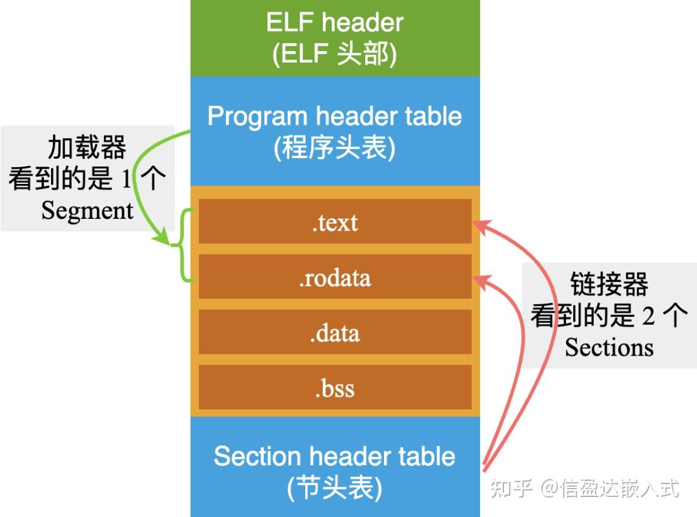
* 其中的三个 header 均是由 3 个结构体这种的数据结构来维护的:
    - `ELF header`: 是一个总管, 决定了完整的 ELF 文件内部的所有信息。
```C++
#define EI_NIDENT 16

typedef struct {
    unsigned char   e_ident[EI_NIDENT];  // 开始的 16 个字节包含了, 32位还是64位, 大端存储还是小端存储
    Elf32_Half      e_type;              // 类型, 是可执行文件, 还是目标文件, 动态库文件
    Elf32_Half      e_machine;           // CPU 类型, 比如 Intel 80386
    Elf32_Word      e_version;           // 版本信息
    Elf32_Addr      e_entry;             // 程序入口地址
    Elf32_Off       e_phoff;             // Program header table 在 ELF 文件中的偏移量。比如为 52 的话, 就是从第 52 个字节开始, 就是程序头表开始的位置。
    Elf32_Off       e_shoff;             // Section header table 在 ELF 文件中的偏移量。
    Elf32_Word      e_flags;             // 处理相关标志
    Elf32 Half      e_ehsize;            // ELF header 数据的长度, 字节数
    Elf32_Half      e_phnum;             // Program header table 中一共有多少个 entry。
    Elf32 Half      e_phentsize;         // Program header table 中每一个 entry 的长度(即所占用字节数)。
    Elf32_Half      e_shnum;             // Section header table 中一共有多少个 entry。
    Elf32 Half      e_shentsize;         // Section header table 中每一个 entry 的长度(即所占用字节数)。
    Elf32_Half      e_shstrndx;          // 字符串表 Entry 在 Section header table 中的索引。如 28 表示, 第 28 个 Entry 描述的是字符串表的这个 section。
} Elf32_Ehdr;
```
    - 字符串表: ELF中的字符串, 变量名, Section 名称, 连接器加入的符号, 长度不固定。将这些字符串集中起来, 统一放在一起, 做为一个独立的 section 进行管理。对于每个字符串只需要知道索引就可以了。
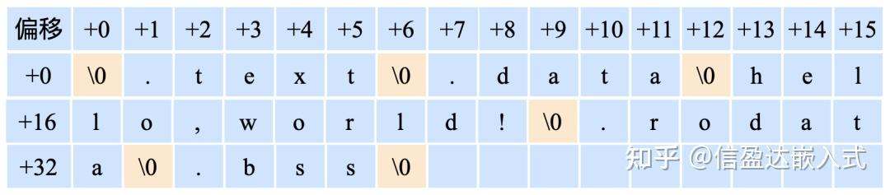
    - `section header table`: 
```C++
typedef struct {
    Elf32_Word sh_name;         // 这个 entry 的名字, 对应的是字符串表中的索引值。
    Elf32_Word sh_type;         // 表示这个 section 的类型
    Elf32_Word sh_flags;        // 
    Elf32_Addr sh_addr;
    Elf32_Off  sh_offset;       // 这个 section 在 ELF 中的偏移量
    Elf32_Word sh_size;         // 这个 section 的大小(字节)
    Elf32_Word sh_link;
    Elf32_Word sh_info;
    Elf32_Word sh_addralign;
    Elf32_Word sh_entsize;
} Elf32_Shdr;
```
    - `Program header table`: 
```C++
typedef struct {
    Elf32_Word   p_type;        // 段的类型, 1: 表示这个段需要加载到内存中;
    Elf32_Off    p_offset;      // 段在 ELF 文件中的偏移地址，这里值为 0，表示这个段从 ELF 文件的头部开始;
    Elf32_Addr   p_vaddr;       // 段加载到内存中的虚拟地址
    Elf32_Addr   p_paddr;       // 段加载的物理地址，与虚拟地址相同;
    Elf32_Word   p_filesz;      // 这个段在 ELF 文件中，占据的字节数
    Elf32_Word   p_memsz;       // 这个段加载到内存中，需要占据的字节数
    Elf32_Word   p_flags;
    Elf32_Word   p_align;
} Elf32_Phdr;
```
* ELF header 描述了文件的总体信息，以及两个 table 的相关信息(偏移地址，表项个数，表项长度); 每一个 table 中，包括很多个表项 Entry，每一个表项都描述了一个 Section/Segment 的具体信息。其实这些结构和段, 都是字节紧密排列的, 展示的数据结构是解析后的, 实际上是字节流的形式。

34. Linux 下编译 `C++` 文件的整个过程是什么样的呢？
* GCC 编译器读取源程序文件 `hello.c`, 并把它翻译成一个可执行的目标文件 `hello`。这个翻译过程分成四个阶段, `预处理`, `编译`, `汇编`, `链接`, 执行这四个阶段的程序为`预处理器`, `编译器`, `汇编器`, `连接器`。

* 预处理阶段:
    - 处理 `#include` 预编译指令, 将被包含的文件内容直接插入到预编译指令的位置。
    - 展开所有的宏定义, 处理所有的`条件预编译`指令, 如 `#if`, `#ifdef`, `#elif`, `#else`, `#endif`。
    - 删除所有的注释; 添加行号和文件标识, 以便编译时产生调试用的行号以及编译错误警告行号。
* 编译阶段: 将预处理完的文件进行`语法分析`, `词法分析`, `语义分析`, `中间代码生成`, `目标代码生成和优化`。生成汇编语言, 为不同高级语言的不同编译器提供了通用的输出语言。
    - 词法分析: 将源代码的字符串序列分成一系列的 `token`。
    - 语法分析: 依据这些 `token` 生成抽象语法树(AST)。
    - 语义分析: 检查程序是否符合语言的语义规则, 即检查程序在逻辑和意义上的正确性。
    - 中间代码生成: 将整个抽象语法树转换为中间格式(IR)。中间代码使得编译器被分为前端和后端。编译器前端负责产生机器无关的中间代码；编译器后端将中间代码转化为目标机器代码。
    - 目标代码生成和优化: 针对不同的机器进行优化并生成机器代码。
* 汇编阶段:
    - 汇编器将编译器的输出翻译成机器语言指令, 并将这些指令打包成 `elf(Executable and Linking Format)` 文件的格式, 并将结果保存在目标文件(.o)中。
* 链接阶段: 将各种代码和数据片段合并组成一个单一文件的过程, 生成的文件可以被加载(复制)到内存并执行(单独的逻辑地址->统一的逻辑地址)。
    - 链接可以发生在: a. 载(load)入前  b. 载入时  c. 运行时, 由链接器的程序自动执行。
    - 链接使得 `分离编译` 成为可能, 我们不用将一个大型的应用程序组织成一个巨大的源文件, 而是可以将其分解为更小的、更好的管理的模块, 可以独立的修改和编译这些模块。

35. 静态链接和动态链接的过程是什么样的呢？
* `静态链接器`以一组可重定位目标文件和命令行参数做为输入, 生成一个完全链接的、可以加载和运行的可执行目标文件做为输出。
* 静态链接的过程:
    - `合并段并分配虚拟地址空间`: 扫描所有的输入目标文件, 获得他们的各个段的长度、属性和位置, 并且将输入目标文件中的符号表中的所有`符号定义和符号引用`收集起来, 统一放到全局符号表中。这样获取到各个段的长度和位置之后, 就能将其合并, 计算出合并后的各个段的长度与位置, 并建立映射关系(可执行文件与进程虚拟地址之间的映射)。在链接之前, 目标文件中的所有段的虚拟地址都是0, 因为虚拟空间还没有被分配, 默认都为0。等到链接之后, 可执行文件中的各个段已经都被分配到了相应的虚拟地址。
    - `符号解析和重定位`:
        - `符号解析`: 目标文件中定义和引用符号, 每个符号对应一个函数、全局变量、静态变量。符号解析是将每个符号引用正好和一个符号定义关联起来。目标文件中 `.symtab` 是符号表, 记录着程序中定义和引用的`函数和全局变量`的信息。当编译器遇到一个不是在当前模块中定义的符号（变量和函数名）时, 会假设该符号是在其他某个模块中定义的, 生成一个链接器符号表条目, 并把它交给链接器处理。如果链接器在它的任何输入模块中都找不到这个被引用符号的定义, 就输出一条错误信息并终止。
        - `重定位`: 链接器完成了符号解析这一步, 就把代码中的每个符号引用和正好一个符号定义（即它的一个输入目标模块中的一个符号表条目）关联起来。链接器将所有的相同类型的节合并成为同一类型的新的聚合节。例如, 来自所有输入模块的.data节被全部合并成为一个节, 这个节称为输出的可执行目标文件的 .data 节。重定位节中符号的引用, 链接器修改代码节和数据节中对每个符号的引用, 使的它们指向正确的运行地址。
* 动态链接的过程:
    - 动态链接和共享库出现的原因:
        - 静态库和所有的软件一样, 需要定期的维护和更新。如果程序员想要使用一个库的最新版本, 他们必须以某种方式了解到该库的更新情况，然后显示地将他们的程序与更新的库重新链接。
        - 在静态链接情况下, 两个程序共享同一个模块, 在静态链接后输出的两个可执行文件中各有一个共享模块的副本。对内存和磁盘造成了很大的浪费。
        - 共享库是一个目标模块, 在运行或者加载时, 可以加载到任意的内存地址, 并和一个在内存中的程序链接起来, 这个过程是动态链接, 由动态连接器的程序来执行。
    - 在使用动态库创建可执行文件时, 静态执行一些链接(主要是重定位和符号表的信息), 然后在程序加载时, 动态完成链接。没有任何动态库中的代码和数据节真的被复制到可执行文件中。链接器复制了一些重定位和符号表的信息，它们使得运行时可以解析对libvector.so中代码和数据的引用。加载和运行时, 加载完成了部分链接的可执行文件, 其中包含了 `.interp` 节, 这个节包含动态连接器的路径名(动态链接器本身就是一个共享目标, ld-linux.so)。加载和运行这个动态链接器, 执行下面重定位来完成链接任务:
        - 重定位libc.so的文本和数据到某个内存段。
        - 重定位libvector.so的文本和数据到另一个内存段。
        - 重定位prog21中所有对libc.so和libvector.so定义和符号的引用。
        - 最后动态链接器将控制传递给应用程序。共享库的位置就固定了，并且在程序执行的过程中都不会变。
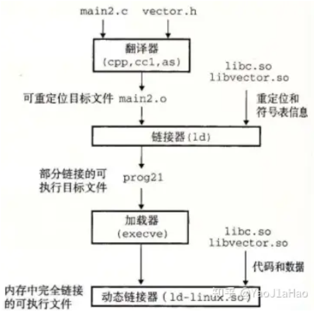

36. `.data` 和 `.bss` 段的详解?
* `.data` 部分包含了初始化的全局变量和静态变量。初始化的数据是在程序开始运行之前具有的值, 这些值是可执行文件(ELF) 格式的一部分。当将可执行文件加载到内存中以供执行时, 这些初始化的值会被加载到内存中。所以定义的初始化的数据越多, 可执行文件越大, 并在将其从磁盘加载到内存所需要的时间也越长。
* `.bss` 部分包含了未初始化的全局变量和静态变量。这个段的变量只有 `名称` 和 `大小`, 但是并没有值。`.bss` 不包含任何数据值, 只是简单的维护开始和结束的地址, 以便内存区能在运行时被有效地清零。其实有些初始化为 0 的也能放到 `.bss` 段, 等待程序加载运行的时候在赋值。
* 将 `.data` 和 `.bss` 分开的理由是为了节约磁盘空间, `.bss` 不占用实际的磁盘空间。例如, 以下两段程序分别代表两个文件, 通过编译之后得到可执行文件, 利用 `ls -l` 来查看执行文件的大小:
```C++
#include <stdio.h>
int a[1000];
int b[1000] = {1};
int main()
{
    printf("123\n");
    return 0;
}
/*
-rwxrwxr-x 1 xxx xxx 12696 Dec  1 01:04 test

size test
   text    data     bss     dec     hex   filename
   1174    4568    4032    9774    262e   test
*/
```
```C++
#include <stdio.h>
int a[1000] = {1};
int b[1000] = {1};
int main()
{
    printf("123\n");
    return 0;
}
/*
-rwxrwxr-x 1 xxx xxx 16696 Dec  1 01:09 test

size test
   text    data     bss     dec     hex filename
   1174    8568       8    9750    2616 test

*/
```
* 从以上可以看见, 文件大小从 12696 字节变成了 16696 字节, 与之前相比该文件大小涨了 4000 字节。其实这个就是 `a[1000]` 的大小。因为初始化了 `a[1000]`, 让这个数组从 `.bss` 改到了 `.data` 段。

37. 程序的指令和数据分开的原因？(因为指令段有 `.text`, 数据段有 `.data` 和 `.bss`)
* (安全)防止程序指令贝有意无意的修改: 数据和指令被映射到两个虚拟存储区域, 数据区域对于进程来说是可以读写的, 指令区域对于进程来说是只读的, 所以可以将这两个区域的权限分别设置成可读写和只读。
* (共享)利用段的共享, 节省空间: 当操作系统中运行着多个程序的副本时, 指令都是相同的, 所以内存只需要保留一份该程序的指令部分。除了代码段, 其他只读段都可以进行共享的, 通常可以节省大量的内存。
* (区分)对于冯诺依曼体系的计算, CPU 是不太能够识别指令和数据的, 之后将其分成`数据段`和`指令段`。

38. 本地编译与交叉编译?
* 本地编译: 在当前编译平台下, 编译出来的程序只能放到当前平台下运行。比如我们在 x86 平台上, 编写程序并编译成可执行文件。
* 交叉编译: 在当前编译平台下, 编译出来的程序能运行在体系结构不同的另一种目标平台上, 但是编译平台本身却不能运行该程序。比如, 我们在 x86 平台上, 编写程序并编译成能运行在 ARM 平台的程序, 编译得到的程序在 x86 平台上是不能运行的, 必须放到 ARM 平台上才能运行。
* 本地编译的用途:
    - 编译速度: 目标平台的编译速度通常比当前的编译主机慢得多, 许多专用的嵌入式硬件, 没有太高的性能。
    - 资源限制: 整个编译过程是非常消耗资源的, 嵌入式系统往往没有足够的内存或磁盘空间。
    - 必要性: 即使目标平台资源充足, 可以本地编译, 但是 `第一个在目标平台上运行的本地编译器` 总需要通过 `交叉编译` 获得。
* 交叉编译链是为了编译跨平台体系结构的程序代码而形成的多个子工具构成的一套完整的工具集。同时, 其隐藏了预处理、编译、汇编、链接等细节。当我们指定源文件的时候, 它会自动按照编译流程调用不同的子工具, 自动生成最终的二进制程序映像(.bin)。
* 交叉编译链的命名规则, `arch-core-kernel-system`:
    - `arch`: 用于那个架构。
    - `core`: 使用那个CPU Core, 如 Cortex A8, 这个比较灵活, 有的以开发板命名, 有的直接是 none 或 cross。
    - `kernel`: 所运行的 OS, 有 linux, uclinux, bare。
    - `system`: 交叉编译链所选择的库函数和目标映像的规范。如 gnu, gnueabi 等, 其中 gnu 等价于 `glibc + oabi`, gnueabi 等价于 `glibc + eabi`。
```javascript
arm-none-linux-gnueabi-gcc
arm-cortex_a8-linux-gnueabi-gcc
mips-malta-linux-gnu-gcc
x86_64-linux-gnu-g++
```
* 使用 CMAKE 进行交叉编译的方式, 在编译时添加 `CROSSCOMPILE_ENABLED` 选项配置。其实就是设置一些 CMAKE 变量来告诉 CMAKE。`CMAKE_SYSTEM_NAME`, 即目标系统名称, 这里是 `Linux`; `CMAKE_SYSTEM_PROCESSOR`, 即目标系统的处理器名, 这里是 aarch64。工具链的位置由 `CMAKE_C_COMPILER` 和 `CMAKE_CXX_COMPILER` 指定。`CMAKE_C_COMPILER` 是指 C 编译器的可执行文件的路径, `CMAKE_CXX_COMPILER` 是指 C++ 编译器的可执行文件的路径。
```C++
cmake_minimum_required(VERSION 3.1.3)
project(hello)
set(HELLO_SRCS hello.c)

// 通过 option 指令增加一个 CROSSCOMPILE_ENABLE 编译选项, 默认为 OFF, 设置为 ON 时进行交叉编译。
if (CROSSCOMPILE_ENABLED)
    set(CMAKE_SYSTEM_NAME Linux)         // 系统名称
    set(CMAKE_SYSTEM_PROCESSOR aarch64)  // 处理器名称
    set(target_arch aarch64-linux-gnu)
    set(CMAKE_C_COMPILER /usr/bin/aarch64-linux-gnu-gcc)     // C 工具链位置
    set(CMAKE_CXX_COMPILER /usr/bin/aarch64-linux-gnu-g++)   // C++ 工具链位置
    set(CMAKE_LIBRARY_ARCHITECTURE ${target_arch} CACHE STRING "" FORCE)
    set(CMAKE_FIND_ROOT_PATH_MODE_PROGRAM NEVER)
    set(CMAKE_FIND_ROOT_PATH_MODE_LIBRARY ONLY)
    set(CMAKE_FIND_ROOT_PATH_MODE_INCLUDE ONLY)
    set(CMAKE_FIND_ROOT_PATH_MODE_PACKAGE ONLY)
endif()

add_executable(${PROJECT_NAME} ${HELLO_SRCS})
```

39. `GNU` 和 `LINUX` 是什么?
* `GNU` 是一个自由的软件项目, 其项目提供了许多重要的系统工具, 如编译器(GNU C, gcc), 库(GNU C库, glibc), 命令行工具(bash, shell), 操作系统的基本命令(ls, cp, mv, rm)。这些组成了操作系统的绝大部分, 但是缺少了内核。
* `Linux` 与 GNU 工具共同组成了 `GNU/Linux` 的操作系统。`Linux` 主要负责:
    * `进程管理`: 确保多个进程能够有效地共享 CPU。
    * `内存管理`: 有效分配和回收系统内存。
    * `文件系统管理`: 负责文件系统的操作, 包括文件的读写, 挂载。
    * `硬件驱动支持`: 处理与硬件的交互, 如存储、网络设备等。
* Linux 内核与 GNU 工具共同构建了现代流行的许多操作系统, 如 Ubuntu、Debian、Fedora 等。虽然 Linux 内核非常重要, 但操作系统的大部分日常使用功能来自 GNU 项目提供的工具。