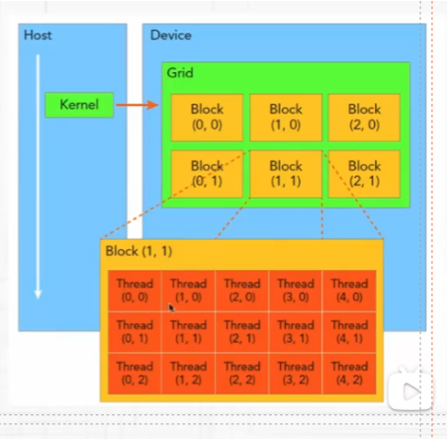
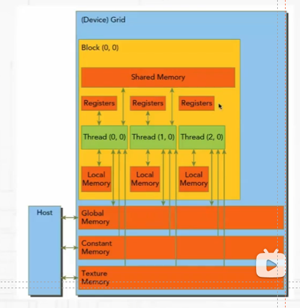

## 高性能计算基础
1. CUDA 的线程组织结构?
    * CUDA 的线程组织结构包括网格（Grid）、块（Block）、线程（Thread）的概念。
    * 一个网格包含多个块，而一个块包含多个线程。线程是基本的执行单元，块是线程的集合，网格是块的集合。
    * 每个线程有独立的线程 ID，块有独立的块 ID，通过这些 ID 可以方便地在 CUDA 程序中对数据进行同步与访问。
    

2. CUDA的存储体系结构，每一种存储的优缺点，该如何合理使用?
    * CUDA 的存储体系结构包括寄存器、共享内存、本地内存、全局内存、全局缓存、常量内存等。
    * 寄存器是 GPU 内存中访问速度最快的一种，用于存储每个线程的局部变量和临时数据, 数量有限。
    * 本地内存用于存储无法存放到寄存器中的变量，比如在较大的数据结构。
    * 共享内存是用于每个线程块内部的内存，常用于线程块内的线程之间共享数据。它比全局内存访问速度更快。
    * 全局内存是 GPU 内存中速度较低的一种，用于存储全局数据，可以被所有线程块的线程访问和写入, 容量大。
    * 全局缓存（L1和L2）是现代 GPU 具有的全局缓存，用于加速对全局内存的访问，它是速度介于全局内存和更快的内存层级之间。 
    * 常量内存用于存储只读数据，它有比全局内存更快的访问速度，但是不能被写入。
    * 其中寄存器、共享内存、本地内存是片上内存，全局内存和常量内存是片外内存。
    

3. GPU 每一代的新特性有了解过吗？应该从哪里去了解详细信息？
    * 每一代GPU都会引入新的特性，包括架构改进、新的指令集等。
    * 详细信息可以通过访问 GPU 制造商（如NVIDIA、AMD）的官方网站，查阅相应的技术文档和白皮书，以及阅读相关的学术论文来获取。

4. CUDA stream 的概念，为什么要使用多个 stream？
    * CUDA stream 是 GPU 上的任务队列，也就是命令流水线，可以在一个GPU上并行执行多个任务, 提高 GPU 利用率和性能。
    * 一个任务也可以拆成不同的部分来放到多个 stream 中进行加速, 能够实现 kernel 计算与访存的时间重叠, 提高效率。

5. GPU和CPU分别适合执行哪些程序？结合它们的硬件架构解释一下为什么它们有各自的优势。
    * CPU 通常有少量的高性能核心，每个核心的时钟频率较高，并且有复杂的控制单元。
    * GPU 包含大量的简单核心，设计用于并行处理，而且通常使用高带带宽的显存(DDR5, DDR6)，以加速数据吞吐量。
    * CPU 的单核性能强，擅长完成多重复杂任务，重在逻辑，重在串行程序。
    * GPU 适合用于 3D 游戏、视频编码、以及科学计算中的矩阵运算和物理模拟等。

6. 神经网络加速器与 CPU、GPU 相比，有什么区别呢？
    * 神经网络加速器(NPU)是专门设计用于加速人工智能和深度学习任务的硬件，其是模拟生物神经网络而构建的。
    * NPU 包含专门设计的处理单元，用于执行矩阵乘法、卷积等神经网络运算。
    * NPU 通常定制化内存结构，以最大化数据传输效率和计算密度。
    * 由于专注于特定的任务，NNA 可以实现更高的能效比，降低能耗，但是其并不通用。

7. 半精度浮点数 FP16 各个部分的具体位数，为什么要有半精度浮点数？
    * 半精度浮点数 FP16 包含1位符号位、5位指数位和10位尾数位，最大范围是 [-65504 - 66504]。
    * FP16 与 float 相比，内存占用更少，计算更快，同时在大多数情况下保持足够的精度(存储优势，计算优势，通信优势)。
        - 理想情况下，fp16 模型占用的内存只需要原来的一半，训练时可以使用更大的 batch_size。
        - 计算更快，不少 GPU 硬件都有针对 fp16 的计算进行优化，如 TensorCore
    * 但是 fp16 也会存在问题：1）数据溢出问题   2）舍入误差问题

8. TensorCore 的加速原理？
    * 并行计算：TensorCore 相比于 CUDA Core，在一个时钟周期内执行多个操作，Tensor Core 可以同时对两个4×4的FP16张量进行矩阵乘积计算，并将结果累加到另一个4×4的张量上
    * 混合精度计算：在底层硬件算子层面，TensorCore 使用半精度浮点数（FP16）进行矩阵乘法，然后使用单精度浮点数（FP32）进行累加。这种混合精度计算方法既能提高计算速度，又能在保留足够精度的同时减少内存带宽需求。
    * 那为什么 NV 不生成一个全是 Tensor Core 的深度学习专用 GPU 架构呢？
        - Tensor Core 更擅长于 GEMM, 其在通用并行任务上很可能不如 CUDA Core 高效。
        - 深度学习不只是矩阵运算, 还有很多并行运算。如果瓶颈时在并行计算，那么这种类型的深度学习任务可能更适合CUDA Core。

9. MPI，OpenMP以及CUDA各自适用的加速场景。
    * MPI 适用于分布式内存系统，用于在不同计算节点间进行通信。
    * OpenMP适用于共享内存系统，主要通过并行化代码中的循环等来提高性能。
    * CUDA 适用于 GPU 加速，通过在 NVIDIA GPU 上并行执行任务来提高性能。
    * 介绍下 OpenMP?
        - OpenMP 是基于共享内存模式的一种并行编程模型。
        - OpenMP 是以线程为基础的，其执行模式采用fork-join的方式，其中fork创建新线程来并行执行，join将多个线程合并, 控制流回到单独的线程中。

10. 平时如何进行 kernel 的优化，会用到哪些工具？
    * 避免线程束分歧，让同一个 warp 中的线程都在同一个分支下。
    * 向量化内存访问：很多 CUDA 内核都是受带宽限制的, 使用向量化访存可以减少访存指令, 指令 cache 里能够存下更多指令, 提高指令 cache 的命中率, 提高带宽利用率。
    * 全局内存合并：全局内存访问指的是多个线程同时访问全局内存时, 这些访问被合并成更少的内存事务, 这样可以提高内存访问效率。保持全局内存访问的连续性, 尽可能让同一个 warp 访问连续的全局内存地址。
    * 单个 Stream 中通过 Host 计算与 GPU 计算的 Overlap 来提高效率；多个 stream 通过内核执行, 数据传输之间的 Overlap 来提高效率。
    * 对循环体简单的循环进行循环展开。
    * 提高共享内存的访问效率，避免 bank 冲突。
    * 提高指令集并行，不论是CPU还是GPU，指令的执行都是通过流水线进行的，流水线分为多个stage，即一条指令执行完成需要每个stage的工作都执行完成。而一个时钟周期并不是完成一条指令执行的所有时间，而是每一个stage完成当前工作的时间。流水线可以同时执行多条指令的不同阶段。
    * 可以使用数据预取的方法，提高指令级的并行。数据1已读取到寄存器，使用该数据1计算前，先将后续数据2的读取指令发射，再执行一系列数据1的处理指令；这样数据1的处理和数据2的读取在流水线上同时执行着。当数据1处理完成，需要处理数据2时，可以确保数据2已经存在于寄存器中，此时类似的将数据3的读取和数据2的处理同步执行起来。
    * 使用 TensorCore 加速矩阵运算。
    * 用的工具有：`NVIDIA Nsight Compute` 和 `NVIDIA Nsight Systems`。

11. 说下 `NVIDIA Nsight Compute` 和 `NVIDIA Nsight Systems` 的用法？
    * `Nsight Systems` 提供全局视图的性能分析, 包括整体应用的执行流程、资源使用和性能特性。Nsight Systems 不仅能够分析 GPU 性能, 也能够分析 CPU、内存和系统级的性能特性。使用时主要关注: 应用整个上各个核函数以及操作消耗的事件顺序, CPU 和 GPU 之间的数据传输耗时, 多个 Stream 之间的调度信息, SM warp occupancy。
    * `Nsight Compute` 对核函数的性能特性和瓶颈进行详细的分析。使用时主要关注: SM 的吞吐量, 依据 roofline model 分析当前核函数是属于计算密集型, 还是访存密集型, 估算核函数不同线程配置对 warp occupancy 的影响。L1 cache 和 L2 cache 的吞吐量和命中率。

12. 介绍下 Roofline Model。
    * Roofline Model 其实是说明模型在一个计算平台的限制下, 到底能够达到多快的浮点计算速度。具体来说解决的问题是 计算量为A且访存量为B的模型在算力为C且带宽为D的计算平台所能达到的理论性能上限E是多少。Roofline 划分出了计算瓶颈取余和带宽瓶颈区域。模型是实际表现一定是越贴近于边界越好的, 最理想的情况, 是实际表现达到拐点处。Roofline Model 帮助确定性能瓶颈和改进空间。

13. CPU上哪些并行优化方法？
    * 适用于共享内存系统的 OpenMP，主要通过并行化代码中的循环等来提高性能。
    * 向量化指令集 SIMD 指令集，同时处理多个数据，提高向量运算效率。

14. ARM相关的库有了解过吗？
    * ARM 架构下 NEON SIMD 库, ARM Compute Library。

15. ptx 是什么，可以深度解析下吗？
    * PTX（Parallel Thread Execution）是由 NVIDIA 推出的一种GPU程序语言，用于编写在GPU上执行的并行程序。它是一种低级程序语言，类似于汇编语言，但比汇编语言更易于编写和阅读。
    * PTX提供了一系列基本指令，如加载内存、存储内存、线程同步和分支跳转等。
    * 开发者可以使用NVIDIA提供的CUDA Toolkit进行PTX程序的开发。

16. 如何确定最优的 BLOCK_SIZE ?
    * 需要结合具体的硬件环境和程序特点来进行评估。
    * CUDA 设备有每个线程块最大线程数的限制（通常为 1024 个线程）。同时，每个线程块使用的寄存器和共享内存资源也有限制。
    * 为了充分利用 GPU 的计算资源，应该选择能够高效利用寄存器、共享内存和其他硬件资源的 block_size。
    * 为了隐藏内存访问延迟和其他计算延迟，需要有足够多的线程块在运行。
    * 较大的 BLOCK_SIZE 可以提高计算效率，但也会增加内存访问冲突的可能性, 对共享内存资源造成压力。
    * 尝试不同的 block_size 来估算结果，一般都是 32 的倍数（如 64，128，256）。
    * 对于开发者而言，在启动核函数时，应将Thread个数设置为WarpSize的整数倍，这样可以减少资源的浪费；同时，应该将Block个数设置地尽可能多，这样可以减少SM闲置情况的发生，提高硬件资源利用率。

17. 如何计算CPU指令的吞吐量和时延?
    * 时钟频率：CPU的基本工作频率，以赫兹(Hz)为单位。
    * 时钟周期：时钟频率的倒数，CPU 完成一个基本操作所需时间。
    * 机器周期：CPU 完成一个指令所需时间, 通常包含多个时钟周期。
    * 指令吞吐量：CPU 每秒能够执行的指令个数, 指令吞吐量=时钟频率 / 指令周期。
    * 指令时延：CPU 执行一个指令所需要的时间，以时钟周期为单位。

18. GPU 资源调度有那些方法？
    * 先进先出调度：任务按照它们进入GPU队列的顺序依次执行。这种方法没有优先级考虑，可能导致任务等待时间较长。
    * 抢占式调度：抢占式调度允许优先级更高的任务中断正在执行的任务，以确保重要任务能够及时执行, 可能会造成饥饿现象。
    * 轮询调度：任务按照轮询的方式执行，每个任务在一个时间片内运行一段时间，然后切换到下一个任务。这种方法可以确保每个任务都有机会执行。

19. 产生 bank 冲突的原因和解决办法？
    * 为了获得更高内存带宽，共享内存被分为32个同样大小的内存模型，被称之为存储体(bank)，它们能被同时访问。
    * 如果线程束需要对共享内存进行访问，且在每个bank上只访问不多于一个的内存地址，那么该操作可由一个内存事务完成。
    * 同一线程束中不同线程访问同一bank的不同层级的不同地址就会产生bank冲突。而一旦在访问共享内存时发生bank冲突，那就需要多个内存事务才能完成，进而就会影响核函数的效率。
    * 可以使用填充的办法让数据错位，来降低冲突。

20. CUDA 核函数的执行流程？
    * CUDA运行时系统将该核函数任务指定到当前的GPU设备上，即将Grid分配到一个Device上;
    * 根据<<<>>>内的第一个参数，告诉Giga Thread Engine要调度多少个Block, Giga Thread Engine会将各个Block分配到各个SM上，一个Block只能占用一个SM，一个SM可以同时运行多个Block；
    * 当SM收到一个Block任务后，会根据<<<>>>内的第二个参数，告诉Warp Scheduler要调度多少个Thread。为了提高执行效率，Warp Scheduler会将这些Thread分组，每32个Thread为一组称为一个Warp（线程束），不足32的情况会补全，只是补充的线程不会产生真实影响。最后，每个Warp会被分配到32个Core上运行。
    * Block 的调度方法：考虑到SM的负载均衡，Giga Thread Engine大概率是轮流(轮流发牌的方法)将Block分配到SM上的。
    * Warp  的调度方法：一个Block被分配计算资源后（如寄存器和共享内存），该Block被称为Active Block，它所包含的Warp被称为Active Warp，Active Warp可以进一步分为三类——Eligible Warp、Seleted Warp和Stalled Warp。准备执行但尚未执行的Warp称为Eligible Wrap(就绪态)，正在执行的Warp称为Seleted Warp(运行态)，没有做好准备的Warp称为Stalled Warp(阻塞态)。

21. NVIDIA 的 warpsize 为 32, 为什么不能太大或者太小呢？
    * 能够支持同时获取数据，让一组Core获取当前指令时只需要一次访存，然后将指令广播给各个Core。这样不仅降低了访存时间，还降低了内存带宽占用。
    * 太大更容易导致Warp内的分支执行, GPU 没有很复杂的分支预测机制。因为一个Warp内的所有线程在一个周期中执行的指令是相同的，所以同一个Warp内的所有线程会执行所有分支，即使某些线程不满足分支条件，依然要执行，只是不产生真实影响。

22. 2080 Ti 和 A100 的的配置，背诵一下？
    * 2080 Ti:
        - 68 个 SM, 4352 个 CUDA Core, 显存是 DDR6，显存带宽 616 GB/s
        - 最大理论运算能力，fp32: 13.45 TFLOPS; fp16: 26.9 TFLOPS; INT8: 107.6 TOPS
    * A100:
        - 108 个 SM, 6912 个 CUDA Core, 显存带宽是 2039 GB/s
        - 最大理论运算能力，fp32: 19.5 TFLOPS; fp16: 39 TFLOPS; INT8: 78 TOPS

23. CUDA 中如何计算 kernel 的 warp 占用率？
    * 首先要知道，每个 block 只能分配到一个 SM 上。但是一个 SM 上可以分配到多个 block, 每个 SM 可以同时处理多个 warp，这些 warp 可以来自同一个 block，也可以来自不同的 block。
    * warp 占用率是衡量SM上活跃线程束比例的重要参数，计算公式是 `SM 中活跃线程束的数量/SM中最大线程束的数量`。
    * 通过查询 GPU 的属性，能够得到每个 SM 上的最大线程束数量，每个 SM 上的寄存器数量，每个 SM 上共享内存的数量。
    * 依据 kernel 确定每个 block 需要多少共享内存，从而确定每个 SM 上能够放置多少个 block, 还要考虑均匀分配的问题, 最终确定每个 SM 分配到了多少个 block。
    * 通过 kernel 能够确定每个线程所需要的寄存器的个数，能够得到每个 warp 所需要的寄存器个数，从而得到一个 SM 上能够放多少 warp。 

24. flash attention 的加速原理？
    * flash attention 主要解决 transformer 中计算速度慢和存储占用高的问题。但与大多数 efficient transformer 集中改进降低模型的FLOPs不同，flash attention 将优化重点放在了降低存储访问开销(MAC)。而且序列长度越长，显存节省越多。
    * 通过分块计算，融合多个操作，减少中间结果缓存；反向传播的时候，再重新计算中间结果，解决不缓存中间结果带来的梯度计算问题。
    * 其中的 self-attention 部分，直接利用分块矩阵乘法进行计算。关键问题在于解决 softmax 的分母包含与所有元素相关的求和项。解决方法就是：首先计算一个分块的局部 softmax 值，然后存储全局最大值和全局 EXP 求和项。当处理完下一个分块的时候，利用新的全局最大值和全局EXP求和项来更新旧的softmax值, 接下来在处理下一个分块，然后再更新。
    * 其中计算的 softmax 都是稳定版本的。
    * flash attention v2 相比于 v1 减少了非矩阵乘法的计算，可以利用 TensorCore 加速；调整了内外循环，Q为外层循环，KV为内存循环，减少HBM的读写，如果一个 block 是处于原始矩阵上三角部分，不进行 attention 的计算(被 mask)。

25. 常见的计算密集型的算子和访存密集型的算子？
    * 计算密集型：整个耗时主要在计算本身。大矩阵乘法、大通道数的卷积操作。
    * 访存密集型：整个耗时主要集中在存储器的访问（MAC, 存储访问开销）上。逐元素操作、Reduce操作。

26. 为什么稳定版本的 softmax 可以解决上溢和下溢的问题？
    * 当每个元素 $x_i$ 减去最大值 m(x) 后, 可知分子最大只可能是 $e^0=1$, 没有上溢的可能性，同理分母中至少有一项是 $e^0$, 因此分母不会为0。

27. 卷积的参数量和计算量(FLOPS)是如何计算的？[参考](https://blog.csdn.net/Brikie/article/details/112646865)
    * 卷积为 kernel_size=($k_h$,$k_w$), 分组数为 g, 卷积的输入特征通道数为 $C_{in}$, 输出特征图大小为 $(C_{out}, H_{out}, W_{out})$
    * 参数量:  
        - 有 bias: $(k_h\times k_w \times (C_{in} / g) + 1) * C_{out}$
        - 无 bias: $(k_h\times k_w \times (C_{in} / g)) * C_{out}$
    * 计算量: 
        - 有 bias: $(2 \times k_h\times k_w \times (C_{in}/g) * C_{out} * H_{out} * W_{out})$
        - 无 bias: $(2 \times k_h\times k_w \times (C_{in}/g - 1*g) * C_{out} * H_{out} * W_{out})$

28. 为什么 Tensor Core 可以加速深度学习？
    * 现如今的 GPU 中有三种核心，分别是 CUDA Core, Tensor Core(深度学习), RT Core(光线追踪，能够对高速对光线和声音进行渲染)。CUDA Core 是用于通用并行计算任务的计算核心；Tensor Core 是针对深度学习和 AI 工作负载而设计的专用核心，可以实现混合精度计算并加速矩阵运算；RT Core 是专门用于光线追踪处理的核心，能够高速进行光线和声音的渲染；
    * CUDA Core 每个是时钟周期只能进行一次运算，所以 CUDA Core 的数量和时钟频率限制了深度学习计算性能的提升。
    * 第一代 Tensor Core 是 volta 架构的 Tesla V100 引入的，用于执行融合乘法加法, 其允许两个 $4\times 4$ FP16 矩阵相乘并添加到 $4\times 4$ FP16 或者 FP32 矩阵中。其利用了混合精度计算，输入矩阵是 fp16，但是最终输出是 fp32, 且输出中的精度损失很小, 大大加快模型推理速度。Hopper 架构的 H100 是第四代 Tensor Core, 去掉了 RT Core, 并引入了 Transformer 引擎。
    * Tensor Core的计算速度比 CUDA Core快得多。CUDA Core 每个时钟周期执行一次操作，而Tensor Core 内核每个时钟周期可以执行多个操作。
    * 混合精度。在底层硬件算子层面，使用半精度（FP16）作为输入和输出，使用全精度（FP32）进行中间结果计算从而不损失过多精度。

29. 既然 Tensor Core 这么好，为什么不生产全是 Tensor Core 的深度学习专用GPU架构？
    * CUDA Core 针对各种并行计算任务进行了优化，更适合于通用并行计算任务。
    * 深度学习任务其不仅仅是矩阵运算，还有很多的并行计算，这就看瓶颈在哪里了。如果瓶颈时在并行计算，那么这种类型的深度学习任务可能更适合CUDA Core。Tensor Core 也能用于通用并行计算任务，但是他们可能不如 CUDA Core 高效。
    * Tensor Core的使用是有些限制的，对于GEMM计算其效果很好，其次其输入和输出数据类型需要是半精度或单精度，矩阵的维度最好是 8 的倍数。

30. 影响 GPU 性能的因素有哪些？(CUDA Core 数量，时钟频率，GPU 架构)
    * 更多 CUDA 核心数量意味着可以并行处理更多数据；更高的时钟速度意味着单个核心可以执行得更快；GPU的架构，因此具有更多 CUDA 核心的显卡不一定比具有较少 CUDA 核心的显卡更强大。
    * 由于时钟速度和CUDA核心数量的限制，NVIDIA 才针对深度学习推出了 Tensor Core。

31. vLLM 的整体调度过程？[原文](https://aijishu.com/a/1060000000458185)
    * 常规的LLM 推理过程分为 prefill 和 decoder 两个阶段，并通常会使用 KV Cache 加速推理(计算后面的 token 时, 就不需要对前面的 token 重复计算了)。
    * prefill 是预填充阶段，把整段的 prompt 喂给模型做 forward 计算，这个过程我们会把其中的 prompt 得到的 K, V 保存在 cache k 和 cache v 中。
    * decode 阶段, 依据 prompt 的 prefill 的结果，一个 token 一个 token 的生成 response。同样每走完一个 decode 过程，就会把 response KV 存入 KV cache 中。
    * 其中存在一些问题: 输出序列长度无法提前预知，很难为 KV cache 量身定制存储空间。常见的方法是，依据预先设定的(batch_size, max_sqe_len)固定的尺寸在 gpu 显存上预先开辟一块连续的存储空间(容易造成 gpu 显存不足)。
    * vLLM 通过 PagedAttention 的技术动态地请求分配 KV cache 显存，提升显存利用率。vLLM 中默认的大小为 16, 即可装 16 个 token 的 K/V 值。
    * 一个请求->操作系统的一个进程  每个逻辑内存(通过 token 来划分, 每个块的大小)  块表(逻辑内存到物理内存的映射)  物理内存(gpu真实的显存)
    * 在 prefill 阶段, vLLM 拿到 prompt, 依据事先设定好的 block 大小, 为 prompt 划分逻辑块, 划分好逻辑块之后将其映射到物理块中，通过一张表来记录映射关系。在 decode 阶段，使用 KV cache 计算 attention, 产生新的 K, V cache, 更新逻辑块、物理块和 block table。
    * 这样的优势主要能体现在以下几个方面:
        - parallel sampling: 同样的 prompt 希望能够续写，给出三种不同的回答。由于 PagedAttention 的存在，所以 prefiil 阶段, 逻辑内存就能共用，物理内存相同，在 decode 阶段，在将自己的部分映射到不同的 block 中。对于相同数据对应的KV cache，能复用则尽量复用；无法复用时，再考虑开辟新的物理空间。
        - beam search: 在每个decode阶段，我不是只产生1个token，而是产生 top k 个token（这里k也被称为束宽）。top k个token必然对应着此刻的top k个序列。我把这top k个序列喂给模型，假设词表的大小为|V|，那么在下一时刻，我就要在k * |V|个候选者中再选出top k，以此类推。每个轮次都要淘汰一批序列，这个直接将淘汰的序列的内存释放掉就可以了。
    * 这种动态分配显存的方式还要解决，表面上能处理更多的 prompt 了，但是没有为每个 prompt 留出充足的显存空间，显存会出现大满的情况。解决方法如下：
        - 当有一堆请求到达vLLM服务器时，vLLM肯定优先处理来得早的请求。当 gpu 显存满的的时候，暂停这堆请求中最后到达的那些请求的推理，同时将它们相关的KV cache从gpu上释放掉，以便为更早到达的请求留出足够的gpu空间，让它们完成推理任务。等gpu资源充足时，重新恢复它们的执行。
        - 恢复他们的执行有两种方法：交换策略和重新计算策略:
            - 当一堆请求来到vLLM服务器上时，按照First-Come-First-Serve（FCFS）原则，优先处理那些最早到来的请求。
            - 当gpu资源不足时，为了让先来的请求能尽快做完推理，vLLM会对那些后到来的请求执行“抢占”，即暂时终止它们的执行。
            - 一旦vLLM决定执行抢占操作，它会暂停处理新到来的请求。在此期间，它会将被抢占的请求相关的KV block全部交换（swap）至cpu上。等交换完成后，vLLM才会继续处理新到来的请求。
            - 当vLLM认为gpu有足够资源时，它会将cpu上的KV block重新加载回gpu，恢复被抢占请求的执行（recomputation）。
    * vLLM 在很多场景下许哟啊多卡完成推理，操作是：
        * vLLM 有一个中央调度器，负责计算和管理每张卡上KV cache从逻辑块到物理块的映射表(block tables)。
        * 在做分布式计算时，Schedular会将映射表广播到各张卡上，每张卡上的Cache engine接收到相关信息后，负责管理各卡上的KV block。

31. paged attention 优化？
    * PagedAttention 地设计灵感来自操作系统地虚拟内存分页管理技术。能够扩展 GPU 的显存并解决显存利用率不足的问题。
    * paged attention 技术能够动态地为请求分配 KV Cache 显存，提升显存利用率。