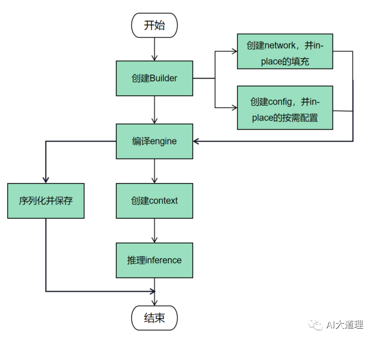

1. MLIR 有了解过吗？ONNX有了解过吗？
    * MLIR 是一个多级中间表示框架, 目的是为了解决当前深度学习领域中存在的 IR 碎片化问题。
    * ONNX 是一种开放的IR，主要用于不同深度学习框架之间的模型转换和互操作性。
    * ONNX 通过定义了一套标准化的算子和模型格式来实现。
    * 无论使用何种训练框架训练模型（pytorch/ tensorflow）, 在训练完毕后都可以将这些框架的模型统一转换为 ONNX 这种格式进行存储。

2. TVM 的整体架构是什么呢？
    * 前端输入：支持多种深度学习框架的模型做为输入（pytorch/ tensorflow）, 将其转换成中间表示 IR。
    * 中间表示：TVM 使用两级 IR，Relay 和 TIR；Relay是高级IR，用于表示高级神经网络算法; TIR 是接近硬件操作的的低级 IR。
    * 自动调度：自动优化模型的计算图(算子融合)和内核实现。
    * 运行时：TVM 提供清亮的 Runtime, 支持模型在 CPU，GPU，FPGA 上进行部署和执行。

3. 为什么要进行推理优化呢？直接用tensorflow或者pytorch的推理接口不行吗？
    * tensorflow或者pytorch的这种训练推理框架，不能很好的优化模型在特定设备上的推理能力。
    * 主要是为了提高模型在实际应用中的性能，解决其在推理面临的高计算复杂度、大内存需求等问题
    * 通过推理优化可以加快推理速度(对在线翻译、自动驾驶尤其重要)；减少内存和计算资源的消耗（计算的更有效率了）；减低部署成本（使用更低算力的设备就能解决问题）

4. 模型推理优化的常用方法有哪些？
    * 推理性能优化的常用方法主要包括`模型的压缩技术`和`推理加速技术`。
    * 模型的压缩技术主要包括：
        - 模型剪枝：从大型网络中筛选出不重要的神经元以及权重，将它们从网络中删除，同时尽可能地保留网络的性能。
        - 模型量化：将高精度表示的网络权重和激活值用低精度来近似表示，实现模型轻量化, FP16量化, INT8量化。
        - 模型蒸馏：将复杂、学习能力强的网络学到的特征，表示成“知识”蒸馏出来，传递给参数量小、学习能力弱的网络。
    * 推理加速技术主要包括：
        - 算子融合：因为每个 op 都会对应一个内核调用和多次显存读取；小的 op 启动 GPU kernel 的时间甚至会大于 GPU 计算时间；所以将算子合并能够有效地提高计算性能。Conv + BN 的融合
        - 计算图优化：节点融合(将两个相邻矩阵乘法操作合并成一个操作，减少中间数据的生成和存储)、并行化分支替代单分支、识别提取计算图中的子图，将其替换为已经优化好的库函数或者自定义内核, 死代码消除(移除计算图中不会被执行的节点和操作)。
        - CPU 频率远快于主存访问速度，造成CPU常常需要等待主存，利用 cache 局部性原理来提高缓存命中率。时间局部性（如果某个数据被访问，那么在不久的将来它很可能被再次访问）和 空间局部性（如果某个数据被访问，那么与它相邻的数据很快也可能被访问）

5. TensorRT 对模型实现了哪些推理优化？
    * 常量折叠：预计算图中那些在推理前就能确定结果的表达式，在编译期间提前计算并简化，减少运行时的计算负担。
    * 算子融合：将多个 Op 合并为一个复合 Op, 减少Kernel启动次数和内存访问次数。
    * 层融合(layer fusion)：
        - 垂直合并网络层（算子融合）：比如将 Conv 、BN、ReLU 三个层进行合并为一个层（CBR）。
        - 水平合并网络层：将输入相同，操作相同的层进行水平合并。
            * 水平融合有效果主要是因为减少了冗余计算和减少内存访问。
            * 多个相同操作的层在执行时会有大量的重复计算，合并这些层，可以减少冗余操作。
            * 多个层计算会涉及多次内存读写操作，合并后可以减少这些内存读写操作。
        - 直接融合掉 Concat 操作：将 Concat 的输入直接送入到下面的操作中，不再单独进行 concat 后在输入，减少了一次传输吞吐。
    * 多流执行：通过多流来同时处理多个推理请求，提高吞吐量。
    * 量化：将模型中的权重和激活值从浮点数转换为低精度的表示形式。TensorRT提供了量化校准工具，以最小化量化带来的精度损失。
    * 内核自动调整：依据不同的显卡型号，选择不同的优化策略以及计算方式，寻找最适合当前架构的计算方式(TensorRT 预先已经写好，有个自动筛选的过程)。

6. 算子融合为何能够加速推理，优化了哪一个部分呢？
    * 算子融合通过将多个操作合并为一个单一复合操作来减少模型中的层次。
    * 减少了内存访问次数和数据传输量，因为它降低了中间结果的读写需求。
    * 减少了内核启动次数，减少了内核启动造成的时间浪费。

7. 有那些算子融合的技术(TensorRT用到了那些算子融合？)
    * 卷积与激活函数融合：Convolution 与 ReLU(Sigmoid) 的融合
    * BN层与激活函数融合：Batch Normalization 与 ReLU(Sigmoid) 融合
    * 卷积与BN层的融合：将卷积操作和紧随其后的批归一化融合成一个操作，减少内存访问和计算时间。
    * 卷积与BN与激活函数的融合
    * 元素级操作融合：将多个逐元素操作(加法、乘法)融合成一个内核。
    * 矩阵乘法和加法(偏置项)融合成一个操作
    * softmax 与 log 进行融合
    * 多个矩阵乘法也能融合

8. 算子融合在推理框架中是如何实现的呢？
    * 推理框架会加载和解析深度学习模型, 将模型转换为计算图（有向无环图）的形式，节点表示操作，边代表数据依赖关系。
    * 算子融合包含以下几个步骤：
        - 模式匹配：使用模式匹配算法识别计算图中的融合机会。例如，识别卷积层和紧随其后的激活函数。
        - 子图替换：识别出可融合的子图后，框架会将这些子图替换为单个节点或更优化的子图。
        - 内存优化：在融合过程中，框架会优化内存分配和数据布局，以减少内存带宽和提升缓存利用率。

9. TensorRT 如何进行自定义算子开发？
    * 自定义算子主要分为三步：定义插件类、实现算子逻辑、注册插件。
    * 定义插件类：继承 `nvinfer1::IPluginV2`, 实现其虚函数，包括数据类型和格式配置（configureWithFormat）、序列化与反序列化（serialize 和 deserialize）、输出维度（getOutputDimensions）。
    * 实现算子逻辑：在 enqueue 函数中实现算子的具体计算逻辑。
    * 注册插件：继承 `nvinfer1::IPluginCreator` 接口注册插件，使得TensorRT能够识别和使用自定义算子。
    * 验证正确性和性能，与预期结果对比，验证自定义算子是否正确，性能是否达标。

10. 模型量化的加速原理？
    * 模型量化是指将模型中的权重和激活值的数据类型从浮点数（如FP32）转换为低精度的格式（如INT8或FP16）
    * 减少了模型的内存占用，降低了计算所需的内存带宽, 能显著减少模型大小。
    * 利用专门的低精度计算单元，加速模型的推理过程。

11. 模型量化带来的精度损失如何解决？
    * 精度损失原因：量化过程中，由于将浮点数映射到有限的整数范围，会引入量化误差，导致模型的精度下降。
    * 可以通过量化校准和量化感知训练来解决：
        - 量化校准：量化前后对模型进行校准，选择最优的量化参数(量化比例和零点), 最小化量化误差, 通常包括最大值校准和百分位校准。
        - 量化感知训练：在模型训练过程中模拟量化效果，让模型适应量化带来的误差。

12. ONNX Runtime支持在多种硬件上进行推理，说明具体的实现机制。
    * ONNX Runtime 是一个用于优化和运行机器学习模型的推理引擎
    * ONNX Runtime 支持 ONNX 格式的模型，能够使用不同AI框架训练的模型在不同的平台和设备上运行。
    * ONNX Runtime 提供一系列 `执行提供程序` 来支持不同的硬件。每个执行提供程序都针对不同的硬件实现了ONNX中的操作。根据硬件资源自动选择最适当的程序。

13. 如果要为硬件公司开发一套推理框架，应该重点关注那些部分呢？
    * 推理框架的核心组成部分应该分成如下几个：
        - 模型解析器：负责将各种AI框架转换为框架能够理解和执行的内部格式 IR。
        - 图优化引擎：通过算子融合、常数折叠等技术优化计算图，减少不必要的计算，提高执行效率。
        - 执行引擎：负责根据优化后的计算图，在特定的硬件上执行计算任务，为不同硬件提供定制化支持，确保模型能够在多种平台上高效运行。。
    * 主要关注点应该落在 框架的兼容性和适配性 和 充分利用硬件来优化性能。

14. 各种推理框架都有何优劣势？它们的性能怎么样？
    * TensorRT：
        - 优势：专门为 NVIDIA GPU 设计，提供高度优化的推理性能，很适合高吞吐量的服务器端和边缘设备。
        - 劣势：只能用在 NVIDIA GPU 上，不适用于其他硬件。
        - 性能：在 NVIDIA GPU 上，通常能达到最佳的推理速度和效率。
    
    * ONNX Runtime：
        - 优势：支持多种平台框架，CPU、GPU、FPGA。与 ONNX 模型格式紧密集成，方便从不同的训练框架迁移模型。
        - 劣势：虽然支持多种硬件，但在特定硬件上的优化可能不如专门的推理引擎深入。
        - 性能：提供良好的跨平台性能，但在特定硬件上可能不是最优。
    
    * TensorFlow Lite：
        - 优势：专为移动和嵌入式设备优化，减少模型大小和提升推理速度，广泛应用于Android和IOS设备。
        - 劣势：只针对移动设备和嵌入式设备进行优化进行优化。
        - 性能：在移动设备上提供优化的推理性能，特别是在支持NEON指令集和GPU加速的设备上。

15. 分布式训练中有那些并行模式？每种模式的优缺点是什么？
    * 数据并行：将数据集划分为多个子集，每个设备或节点负责处理一个子集，并在每个子集上独立训练模型。通过梯度聚合和同步来更新模型参数。
        - 优势：数据并行适用于大规模训练数据集和相对较小的模型，能够提高训练速度。
        - 劣势：需要大量的通信开销，因为设备之间需要传输梯度信息。此外，需要额外的内存来存储模型副本和梯度。
    * 模型并行：将模型分解为多个部分，在不同的设备或节点上并行处理。每个设备只负责处理模型的一部分，并与其他设备交换中间结果。
        - 优势：适用于大型模型或需要更高计算需求的任务，允许训练更大规模的模型。
        - 劣势：需要更复杂的编程和通信模式，以确保各个设备之间的协同工作。可能存在设备之间的通信瓶颈。
    * 可以将数据并行和模型并行结合使用，以充分利用多个设备和节点的计算能力。

16. 分布式训练我们重点要处理的问题有哪些呢？
    * 通信开销：非常需要关注设备之间的通信开销和传输延迟，可以采用压缩，稀疏化，量化等技术。
    * 容错性：多机训练中，必须考虑训练中的设备故障或网络异常。

17. MPI 可以应用于 AI 框架的那些方面呢？
    * 数据并行：MPI通过消息传递，可以在不同计算节点之间传输数据，实现数据的并行处理。
    * 参数同步：MPI通过消息传递，可以在计算节点之间进行参数的同步和更新，确保所有节点上的模型参数保持一致。
    * 容错性：MPI 提供了容错功能，可以在计算节点故障后重新分配任务和数据，保证训练过程的连续性和可靠性。

18. 反向传播的原理，具体实现是什么呢？
    * 前向传播：是神经网络训练和推理过程中用于计算网络输出的过程，输入数据依次通过网络的每一层，经过一系列线性变换和非线性激活函数，最后生成预测输出。
    * 反向传播：用于计算神经网络中每个参数的梯度，从而更新参数以最小化损失函数。其基本原理是利用链式法则（链式求导法则）来逐层计算梯度。

19. TensorFlow 和 Pytorch 的设计思路有何不同？有和优劣？
    * TensorFlow：由Google开发，使用静态计算图，需要先定义后台运行，计算效率通常会更高一些。
    * Pytorch：由 FaceBook 开发，使用动态计算图，允许即时修改和执行，非常适合研究工作。
    * TensorFlow 支持移动和嵌入式的部署（Tensor Lite），对于高性能服务器还有 TensorFlow Serving 可用, 包含 Pytorch 很多框架都没有这个功能。

20. Pytorch 中如何自定义算子呢？
    * 实现算子：实现自定义算子的 CUDA 版本或者 C++ 版本, 算子文件。
    * 注册算子：包含 `#include<torch/extension.h>` 头文件，使用 Pytorch 的 C++ 前端定义函数，做些类型检查和调用自定义算子，利用 Pytorch 自带的 pybind11 注册函数的 Python 接口，注册文件。
    * 编译加载算子：利用 pytorch中的 `torch.utils.cpp_extension` 来编译(提供刚才定义的两个文件名)、加载算子(根据注册到Python的文件名)。
    * 执行算子。
    * 使用 `torch.utils.cpp_extension.load` 来加载自定义算子时，是在运行到加载自定义算子的那一行代码时，才会进行编译和加载。这种即时编译和加载方式保证了在开发的过程中能够快速迭代和测试算子。
    * 如果想要使得自定算子能够顺利地进行反向传播，就需要实现其前向传播和反向传播方法地算子。然后最后多加一步，利用 `torch.autograd` 自定义一个算子 function, 把前向传播和反向传播都包装进去（分别在 function 中的 forward 和 backward 方法中）。

21. 卷积操作中常见三种加速方式 im2col+GEMM、Winograd、FFT，这些方法的优缺点是什么呢？
    * im2col（image to column）：将卷积操作转换为矩阵乘法GEMM，将输入特征图的局部感受野展开成多个列，然后与感觉核矩阵进行乘法计算。
        - 优点：适用于各种卷积层，矩阵优化可以使用高度优化的线性代数库 cuBLAS 进行加速。
        - 缺点：im2col 转换会显著增加内存使用量, 尤其是对大尺寸输入特征图和大卷积核。
    * Winograd：将卷积操作转换为小矩阵乘法来减少计算量。
        - 优点：对于小卷积核(3×3), Winograd 能够显著减少乘法操作次数，在卷积核较小的时候非常高效。
        - 缺点：主要适用于小卷积核(3×3), 对大卷积核效果不佳。
    * FFT：利用快速傅里叶变换，将卷积操作转换为频域中的乘法操作，然后通过逆傅里叶变换返回空间域。
        - 优点：对于大尺寸卷积核，FFT 可以显著减少计算复杂度。
        - 缺点：FFT和iFFT需要额外的计算开销，需要较大内存空间来存储频域表示，对于小卷积核不能有很好的加速效果。

22. 常见的移动端的推理框架都有那些呢？
    * TensorFlow Lite：用在移动设备上运行 TensorFlow 模型的轻量级解决方案。
    * ONNX Runtime Moblie：ONNX Runtime 的移动版本，专门为移动设备进行优化。
    * NCNN：由腾讯开源的高性能神经网络前向计算框架，专为移动端优化。

23. 移动端和服务器端的推理优化思路有何不同呢？
    * 电池容量和寿命：移动端设备的电池寿命是重要考虑因素，优化性能时需要考虑减少能耗。
    * 存储限制：移动设备的存储空间有限，模型大小通常要控制在合理的范围内。
    * 实时性：移动端的计算能力有限，而且对延迟更加敏感，需要更高效的模型和优化方法，将推理时间控制在可接受的范围内。

24. 移动端用到的加速技术有那些？
    * ARM NEON：arm 架构处理器的高级 SIMD 指令集，加速向量运算。
    * GPU 加速：使用移动设备的 GPU 进行并行加速，如通过 OpenCL 等
    * DSP 指令集：用于加速音频和图像处理的专用指令集。

25. 自动驾驶的推理框架，应该重点关注那些指标呢？
    * 延迟：推理延迟直接影响到自动驾驶系统的响应时间, 低延迟对于自动驾驶系统至关重要。
    * 吞吐量：需要处理大量数据（摄像头，激光雷达）, 高吞吐量可以保证系统能在规定时间处理完所有输入数据。
    * 准确性：推理的准确性直接关系到自动驾驶的安全和可靠性。
    * 能耗：低能耗对于自动驾驶车辆的续航能力和总体功耗管理至关重要，特别是在电动车中。

26. 推理引擎序列化？
    * 序列化是指将引擎转换为一种指定的格式，以便存储和以后使用进行推理，当推理时只需要反序列化引擎即可。
    * 因为从模型定义到生成推理引擎，通常是非常耗时的，通过推理引擎序列化能够避免重复构建推理引擎。
    * 序列化引擎通常不能跨平台和TensorRT版本移植。

27. TensorRT 使用流程？
    * TensorRT 整个过程分成 模型解析(Praser), engine 优化 和 执行。
    * 输入一个预训练好的模型，将模型通过 parser 等方式输入到 TensorRT 中，TensorRT 进行一系列的优化，生成一个 Serialization（序列化串）。将生成好的 Serialization 放到内存或者文件中。
    * 读入序列化引擎，反序列化。在执行之前创建 context（预先分配资源），在 context 做 engine 的推理。
