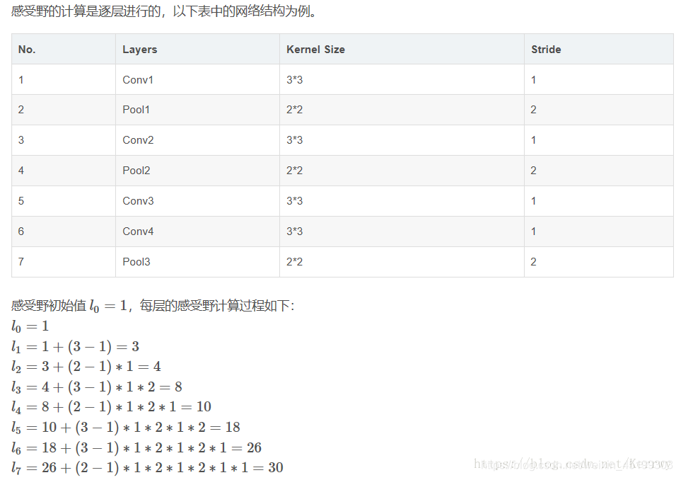
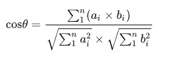

## 深度学习基础
1. Conv 与 BN 融合过程
    * Conv 与 BN 两个算子都是做线性计算, 所以可以融合成一个算子。融合过程如下公式所示:
    * 其实融合后的效果就是, 对每个卷积核乘以了一个缩放系数。对每个卷积核的偏置, 先缩放再偏移。
    ```python
    from collections import OrderedDict
    import numpy as np
    import torch
    import torch.nn as nn

    def main():
        torch.random.manual_seed(0)

        f1 = torch.randn(1, 2, 5, 5)
        module = nn.Sequential(OrderedDict(
            conv=nn.Conv2d(in_channels=2, out_channels=4, kernel_size=3, stride=1, padding=1, bias=False),
            bn=nn.BatchNorm2d(num_features=4)
        ))

        module.eval()
        with torch.no_grad():
            output1 = module(f1)
            print(output1)

        # Conv 参数
        kernel = module.conv.weight             # [4, 2, 3, 3]

        # bn 参数
        running_mean = module.bn.running_mean    # [4] 
        running_var = module.bn.running_var      # [4]
        gamma = module.bn.weight                 # [4]
        beta = module.bn.bias                    # [4]
        eps = module.bn.eps                      # 1e-5
        
        # 融合后的参数
        std = (running_var + eps).sqrt()         # [4]
        t = (gamma / std).reshape(-1, 1, 1, 1)   # [ch] -> [ch, 1, 1, 1]
        kernel = kernel * t                      # [ch] -> [ch, 1, 1, 1]
        bias = beta - running_mean * gamma / std # [ch]

        # 开始融合
        fused_conv = nn.Conv2d(in_channels=2, out_channels=4, kernel_size=3, stride=1, padding=1, bias=True)
        fused_conv.load_state_dict(OrderedDict(weight=kernel, bias=bias))

        with torch.no_grad():
            output2 = fused_conv(f1)
            print(output2)

        np.testing.assert_allclose(output1.numpy(), output2.numpy(), rtol=1e-03, atol=1e-05)
        print("convert module has been tested, and the result looks good!")

    if __name__ == '__main__':
        main()
    ```

2. 反向传播的原理有何不同？(https://blog.csdn.net/weixin_45186425/article/details/128167040)
    * 使用损失函数定义预测值与真实值之间的差异。当损失函数越小时, 说明模型的效果越好, 我们通常追求损失函数最小时所对应的权重向量 w。对于凸函数而言, 导数为 0 的点就是极小值点, 因此尝尝先对权重 w 求导, 然后再令导数为 0 来求解极值和对应的 w。但是对于像神经网络这样的复杂模型，可能会有数百个w的存在。令所有权重的导数为 0 并且一个个求解方程难度很大, 工作量也很大。所以使用 `逐步迭代的方法, 使得损失函数到达最小值`。
    * 梯度向量是多元函数上，目标值对各个自变量的偏导数组成的向量。比如损失函数是 `L(w1, w2, b)`, 在损失函数上对 `w1, w2, b` 这三个自变量求偏导, 求得的梯度向量的表达式是 $\left[\frac{\partial L}{\partial w_{1}}, \frac{\partial L}{\partial w_{2}}, \frac{\partial L}{\partial b}\right]^{T}$。
    * 为了控制每次走的距离的大小, 将步长 $\eta$ 加入公式, 所以权重迭代公式为 $w_{(t + 1)} = w_{(t)} - \eta \frac{\partial L}{\partial w_{(t)}}$ 。偏导数的大小影响整个梯度向量的大小, 偏导数前的减号影响整体梯度向量的方向。当 $\eta$ 设置的很大的时候, 梯度下降的每一个步子就迈的很大, 走的很快, 设置的很小的时候就走的很慢。
    * 动量法: 整体思想就是在梯度的历史方向与现有方向相同时, 卖出大步子, 在历史方向与现有方向相反时, 迈出小步子。做法就是让上一步的梯度向量与现在这一点的梯度向量以加权的方式求和, 求解出受到上一步大小和方向影响的真实下降方向。$v_{t}=\gamma v_{(t-1)}- \eta \frac{\partial L}{\partial w}$。$w_{(t+1)}=w_{(t)}+v_{(t)}$

3. 卷积神经网络中, 卷积操作生成特征图的形状公式？
    * 假设输入特征图的大小为 $H\times W \times C$, 有 N 个卷积核, 每个卷积核的大小为 $f_h \times f_w \times C$, 步幅为 $s_h$ 和 $s_w$, 填充为 $p_h$ 和 $p_w$。那么输出特征图的大小为 $O_h \times O_w \times N$。其中 $O_h$ 和 $O_w$ 的计算公式为:
        - $O_h = \frac{H-f_h+2\times p_h}{s_h} + 1$
        - $O_w = \frac{W-f_w+2\times p_w}{s_w} + 1$
    * 举个例子, 输入特征图大小为 $28\times 28 \times 3$, 有 4 个卷积核, 每个卷积核的大小为 $3\times 3\times 3$, 步幅为 1, 填充为 1。
        - $O_h = \frac{28-3+2\times 1}{1} + 1 = 28$, $O_w = \frac{28-3+2\times 1}{1} + 1 = 28$
        - 所以输出特征图大小为 $28\times 28\times 4$

4. 卷积神经网络, 感受野的计算公式？
    * 感受野的定义是卷积神经网络中每一层输出特征图上的像素点在输入图片上映射的区域的大小。感受野的计算公式为:
        - $l_k = l_{k-1} + ((f_k-1)\times \prod _{i=1}^{k-1}{S_i})$, 其中 $l_k$ 表示第 $k$ 层的感受野的边长, $k_{k-1}$ 表示第 $k-1$ 层的感受野, $f_k$ 表示第 $k$ 层卷积核的大小, $S_i$ 表示第 $i$ 层的步长。
    * 一般来说第一层感受野为该层卷积核的大小, 而且感受野只与卷积核尺寸和步长有关。如下是计算感受野的例子:
    

5. 大模型架构对比盘点？
    
    * 大模型的的架构通常可以分为 3 类, `Encoder-Only` 和 `Decoder-only` 和 `Encoder-Decoder` 结构。这三种结构各有优势, 应用场景和前景也不尽相同。
    * `Encoder-Only` 结构:
        - 经典模型 BERT, 仅包含 Transformer 的编码器部分, 适用于不需要生成序列的任务, 只需要对输入进行编码和处理的单向任务场景, 如文本分析, 情感分析。
        - 优点是能够更好的理解输入文本的语义和上下文的信息。缺点是无法直接生成文本输出, 在文本生成任务中不太适用。
    * `Decoder-Only` 结构:
        - 经典模型 GPT, 也被称为生成式架构, 仅包含 Transformer 中解码器的部分。常用于序列生成任务, 如文本生成, 机器翻译。这种架构可以进行无监督预训练, 模型通过大量的无标注数据学习语言的统计模式和语义信息。
        - 擅长的点是创造性写作。缺点是需要大量的训练数据来提高生成文本的质量和多样性。
    * `Encoder-Decoder` 结构:
        - 经典模型 T5, 序列到序列的架构, 同时包含 Transformer 的编码器和解码器。Encoder-Decoder 架构的核心思想是利用编码器对输入序列进行编码，提取其特征和语义信息，并将编码结果传递给解码器。然后，解码器根据编码结果生成相应的输出序列。
        - 优点更好的处理输入序列与输出序列之间的关系, 提高机器翻译的准确性。缺点是模型的复杂度过高, 训练时间和计算资源消耗比较大。

6. 具体对比下 GPT 和 BERT 的异同？
    * 适用于任务的不同:
        * ChatGPT 主要用于生成式的 NLP 任务，如对话生成和文本摘要等。这是因为 ChatGPT 是一个单向的语言模型，它只考虑了文本的前面部分，而没有考虑后面的部分。因此，它可以在输入未完整时预测接下来的词汇，这使得它在生成式任务上表现出色。
        * BERT主要用于判别式的NLP任务，如文本分类和情感判别。相比于 ChatGPT，BERT 采用了双向的语言模型，它可以同时利用文本的前面和后面信息来推断当前的上下文。
    * 训练方式的不同:
        * ChatGPT 是通过将大量文本数据输入到网络中进行训练来学习文本表示。
        * 而 BERT 则是通过`预先训练`和`微调`两个步骤进行的。在预先训练时，BERT 使用了两个任务：`掩码语言建模`和`下一句预测`，以学习通用的文本表示，然后在微调阶段将其应用于具体的NLP任务。
    * 计算效率的不同:
        * ChatGPT 的计算效率是较低的, 因为要一个 token, 一个 token 的生成, 每次生成也要用到以前的输入进行计算。
        * BERT 是有更好的并行性, 计算效率通常是较高的。

7. 手撕目标检测中的 `NMS` 的 C++ 代码？
* 整体的难点就两个, 1）计算两个框的 IOU    2）NMS 的过程
* 1) 计算两个框 IOU, 就以两个框相交的示意图来寻找交集的左上角和右下角的点的坐标。新的左上角的坐标, 是原始的两个左上角的坐标产出。新的右下角的坐标, 是原始的右下角的坐标的产出。IOU = 交集/并集 = 交集/(面积1+面积2-交集)。
* 2）NMS的过程。核心是维护一个 order, order 的初始值是原始的框依据 score 排序后的结果的下标。然后每次取出第一个值(score 最大) 放入 keep 数组中, 计算与其他框的 IOU, 保留那些小于等于阈值的索引。然后生成新的 order。
```C++
#include <iostream>
#include <vector>
#include <algorithm>

struct Box {
    int x1, y1, x2, y2;  // (x1, y1) 是左上角点的坐标 (x2, y2) 是右下角点的坐标
    Box(int x1, int y1, int x2, int y2):x1(x1), x2(x2), y1(y1), y2(y2){};
};

// 计算两个边界框的交并比
float iou(const Box& box1, const Box& box2) {
    // 以两个框相交为示意图来找交集的左上角和右下角的点的坐标
    // 交集左上角的坐标 x, y 为两个框左上角的对应分量取最大值。
    int x1 = std::max(box1.x1, box2.x1);
    int y1 = std::max(box1.y1, box2.y1);

    // 右下角的坐标为 x,y 为两个框右小角的对应分量取最小值
    int x2 = std::min(box1.x2, box2.x2);
    int y2 = std::min(box1.y2, box2.y2);

    // 计算交集的宽和高
    int width = std::max(0, x2 - x1);
    int height = std::max(0, y2 - y1);

    // 交集的面积
    int intersection = width * height;

    // IOU 的计算公式为 交集/并集 = 交集/(A面积+B面积-交集)
    int area1 = (box1.x2 - box1.x1) * (box1.y2 - box1.y1);
    int area2 = (box2.x2 - box2.x1) * (box2.y2 - box2.y1);

    float iou = static_cast<float>(intersection) / (area1 + area2 - intersection);

    return iou;
}

// NMS算法实现, 其实是维护了一个索引表, 那些索引的 box 保留
std::vector<int> nms(const std::vector<Box>& boxes, const std::vector<float>& scores, float threshold) {
    // 先记录原始顺序
    std::vector<int> order(scores.size());
    for (int i = 0; i < scores.size(); i++) {
        order[i] = i;
    }

    // 按照得分降序排列边界框的索引, 这种操作第一次见到, 依据一个外值, 影响索引
    std::sort(order.begin(), order.end(), [&](int a, int b) { return scores[a] > scores[b];});

    std::vector<int> keep;         // 用于存储保留的边界框索引
    while (!order.empty()) {       // 候选的 框不为空就一直重复操作
        int base = order[0];       // 选择得分最高的边界框
        keep.push_back(base);      // 将该边界框的索引添加到保留列表中

        // 记录保留框的那些索引, 存储交并比小于阈值的索引
        std::vector<int> new_order;  // 存储更新后的order数组
        for (int t = 1; t < order.size(); t++) {
            float tmp = iou(boxes[base], boxes[order[t]]);  // 计算当前边界框与其他边界框的交并比
            if(tmp <= threshold) new_order.push_back(order[t]);         // 将交并比小于阈值的边界框的索引添加到列表中
        }

        order = std::move(new_order);
    }

    return keep;  // 返回保留的边界框索引
}

int main() {
    // 示例输入
    std::vector<Box> boxes = {{50, 50, 100, 100}, {60, 60, 120, 120}, {70, 70, 130, 130}, {80, 80, 140, 140}};
    std::vector<float> scores = {0.9, 0.75, 0.8, 0.95};
    float threshold = 0.5;

    // 调用NMS算法
    std::vector<int> keep = nms(boxes, scores, threshold);

    // 打印保留的边界框索引
    std::cout << "保留的边界框索引：";
    for (int i = 0; i < keep.size(); i++) {
        std::cout << keep[i] << " ";
    }
    std::cout << std::endl;

    return 0;
}
```
8. 计算样本向量的相似度的方式通常有以下几种？
    - 欧氏距离: $d\left(A, B\right)=\sqrt{\sum{\left(a_i-b_i\right)}^2}, i=1, 2,..., n$。`euclidean_dist = np.sqrt(np.square(vector_1 - vector_2).sum())`。欧式距离越小相似度越大。
    - 余弦相似度: 把两个向量看成空间中的两条线段, 都是从原点, 指向不同的方向。余弦相似度是利用两个向量之间的夹角的余弦值来衡量两个向量之间的余弦相似度。余弦相似度的取值范围为 `[-1, 1]`, 余弦值越大, 表示两个向量的夹角越小, 向量相似度越高。
    
```python
cosine = (float(np.dot(vector_1, vector_2)) / 
            (np.linalg.norm(vector_1) * np.linalg.norm(vector_2)))
​
# 有时需要用0到1的小数来表示余弦距离，可以将其归一化到[0,1]区间
normalized_dist = （1-cosine）/ 2.0
```
    - 编辑距离: 比较字符串相似度常用的方法, 把一个字符串通过插入、删除或替换这样的编辑操作，变成另一个字符串，所需要的最少编辑次数，这种就是编辑距离。
$$editRatio = 1-\frac{editDist}{len(str1)+len(str2)}$$
9. 欧氏距离与余弦距离的差异？
    - 欧式距离: 衡量的是空间各点的绝对直线距离, 与各个点的坐标直接相关。能够体现个体数值特征的绝对差异，所以更多的用于需要从维度的数值大小中体现差异的分析。
    - 余弦相似度: 是空间向量的角度关系, 更加体现在方向上的差异, 而不是位置上。更多的用于使用用户的内容评分来区分兴趣的相似度和差异，同时修正了用户间可能存在的度量标准不统一的问题（因为余弦距离对绝对数值不敏感）。
10. 深度学习优化器总结?
    - SGD(Stochastic Gradient Descent, SGD): 随机梯度下降法, 其中随机的意思是指不用全部数据, 每次只挑选一部分数据来优化模型, SGD 的好处就是可以在保证模型精度的同时降低计算量, 让神经网络可以应用在更大规模的数据上。SGD的公式是 $\theta _{t+1}=\theta _{t}-\gamma g_{t}, \theta, \gamma, g 分别代表参数、学习率、梯度$。
    - SGDM: SGD 会遇到震荡的问题, 导致模型收敛过慢。引入动量(Momentum)的概念, 抵消梯度中那些变化剧烈的分量, 加快收敛速度。SGDM 的公式为 $\theta _{t+1}=\theta _{t}-\gamma v_{t}, v_t = uv_{t-1}+g_t$, 其中 u 取值 0.9, 用于指数加权移动平均, 可以减小更早时刻梯度对当前梯度的影响。
    - RMSProp: 能够实现不同的参数能够使用不同的学习率, 自适应地调整学习率。公式是 $\theta _{t+1}=\theta _{t}- \frac{\gamma}{\sqrt{s_t}+\epsilon}g_t, s_t=\alpha s_{t-1} + (1-\alpha)g_t^2$, $s_t$ 表示历史中所有梯度的平方和, $\alpha$ 代表指数加权移动平均法的参数, 减小之前震荡过大的参数的学习率，增大更新速率较慢的参数的学习率。
    - Adam: SGD 算法主要优化梯度问题, RMSProp 方法主要优化学习率的问题, SGD Momentum + RMSProp 就是 Adam 的算法。$\theta _{t+1}=\theta _{t}- \frac{\gamma}{\sqrt{s_t}+\epsilon}g_t, s_t=\alpha s_{t-1} + (1-\alpha)g_t^2, v_t=\beta v_{t-1}+(1-\beta)g_t$.
    - AdamW: 由于 Adam 在泛化性能上并不如 SGD momentum 好, 所以 AdamW 主要解决了这个问题, 其目前是最热门的优化器, llama2 也是用这个来优化的。