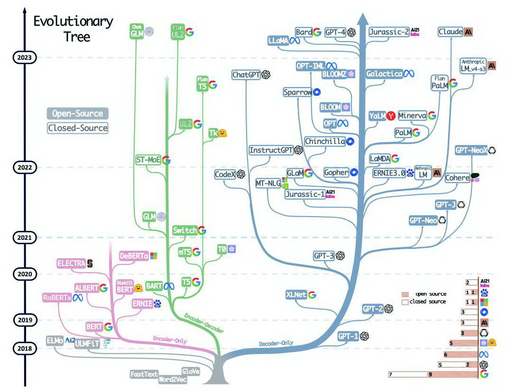
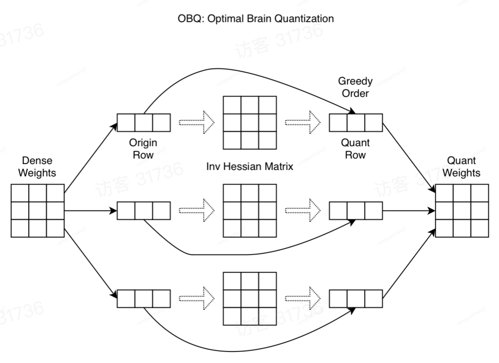
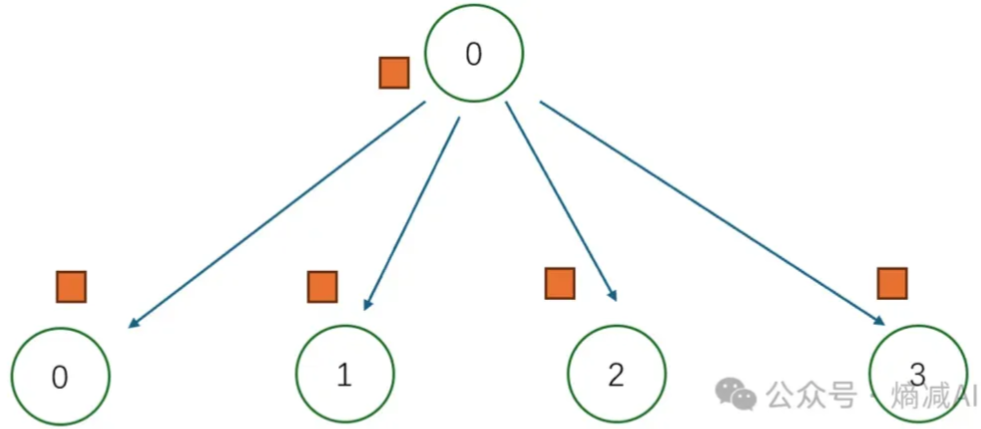

## 深度学习基础
1. Conv 与 BN 融合过程
    * Conv 与 BN 两个算子都是做线性计算, 所以可以融合成一个算子。融合过程如下公式所示:
    * 其实融合后的效果就是, 对每个卷积核乘以了一个缩放系数。对每个卷积核的偏置, 先缩放再偏移。
    ```python
    from collections import OrderedDict
    import numpy as np
    import torch
    import torch.nn as nn

    def main():
        torch.random.manual_seed(0)

        f1 = torch.randn(1, 2, 5, 5)
        module = nn.Sequential(OrderedDict(
            conv=nn.Conv2d(in_channels=2, out_channels=4, kernel_size=3, stride=1, padding=1, bias=False),
            bn=nn.BatchNorm2d(num_features=4)
        ))

        module.eval()
        with torch.no_grad():
            output1 = module(f1)
            print(output1)

        # Conv 参数
        kernel = module.conv.weight             # [4, 2, 3, 3]

        # bn 参数
        running_mean = module.bn.running_mean    # [4] 
        running_var = module.bn.running_var      # [4]
        gamma = module.bn.weight                 # [4]
        beta = module.bn.bias                    # [4]
        eps = module.bn.eps                      # 1e-5
        
        # 融合后的参数
        std = (running_var + eps).sqrt()         # [4]
        t = (gamma / std).reshape(-1, 1, 1, 1)   # [ch] -> [ch, 1, 1, 1]
        kernel = kernel * t                      # [4, 2, 3, 3] * [4, 1, 1, 1] -> [4, 2, 3, 3]
        bias = beta - running_mean * gamma / std # [ch]

        # 开始融合
        fused_conv = nn.Conv2d(in_channels=2, out_channels=4, kernel_size=3, stride=1, padding=1, bias=True)
        fused_conv.load_state_dict(OrderedDict(weight=kernel, bias=bias))

        with torch.no_grad():
            output2 = fused_conv(f1)
            print(output2)

        np.testing.assert_allclose(output1.numpy(), output2.numpy(), rtol=1e-03, atol=1e-05)
        print("convert module has been tested, and the result looks good!")

    if __name__ == '__main__':
        main()
    ```

2. 反向传播的原理有何不同？(https://blog.csdn.net/weixin_45186425/article/details/128167040)
    * 使用损失函数定义预测值与真实值之间的差异。当损失函数越小时, 说明模型的效果越好, 我们通常追求损失函数最小时所对应的权重向量 w。对于凸函数而言, 导数为 0 的点就是极小值点, 因此常常先对权重 w 求导, 然后再令导数为 0 来求解极值和对应的 w。但是对于像神经网络这样的复杂模型，可能会有数百个w的存在。令所有权重的导数为 0 并且一个个求解方程难度很大, 工作量也很大。所以使用 `逐步迭代的方法, 使得损失函数到达最小值`。
    * 梯度向量是多元函数上，目标值对各个自变量的偏导数组成的向量。比如损失函数是 `L(w1, w2, b)`, 在损失函数上对 `w1, w2, b` 这三个自变量求偏导, 求得的梯度向量的表达式是 $\left[\frac{\partial L}{\partial w_{1}}, \frac{\partial L}{\partial w_{2}}, \frac{\partial L}{\partial b}\right]^{T}$。
    * 为了控制每次走的距离的大小, 将步长 $\eta$ 加入公式, 所以权重迭代公式为 $w_{(t + 1)} = w_{(t)} - \eta \frac{\partial L}{\partial w_{(t)}}$ 。偏导数的大小影响整个梯度向量的大小, 偏导数前的减号影响整体梯度向量的方向。当 $\eta$ 设置的很大的时候, 梯度下降的每一个步子就迈的很大, 走的很快, 设置的很小的时候就走的很慢。
    * 动量法: 整体思想就是在梯度的历史方向与现有方向相同时, 卖出大步子, 在历史方向与现有方向相反时, 迈出小步子。做法就是让上一步的梯度向量与现在这一点的梯度向量以加权的方式求和, 求解出受到上一步大小和方向影响的真实下降方向。$v_{t}=\gamma v_{(t-1)}- \eta \frac{\partial L}{\partial w}$。$w_{(t+1)}=w_{(t)}+v_{(t)}$

3. 卷积神经网络中, 卷积操作生成特征图的形状公式？
    * 假设输入特征图的大小为 $H\times W \times C$, 有 N 个卷积核, 每个卷积核的大小为 $f_h \times f_w \times C$, 步幅为 $s_h$ 和 $s_w$, 填充为 $p_h$ 和 $p_w$。那么输出特征图的大小为 $O_h \times O_w \times N$。其中 $O_h$ 和 $O_w$ 的计算公式为:
        - $O_h = \frac{H-f_h+2\times p_h}{s_h} + 1$
        - $O_w = \frac{W-f_w+2\times p_w}{s_w} + 1$
    * 举个例子, 输入特征图大小为 $28\times 28 \times 3$, 有 4 个卷积核, 每个卷积核的大小为 $3\times 3\times 3$, 步幅为 1, 填充为 1。
        - $O_h = \frac{28-3+2\times 1}{1} + 1 = 28$, $O_w = \frac{28-3+2\times 1}{1} + 1 = 28$
        - 所以输出特征图大小为 $28\times 28\times 4$

4. 卷积神经网络, 感受野的计算公式？
    * 感受野的定义是卷积神经网络中每一层输出特征图上的像素点在输入图片上映射的区域的大小。感受野的计算公式为:
        - $l_k = l_{k-1} + ((f_k-1)\times \prod _{i=1}^{k-1}{S_i})$, 其中 $l_k$ 表示第 $k$ 层的感受野的边长, $k_{k-1}$ 表示第 $k-1$ 层的感受野, $f_k$ 表示第 $k$ 层卷积核的大小, $S_i$ 表示第 $i$ 层的步长。
    * 一般来说第一层感受野为该层卷积核的大小, 而且感受野只与卷积核尺寸和步长有关。如下是计算感受野的例子:
    

5. 大模型架构对比盘点？
    
    * 大模型的的架构通常可以分为 3 类, `Encoder-Only` 和 `Decoder-only` 和 `Encoder-Decoder` 结构。这三种结构各有优势, 应用场景和前景也不尽相同。
    * `Encoder-Only` 结构:
        - 经典模型 BERT, 仅包含 Transformer 的编码器部分, 适用于不需要生成序列的任务, 只需要对输入进行编码和处理的单向任务场景, 如文本分析, 情感分析。
        - 优点是能够更好的理解输入文本的语义和上下文的信息。缺点是无法直接生成文本输出, 在文本生成任务中不太适用。
    * `Decoder-Only` 结构:
        - 经典模型 GPT, 也被称为生成式架构, 仅包含 Transformer 中解码器的部分。常用于序列生成任务, 如文本生成, 机器翻译。这种架构可以进行无监督预训练, 模型通过大量的无标注数据学习语言的统计模式和语义信息。
        - 擅长的点是创造性写作。缺点是需要大量的训练数据来提高生成文本的质量和多样性。
    * `Encoder-Decoder` 结构:
        - 经典模型 T5, 序列到序列的架构, 同时包含 Transformer 的编码器和解码器。Encoder-Decoder 架构的核心思想是利用编码器对输入序列进行编码，提取其特征和语义信息，并将编码结果传递给解码器。然后，解码器根据编码结果生成相应的输出序列。
        - 优点更好的处理输入序列与输出序列之间的关系, 提高机器翻译的准确性。缺点是模型的复杂度过高, 训练时间和计算资源消耗比较大。

6. 具体对比下 GPT 和 BERT 的异同？
    * 适用于任务的不同:
        * ChatGPT 主要用于生成式的 NLP 任务，如对话生成和文本摘要等。这是因为 ChatGPT 是一个单向的语言模型，它只考虑了文本的前面部分，而没有考虑后面的部分。因此，它可以在输入未完整时预测接下来的词汇，这使得它在生成式任务上表现出色。
        * BERT主要用于判别式的NLP任务，如文本分类和情感判别。相比于 ChatGPT，BERT 采用了双向的语言模型，它可以同时利用文本的前面和后面信息来推断当前的上下文。
    * 训练方式的不同:
        * ChatGPT 是通过将大量文本数据输入到网络中进行训练来学习文本表示。
        * 而 BERT 则是通过`预先训练`和`微调`两个步骤进行的。在预先训练时，BERT 使用了两个任务：`掩码语言建模(MLM)`和`下一句预测(NSP)`，以学习通用的文本表示，然后在微调阶段将其应用于具体的NLP任务。
    * 计算效率的不同:
        * ChatGPT 的计算效率是较低的, 因为要一个 token, 一个 token 的生成, 每次生成也要用到以前的输入进行计算。
        * BERT 是有更好的并行性, 计算效率通常是较高的。

7. 手撕目标检测中的 `NMS` 的 C++ 代码？
* 整体的难点就两个, 1）计算两个框的 IOU    2）NMS 的过程
    - 1）计算两个框 IOU, 就以两个框相交的示意图来寻找交集的左上角和右下角的点的坐标。新的左上角的坐标, 是原始的两个左上角的坐标产出。新的右下角的坐标, 是原始的右下角的坐标的产出。IOU = 交集/并集 = 交集/(面积1+面积2-交集)。
    - 2）NMS的过程。核心是维护一个 order, order 的初始值是原始的框依据 score 排序后的结果的下标。然后每次取出第一个值(score 最大) 放入 keep 数组中, 计算与其他框的 IOU, 保留那些小于等于阈值的索引。然后生成新的 order。
```C++
#include <iostream>
#include <vector>
#include <algorithm>

struct Box {
    int x1, y1, x2, y2;  // (x1, y1) 是左上角点的坐标 (x2, y2) 是右下角点的坐标
    Box(int x1, int y1, int x2, int y2):x1(x1), x2(x2), y1(y1), y2(y2){};
};

// 计算两个边界框的交并比
float iou(const Box& box1, const Box& box2) {
    // 以两个框相交为示意图来找交集的左上角和右下角的点的坐标
    // 交集左上角的坐标 x, y 为两个框左上角的对应分量取最大值。
    int x1 = std::max(box1.x1, box2.x1);
    int y1 = std::max(box1.y1, box2.y1);

    // 右下角的坐标为 x,y 为两个框右下角的对应分量取最小值
    int x2 = std::min(box1.x2, box2.x2);
    int y2 = std::min(box1.y2, box2.y2);

    // 计算交集的宽和高
    int width = std::max(0, x2 - x1);
    int height = std::max(0, y2 - y1);

    // 交集的面积
    int intersection = width * height;

    // IOU 的计算公式为 交集/并集 = 交集/(A面积+B面积-交集)
    int area1 = (box1.x2 - box1.x1) * (box1.y2 - box1.y1);
    int area2 = (box2.x2 - box2.x1) * (box2.y2 - box2.y1);

    float iou = static_cast<float>(intersection) / (area1 + area2 - intersection);

    return iou;
}

// NMS算法实现, 其实是维护了一个索引表, 那些索引的 box 保留
std::vector<int> nms(const std::vector<Box>& boxes, const std::vector<float>& scores, float threshold) {
    // 先记录原始顺序
    std::vector<int> order(scores.size());
    for (int i = 0; i < scores.size(); i++) {
        order[i] = i;
    }

    // 按照得分降序排列边界框的索引, 这种操作第一次见到, 依据一个外值, 影响索引
    std::sort(order.begin(), order.end(), [&](int a, int b) { return scores[a] > scores[b];});

    std::vector<int> keep;         // 用于存储保留的边界框索引
    while (!order.empty()) {       // 候选的 框不为空就一直重复操作
        int base = order[0];       // 选择得分最高的边界框
        keep.push_back(base);      // 将该边界框的索引添加到保留列表中

        // 记录保留框的那些索引, 存储交并比小于阈值的索引
        std::vector<int> new_order;  // 存储更新后的order数组
        for (int t = 1; t < order.size(); t++) {
            float tmp = iou(boxes[base], boxes[order[t]]);  // 计算当前边界框与其他边界框的交并比
            if(tmp <= threshold) new_order.push_back(order[t]);         // 将交并比小于阈值的边界框的索引添加到列表中
        }

        order = std::move(new_order);
    }

    return keep;  // 返回保留的边界框索引
}

int main() {
    // 示例输入
    std::vector<Box> boxes = {{50, 50, 100, 100}, {60, 60, 120, 120}, {70, 70, 130, 130}, {80, 80, 140, 140}};
    std::vector<float> scores = {0.9, 0.75, 0.8, 0.95};
    float threshold = 0.5;

    // 调用NMS算法
    std::vector<int> keep = nms(boxes, scores, threshold);

    // 打印保留的边界框索引
    std::cout << "保留的边界框索引：";
    for (int i = 0; i < keep.size(); i++) {
        std::cout << keep[i] << " ";
    }
    std::cout << std::endl;

    return 0;
}
```
8. 计算样本向量的相似度的方式通常有以下几种？
    - 欧氏距离: $d\left(A, B\right)=\sqrt{\sum{\left(a_i-b_i\right)}^2}, i=1, 2,..., n$。`euclidean_dist = np.sqrt(np.square(vector_1 - vector_2).sum())`。欧式距离越小相似度越大。
    - 余弦相似度: 把两个向量看成空间中的两条线段, 都是从原点, 指向不同的方向。余弦相似度是利用两个向量之间的夹角的余弦值来衡量两个向量之间的余弦相似度。余弦相似度的取值范围为 `[-1, 1]`, 余弦值越大, 表示两个向量的夹角越小, 向量相似度越高。
    
```python
cosine = (float(np.dot(vector_1, vector_2)) / 
            (np.linalg.norm(vector_1) * np.linalg.norm(vector_2)))
​
# 有时需要用0到1的小数来表示余弦距离，可以将其归一化到[0,1]区间
normalized_dist = （1-cosine）/ 2.0
```
    - 编辑距离: 比较字符串相似度常用的方法, 把一个字符串通过插入、删除或替换这样的编辑操作，变成另一个字符串，所需要的最少编辑次数，这种就是编辑距离。
$$editRatio = 1-\frac{editDist}{len(str1)+len(str2)}$$
9. 欧氏距离与余弦距离的差异？
    - 欧式距离: 衡量的是空间各点的绝对直线距离, 与各个点的坐标直接相关。能够体现个体数值特征的绝对差异，所以更多的用于需要从维度的数值大小中体现差异的分析。
    - 余弦相似度: 是空间向量的角度关系, 更加体现在方向上的差异, 而不是位置上。更多的用于使用用户的内容评分来区分兴趣的相似度和差异，同时修正了用户间可能存在的度量标准不统一的问题（因为余弦距离对绝对数值不敏感）。
10. 深度学习优化器总结?
    - SGD(Stochastic Gradient Descent, SGD): 随机梯度下降法, 其中随机的意思是指不用全部数据, 每次只挑选一部分数据来优化模型, SGD 的好处就是可以在保证模型精度的同时降低计算量, 让神经网络可以应用在更大规模的数据上。SGD的公式是 $\theta _{t+1}=\theta _{t}-\gamma g_{t}, \theta, \gamma, g 分别代表参数、学习率、梯度$。
    - SGDM: SGD 会遇到震荡的问题, 导致模型收敛过慢。引入动量(Momentum)的概念, 抵消梯度中那些变化剧烈的分量, 加快收敛速度。SGDM 的公式为 $\theta _{t+1}=\theta _{t}-\gamma v_{t}, v_t = uv_{t-1}+g_t$, 其中 u 取值 0.9, 用于指数加权移动平均, 可以减小更早时刻梯度对当前梯度的影响。
    - RMSProp: 能够实现不同的参数能够使用不同的学习率, 自适应地调整学习率。公式是 $\theta _{t+1}=\theta _{t}- \frac{\gamma}{\sqrt{s_t}+\epsilon}g_t, s_t=\alpha s_{t-1} + (1-\alpha)g_t^2$, $s_t$ 表示历史中所有梯度的平方和, $\alpha$ 代表指数加权移动平均法的参数, 减小之前震荡过大的参数的学习率，增大更新速率较慢的参数的学习率。
    - Adam: SGD 算法主要优化梯度问题, RMSProp 方法主要优化学习率的问题, SGD Momentum + RMSProp 就是 Adam 的算法。$\theta _{t+1}=\theta _{t}- \frac{\gamma}{\sqrt{s_t}+\epsilon}v_t, s_t=\alpha s_{t-1} + (1-\alpha)g_t^2, v_t=\beta v_{t-1}+(1-\beta)g_t$.
    - AdamW: 由于 Adam 在泛化性能上并不如 SGD momentum 好, 所以 AdamW 主要解决了这个问题, 其目前是最热门的优化器, llama2 也是用这个来优化的。
11. 模型训练的时候的显存如何计算?
* 模型训练时的显存占用主要由 `模型参数`, `优化器`, `激活值`, `梯度值` 这四部分组成(接下来以 Llama2-7B 进行举例)。
    - 模型参数(FP16): Llama2-7B 的参数量为 7 billion (70亿) Byte, 1B=1000^3 约等于 1024^3, 1GB, 那么模型的参数占用的显存为 7*2=14GB。
    - 梯度值(FP16): 每个参数都对应一个梯度, 7*2 = 14GB。
    - 优化器(以Adam优化器为例, 均为FP32): 梯度指数平滑值(7*4=28GB), 梯度平方指数平滑值(7*4=28GB), 模型参数(优化器还会自己再保存一份模型参数, 7*4=28GB), 优化器占用的显存为 28*3 = 84GB。
    - 激活值(FP16): b 是 batchSize, s 是序列长度, h 是隐藏层的大小, a 是 Attention 头的个数, L 是 Transformer block 的个数。Llama7B 激活值占用的显存大小为 $Lbsh(34 + 5\frac{as}{h})$。当 b 为 1, s 是 1024, h 是 4096, a 是 32, L 是 32 时, 占用显存为 5.25GB。
    - 通过以上计算, llama2-7B 占用的显存大小为 14GB + 14GB + 84GB + 5.25GB = 117.25 GB, 注意, 以上计算中, 只有 `激活值` 占用的显存会随着 batchSize 和 seqlen 来变化, 其余的 3 个部分所占用的显存大小基本上是固定的。

12. FP16 存在的问题及混合精度训练？
* FP16 的好处: 通常来说, 现代的 GPU 架构 FP16 的计算速度会更快; 显存占用会变小, 数据传输带宽占用小。
* FP16 存在的两个主要问题: 
    - 表示范围的问题。最小正正数 2^-14 约等于 6.10*10^(-5), 最大正数 65504。
    - 大数吃小数的问题。`2048 + 0.5 = 2048`, 2048 二进制为 `1.0*2^11`, 0.5 二进制为 `1.0*2^-1`, 因为相加要进行位的对齐, 小数向大数对齐, `0.000000000001*2^11`。
* 为了解决这两个问题所以引入了混合精度训练:
    - 使用 FP16 的值有: 权重值, 输入值, 激活值(这三个是前向传播); 反向传播中梯度(梯度, 包含权重值梯度和激活值梯度)。
    - 使用 FP32 的值有: 优化器中的权重值, 优化器中的梯度值
    - 优化器中的梯度使用 FP16->FP32 的梯度值, 是因为梯度的大部分的数字都是比较小的, 很有可能会下溢变为 0, 这样的话, 参数就没办法更新了
    - 混合精度训练中有 `Loss Scaling` 的操作, 防止反向传播的中, 造成 FP16 下溢为 0 导致梯度消失的问题。`Loss Scaling` 的操作过程是求得损失 Loss 之后, 求得 Loss=Loss*N, 然后再用 Loss 进行反向传播计算各个权重和激活值的 fp16 的梯度。当使用这些梯度进行更新参数的时候, 先将 grad 从 fp16 变换为 fp32, 再除以 N 得到相应的梯度更新参数, Loss Scaling 其实是利用了梯度值通常比较小的这个特性。
    - 由于大数吃小数的特性, 所以一般的加法操作, 都会先转换成 fp32 进行加法操作, 需要的话再将结果转换成 fp16, 如 TensorCore。
    
    
    

13. 大模型训练之数据并行 [原文](https://zhuanlan.zhihu.com/p/650002268)
* 数据并行的方法主要有3种, DP, DDP, Deepspeed Zero:
    - DP(DataParallel): Pytorch 最早提供的数据并行的方式, 基于单进程多线程来实现。其有主GPU的概念, 主GPU维护了一个优化器, 其余 GPU 均不维护优化器。这一特点也就导致了四次数据传输: 1）各个GPU前向计算的 Loss 汇集到主GPU  2）汇集的 Loss 从主 GPU 广播到其余 GPU  3）各个GPU反向传播后的梯度汇集到主GPU  4）主GPU更新完参数以后，将模型参数广播到其余 GPU。
    - DDP(Distributed Data Parallel): 基于多进程进行实现, 每个进程都有自己独立的优化器, 执行自己的更新过程。进程之间只传递`梯度`(必须保证初始的模型参数是一模一样的, 才能在相同的梯度更新下保证参数是相同的)。整体梯度的同步过程分成 `Scatter-Reduce` 和 `AllGather` 两个阶段。假设参数量为 $\Psi$, 进程数为 N, 在 `Scatter-Reduce` 阶段, 模型的参数量为 $\Psi/N$ 需要一直向其余 GPU 传递和规约, 总共 N-1 次后能够在一个 GPU 上得到梯度的平均值。在 `AllGather` 阶段, 这个平均值在传递 N-1 次, 传递到所有的 GPU 上。所以总共的传入/传出为 $\frac{2(N-1)\Psi}{N}$。
    - Deepspeed Zero (Zero Redundancy Optimizer) 系列。由于每个 GPU 上存储了模型参数、梯度信息、优化器状态、激活值, 在普通的DDP方法中, 模型参数, 梯度信息, 优化器状态都是一样的, 这就非常的冗余。DeepSpeed 提出了 Zero 通过分片的策略去除冗余。Zero-1 比较适合于 Adam 类的优化器, 因为 Adam 拥有额外的参数的梯度指数平滑值和梯度平方平滑值。ZeRO-1 不适合使用SGD类似的优化器进行模型训练，因为SGD(每个参数的学习率都是相同的)只有较少的参数内存，并且由于需要更新模型参数，导致额外的通讯成本。
    
        - Zero 1: 优化器状态分片。有N个进程, 每个进程保留 $\frac{1}{N}$ 个优化器状态。在前向传播的时候, 不需要进行通信, 再反向传播的时候, 每计算完 $\frac{1}{N}$ 个部分, 就将所有的这部分的梯度都发送到拥有这部分优化器的 GPU 上进行 Reduce, 这部分需要传递 $\frac{(N-1)\Psi}{N}$。每个部分更新完自己这部分的参数以后, 需要将参数发送给其余的 GPU, 这部分需要传送 $\frac{(N-1)\Psi}{N}$。
        - Zero 2: 优化器状态和梯度都分片。前向传播的过程中, 不需要进行通信, 反向传播时, 每计算出一部分的梯度, 就进行 `Scatter-Reduce`, 包含这部分优化器的GPU保留这个梯度, 其余的都释放。每个部分更新完自己这部分的参数以后, 需要将参数发送给其余的 GPU, 这部分需要传送 $\frac{(N-1)\Psi}{N}$。Zero 2 相比于 Zero 1 通信量没有增加, 但是显存却减少啦。
        - Zero 3: 优化器状态和梯度和参数都分片。在前向传播的过程中, 含有这部分参数的GPU都会进行广播操作, 将参数广播给其他的 GPU。其实这部分的通信在 Zero 1 和 2 中也有, 这不过这里是分片发送 $\frac{(N-1)\Psi}{N}$。主要通信消耗在反向传播的时候, 反省传播的时候, 仍然需要参数量, 还需要进行广播, 这部分是 $\frac{(N-1)\Psi}{N}$。最终的梯队还是原来的更新方式 $\frac{(N-1)\Psi}{N}$。
  
14. 大模型训练之模型并行
* 在一般的数据并行中, 每个 GPU 都持有整个模型权重的副本, 这也带来了冗余问题(DeepSpeed zero-3 能缓解这个问题)。模型并行是将模型分割并分布在不同的GPU上, 每个GPU上只保存模型的一部分参数。模型并行分为`张量并行(层内并行)` 和 `流水线并行(层间并行)`。

* `张量并行(层内并行)`: 张量并行从数学原理上来看就是把矩阵分块进行计算(以矩阵乘法举例, Y=XA, X 是输入, A是权重, Y是输出)。张量并行需要非常高的网络带宽, 因为每一层的计算都依赖于前一层的计算结果(前一层要先计算再汇总出来)。因此不建议跨多个节点进行张量并行。实际中，若一个节点有4个GPU，最高的张量并行度为4。
    - 行并行: 行并行就是把权重 A 按照行分割成两部分, 为了保证运算, 把 X 按照列分成两部分。XA = [X1 X2][A1 A2]^T = X1A1 + X2A2 = Y1 + Y2 = Y。X1 和 A1 就可以放到 GPU0 之上计算得出 Y1，，X2 和 A2 可以放到第二个 GPU1 之上计算得出 Y2，然后，把Y1和Y2结果相加，得到最终的输出Y。
    - 列并行: 列并行就是把 A按照列来分割, XA = [X][A1 A2] = [XA1 XA2] = [Y1 Y2] = Y。将 X 分别放置在GPU0 和GPU1，将 A1 放置在 GPU0，将 A2 放置在 GPU1，然后分别进行矩阵运行，最终将2个GPU上面的矩阵拼接在一起，得到最终的输出Y。
* `流水行并行(层间并行)`: 流水线并行有 `F-then-B` 和 `1F1B` 两种策略。`F-then-B` 的策略是先进行前向计算, 再进行反向计算。F-then-B 模式由于缓存了多个 micro-batch 的中间变量和梯度，显存的实际利用率并不高。`1F1B` 前向计算和反向计算交叉进行的方式。在 1F1B 模式下，前向计算和反向计算交叉进行，可以及时释放不必要的中间变量。
    - GPipe: 是 `F-then-B` 策略。其在朴素流水线的基础上, 利用数据并行的思想, 将 mini-batch 分成多个更小的 `micro-batch`, 送入 GPU 进行训练, 提高并行程度。其利用 `Re-computation` 来降低显存, 如果一个设备上有多层, 前向计算时, 只保留最后一层的输出值, 降低了每个设备上内存占用峰值。在求导过程中实时的计算出之前被舍弃掉的中间结果。GPipe 也存在一些问题, 其虽然利用了重计算策略, 但是其本身还是 `F-to-B` 策略, 使得其显存利用率不太高。因为是将 mini-batch 拆分成多个 micro-batch 来做, 所以统计 BN 的样本均值和方差是麻烦的, 但是 LayerNorm 不受影响。空泡率为 `O(k-1/(k+M-1))`增加 `micro-batch` 的数量 m, 可以降低空泡的比例。
    - PipeDream: 是 `1F1B` 策略, 非交错式 1F1B。1F1B 方式相比于 F-then-B 方式，峰值显存可以节省 37.5%，对比朴素流水线并行峰值显存明显下降，设备资源利用率显著提升。但是在 Buble 率上并并没有优化, 空泡率仍然是 `O(k-1/(k+M-1))`。
    - Megatron: 是 `F-then-B` 策略, 交错式调度。在之前非交错式调度中，设备1拥有层1-4，设备2拥有层5-8，以此类推。在交错式调度中，每个设备可以对多个层的子集进行计算，而不是一个连续层的集合。流水线上的每个设备都被分配到多个流水线阶段，每个流水线阶段的计算量较少。能够降低空泡率, 但是带来了额外的通信成本。

* 朴素流水线中存在的问题:
    - GPU利用度不够, 在任意给定时刻，除了一个 GPU 之外的其他所有 GPU 都是空闲的。因此，如果使用 4 个 GPU，则几乎等同于将单个 GPU 的内存量增加四倍，而其他资源 (如计算) 相当于没用上。空泡率 `O(k-1/k)`, 相当于 GPU 数量越多, 空置的比例约接近 1, 即GPU资源都被浪费掉了。
    - 中间结果占据大量内存, 前向传播过程中的中间值都有保留。
    - 通信和计算没有交错, 通过网络发送中间输出 (FWD) 和梯度 (BWD) 时，没有 GPU 执行任何操作。
* 在 PyTorch 中，采用的是GPipe方案。使用的是F-then-B调度策略; 在 DeepSpeed 中，采用的是PipeDream-Flush，使用的是非交错式1F1B调度策略。

15. Python 中 GIL(Global Interpreter Lock)锁的相关问题(其实主要是 CPython 这个解释器的原因, 别的 Python 解释器不一定有这个问题): 
    * GIL 并不是 Python 的特性, 它是在实现 Python 解释器(CPython) 时引入的一个概念, 是 Python 原始解释器 CPython 内部的一把锁。每一个Python 进程都对应一个CPython解释器进程。在CPython解释器内部运行多个线程的时候, 为了防止资源竞争而发生错误, 对所有线程申请全局资源增加了限制-GIL。每个想要运行的线程都必须先获取这个解释进程中唯一的 GIL, 所以 Python 进程中所有的线程只能一个一个交替执行。这其实是 CPython 的缺陷, 其他语言没有。
    * 为什么 CPython 必须引入 GIL?
        - CPython 的内存管理机制。CPython 使用引用计数来管理内存。当一个对象的引用计数变为 0 时，该对象所占用的内存就会被释放。如果不使用 GIL，在多线程环境下，可能会出现两个线程同时对同一个对象的引用计数进行操作的情况。
        - 历史原因。CPython 在设计之初并没有考虑到多线程编程的广泛应用。当时，计算机的硬件资源相对有限，多线程编程并不是一个主要的需求。
    * GIL 什么时候释放？
        - 时间片用完。在当前线程执行超时后会自动释放, python3.x 使用计时器(执行时间达到阈值之后, 当前线程释放 GIL)。
        - 线程发生阻塞。当前线程执行阻塞操作时会自动释放, 比如 IO 操作等可能引起阻塞的系统调用, 暂时释放 GIL。
    * 如何 GIL 锁的性能问题？
        - 使用多进程的方式, 避免 GIL 锁的约束。
        - 使用其他运行速度较快的语言, 如 C 语言。
    * 既然 CPython 存在 GIL 锁, 是否意味着每个线程在操作全局变量的时候, 就不用加 Lock 互斥锁了？
    不行的, 用户操作全局数据必须加 Lock。主要原因时 GIL 的释放时机我们无法控制, 此时操作可能并没有完成, 而不像 Lock 那样, 用完再释放。
    * GIL 有那些影响呢？
        - CPU 密集型任务受限: 对于 CPU 密集型任务, 由于 GIL 锁的存在, 多线程并不能有效地提升性能, 因为多个线程无法同时执行Python字节码。
        - IO 密集型任务相对不受限: 在IO密集型任务中，线程在等待IO时会释放GIL，允许其他线程执行Python字节码，因此在这种情况下，多线程能够发挥一定作用。

16. 过拟合和欠拟合出现原因和避免方案？
* 在模型的整个训练过程中, 训练误差一直在减小, 泛化误差先减少再增大, 当泛化误差达到最小的时候开始分界。其左侧是欠拟合的区域, 其右侧是过拟合的区域。如下图所示:

* 欠拟合: 模型不能在训练集上表现的很差, 无法学习到数据背后的规律。
    - 产生原因:
        - 模型复杂度较低, 参数量较少。
        - 输入数据的特征量较少, 数据质量不高。
    - 解决办法: 
        - 模型复杂化: 回归模型添加更多的高次项; 神经网络中增加网络的深度和隐藏元的个数(更深, 更宽)。
        - 输入数据增加更多的特征: 提高输入数据的特征和质量, 使输入数据有更强大的表达能力。
        - 降低正则化约束: 考虑降低正则化参数或者去掉正则化。
* 过拟合: 模型在训练集上表现得很好, 但在测试集上却表现得很差, 模型没有理解数据背后的规律, 只是对数据的死记硬背, 泛化能力差。
    - 产生原因:
        - 参数太多，模型复杂度过高。
        - 数量太少或者数据噪声干扰过大, 误导了模型对规律的学习。
    - 解决办法: 
        - 增加训练数据数: 增加训练数据的量能够减少噪声的影响, 让模型更多地学习数据的一般特征。采集+数据增强两种方式
        - 降低模型的复杂度
        - 使用正则化约束: 避免训练出来的参数过大从而使模型过拟合
        - 使用 DropOut: 只适用于神经网络中，即按一定的比例去除隐藏层的神经单元，使神经网络的结构简单化。
        - 提前结束训练, 型迭代训练时候记录训练精度(或损失)和验证精度(或损失)，倘若模型训练的效果不再提高，比如训练误差一直在降低但是验证误差却不再降低甚至上升，这时候便可以结束模型训练了。

17. 大模型量化技术
* 大模型量化对象主要有：权重、激活值、KV Cache、梯度、优化器。优化器和梯度的量化主要是在训练场景使用, 减少计算量和通信开销。推理阶段主要是针对权重、激活值、KV Cache 量化。
* LLM.int8() 量化方法():
    - `激活值` 中存在一些离群值, 绝对值明显是更大的, 这些离群值会对量化有很大的影响。LLM.int8() 的量化思路就是把这些特征拿出来单独计算, 只对剩余部分做量化。当模型参数在 6B-7B 之间时, Transformer 所有层上的大幅异常值突然增加, 受影响层的百分比增加, 受影响的序列维度增加。异常值的出现不仅与模型大小有关, 也与困惑度有关。抽取离群值的原因：如果一个向量中有几个数值远大于其他数值，那么量化这些数值会导致其他数值被压缩到零，从而产生较大的误差。
    
    
    - 以激活值 input 和 weight 相乘举例, 首先选取绝对值大于阈值的列做为异常列, 异常列的占比通常不到 0.1%, 确定异常列之后, 在 weight 中选取对应的行。将其拆分成两部分, 异常的哪个部分 input2 和 weight2, 不进行量化, 直接以 fp16 的精度进行矩阵乘法。而非异常的那个部分 input1 和 weight1, input1 逐行进行量化, weight1 逐列进行量化, 量化后的 input1 和 weight1 进行矩阵乘法, 然后反量化后的结果与 input2*weight2 进行相加得到最终的结果。 
* LLM.int8() 方法的特点:
    - LLM.int8() 方法中 weight 在加载模型时进行量化, 能显著的降低显存, 对精度几乎没有影响, 但是模型的推理速度会下降 20% 左右。
* SmoothQuant 量化方法:
    - W8A8(权重为 8bit, 激活值为 8bit) 对于CNN模型已经成为标准了, 但是 LLM 却不太行, 因为当 LLM 模型的参数量到达 6.7B 以上时, 激活值中出现了大量的离群值, 常见的 CNN 量化方法会破坏精度。整体思路由于离群值基本只是存在某些 channel 上, 可以将这些通道进行缩小, 让后将对应的权重进行放大, 但是矩阵乘法的结果是不变的, sacle 的确定方法如下公式所示。
    
    
    - SmoothQuant 不需要微调就能保持很好的准确性, 能够加快推理速度并减少显存占用。
* AWQ 量化方法(Activation-aware Weight Quantization): [原文](https://zhuanlan.zhihu.com/p/697761176)
    - W8A8 量化是对于 Batch serving(多 batch 推理) 是性能很高的, 但是对于单个 batch 的 LLM 推理仍然是有较高的访问限制(IO bound), 所以需要更低精度的权重量化方式。W4A16 for single-batch serving。AWQ 是对模型权重的低比特量化的方法, 使用该方法可以将模型权重量化为 4bit 并在计算时反量化为 FP16, 所以是 W4A16, 也有计算时反量化为 8bit, 所以也有 W4A8 的方法。
    - AWQ 的核心思想是权重并不同等重要, 仅有小部分显著权重(0.1%-1%)对推理结果有较大的影响。依据激活值分布来挑选显著权重, 激活值就是与权重矩阵作matmul运算的输入值。权重的每一行做为一个单位, 在计算时，首先将激活值对每一列求绝对值的平均值，然后把平均值较大的一列对应的通道视作显著通道，保留FP16精度。对其他通道进行低比特量化。但是这样会出现不同精度的问题, 通过 scaling 的方式来解决。
    - 考虑输入权重矩阵 w, 线性运算可写作 y=wx, 权重量化后可以写作 y=Q(w)x, 量化公式的定义如下:
    $$Q(w)=\Delta \cdot Round(\frac{W}{\Delta}), \Delta=\frac{max(|w|)}{2^{N-1}}$$
    - 如果引入缩放因子 $s>1$, 对 w 进行缩放, 量化公式如下
    $$Q(w\cdot s)\cdot \frac{x}{s}=\Delta^{\prime} \cdot Round(\frac{ws}{\Delta^{\prime}}) \cdot x \cdot \frac{1}{s}$$
    - 对权重中的某几个元素乘以缩放因子 s, 大概率不会影响权重 w 的最大值, 所以 $\Delta^{\prime} \approx \Delta$, 而且 $RoundErr(\cdot)$ 视为常数 0.25, 所以误差其实减小为原来的 $\frac{1}{s}$
    - 缩放系数的求法, 是统计各个通道的平均激活值 $s_x$, 然后计算 $s_x^{\alpha}$, 其中 $\alpha$ 是将特征通道分成多个组, 每个组求得一个 $\alpha$。$s_x^{\alpha}$ 就是每个特征通道的缩放系数, $\alpha$ 的搜索方式就是网格法。
* GPTQ 量化方法: [原文](https://zhuanlan.zhihu.com/p/646210009)
    - GPTQ 对某个 block 内的所有参数逐个量化, 每个参数量化之后, 需要适当调整这个 block 内的其他未量化参数, 以弥补量化造成的精度损失, GPTQ 量化需要准备校准数据集。
    - OBS 中先提到的思路, 所以求解海森矩阵和海森矩阵的逆, 来确定每个权重 $w_q$ 对目标值的影响(因为假设模型训练已经充分收敛, 一阶偏导数均为0), 计算 $\Delta w$ 更新其他参数(其是通过计算在约束条件下, 损失最小来计算的)。但是 OBS 的缺点是需要计算所有参数的海森矩阵, OBC 假设参数矩阵同一行参数互相之间是相关的, 不同行之间的参数互不相关，海森矩阵就每一行内单独计算就可以啦。
    
    
    - GPTQ 的创新点是:
        - OBS 采用贪心策略, 先量化对目标影响最小的参数, GPTQ 直接按照顺序做参数量化, 对精度影响不大。这种改进使得参数矩阵的每一行的量化可以`并行的做矩阵计算`, 使得量化速度快了一个数量级。
        - Lazy Batch-Updates, 延迟一部分参数的更新, 缓解 bandWidth 的压力。一般来说, 每次量化一个参数，其他所有未量化的参数都要按公式全都要更新一遍，但是这样计算密度实在是太低。由于参数量化是一列一列按次序进行的, 第 $i$ 列的参数的量化结果受到前 $i-1$ 列量化的影响, 但第 i 列的量化结果不影响前面列的量化。将参数矩阵按每 128 列划分为一个个 group，量化某一列时，group 内的参数立即更新，而 group 后面的列只记录更新量，延迟更新。当一个 group 的参数全部量化完成，再统一对后面的所有参数做一次更新(不减少实际的计算量, 但是有效解决吞吐量瓶颈问题)。
* GPTQ 与 SmoothQuant 的区别？
* GPTQ 适合需要对预训练模型进行高效后量化的场景，特别是在无法重新训练模型的情况下，提供了一个在低比特下保持高精度的解决方案。SmoothQuant 更适合可以对模型进行训练或微调，并需要针对特定硬件进行优化的场景，通过平滑量化策略，实现低比特推理下的高性能。

18. 分布式训练的通讯原语有哪些？
    * 分布式训练系统并不只是单纯的扩大显存的容量, 装载更大的模型和提供更多的 `batch_size`。其也要求在一定程度上线性地提升算力总量, 提高训练速度。业界常用的大模型训练的通信原语库主要有 `MPI` 和 `NCCL`。但是目前 `MPI` 就只用在 CPU 分布式通信的场景了, GPU 的分布式通信库目前都是以 `NCCL` 为主(NV 的卡)。
    * Pytorch 的分布式训练的通信是依赖 `torch.distributed` 模块。这个模块提供了 `point-2-point communication`(提供 send 和 receive 操作) 和 `collective communication`(broadcast, scatter, gather, reduce, all-reduce, all-gather) 两种通信方式。分布式训练的时候, 主要是用 `collective communication`。
        * BroadCast(广播): 节点将自己的数据原封不动的发给其他节点, 常用于网络参数的初始化。
        
        * Scatter(分片后广播): 把数据切分成多个小组, 然后分别提交给相应处理数据的节点。
        
        * Gather(汇聚): 逻辑上和 `Scatter` 是反的, 将多个不同的节点的数据一起发送到一个汇集节点的通信行为。
        
        * Reduce(精简): 将各个节点的数据发送到一个汇集节点, 然后执行 Reduce 操作(sum/max) 得到最终的结果。
        
        * all-reduce: 是最消耗带宽的操作, 整体逻辑上是 redcue + broadcast 来完成, 与相比多了 reduce 操作。
        
        * all-gather: 其实与 gather 逻辑是一样的, 就是每个节点都有 gather 来的数据的完整备份。
        

19. NVLink, NVSwitch, InfiniBand 的区别与联系？
    * NVLink: 通过点对点的连接, 提供 GPU 和 GPU/CPU 之间的高速通信。主要特点如下:
        - 点对点连接: 直接连接两个设备, 提供专用的高度通道, 允许设备之间更快速的共享数据。
        - 小规模GPU互联: 适合 2-4 个 GPU 直接互连, 显著提高 GPU 之间的通信效率。
    * NVSwitch: 用于更大规模 GPU 集群的交换设备, 类似于网络交换机，它将 NVLink 的点对点连接扩展到更大规模的 GPU 网络。主要特点如下:
        - 交换机架构: 通过 NVSwitch，每个 GPU 可以与集群中的其他 GPU 高速通信，而不需要直接的点对点连接。
        - 大规模 GPU 互连: NVSwitch 可以连接多达 16 或更多的 GPU，并提供比单一 NVLink 更高效的通信路径。
    * InfiniBand: 广泛用于服务器之间的高速通信，适用于大规模的 HPC 和 AI 训练集群。NVLink 和 NVSwith 主要用于 GPU 间的高速互连。

20. Megatron 技术？
    * Megatron 的核心技术就是 Tensor 并行, 序列并行, 选择性激活重计算, 1F1B 的 pipeline 并行。
    * 单个计算节点多个卡的情况下, 最好的配置是优先配置 Tensor 并行, 而不是 pipeline 并行, 多个计算节点之间通常是 pipeline 并行。
    * 矩阵乘法 Tensor 并行的示例: Y = XW
        - 横向切分 W, `W->[W1, W2]^T`, 为了保证计算结果 X 就需要纵向切分 `X->[X1, X2]`, 所以 `XW=X1W1+X2W2`。这样的话就可以把 X1 和 W1 放到一个 GPU 上, X2 和 W2 放到另外一个 GPU 上, `计算完成后要相加一个同步点`, 把相加的结果回传给这两个 GPU(all-reduce)。
            - 需要函数 `f` 来做 split 这个事情, 输入是 X, 输出是 X1, X2, 且 X=[X1, X2]。forward 时, 对 X 沿着最后一个维度切割, backward 的时候, 就是沿着最后一个维度拼接。$\frac{\partial{L}}{\partial{X}}=[\frac{\partial{L}}{\partial{X1}}, \frac{\partial{L}}{\partial{X2}}]$。
            - 需要函数 `g` 来对 X1W1 和 X2W2 相加, 前向 forward 可以通过 pytorch 的 all-reduce 来实现, `Y=Y1+Y2`。backward 的时候, $\frac{\partial{L}}{\partial{Y_{i}}}=\frac{\partial{L}}{\partial{Y}}$。
        
        - 纵向切分 W, `W->[W1, W2]`, X 就不能切分了, 因为 W1 和 W2 的第一个维度没有变化, $XW=X[W1, W2]=[XW1, XW2]$。可以把 X 和 W1 放在一个 GPU 上, 把 W 和 W2 放在另一个 GPU 上。
            - `f` 函数来做 identity 的操作, 让每个 GPU 都是直接拿到全部 X。在 backward 的时候, 每个 GPU 上的关于 X 的梯度, $\frac{\partial{L}}{\partial{X}}=\frac{\partial{L}}{\partial{X_{1}}} + \frac{\partial{L}}{\partial{X_{2}}}$
            - `g` 函数来做拼接的操作, 将 XW1 和 XW2 按照最后一个维度拼接, 即 `out=[XW1, XW2]`。backward 就是将 $\frac{\partial{L}}{Y}$ 切分的操作。
        
    * MLP 的多 GPU 实现, 具体结构为 `XA->GELU->Dropout->XB`(A 和 B 均为权重), 实现了 hiddensize->4*hiddensize->hiddensize。对于第一个线形层使用纵向切割 A, 这样就能减少设置一个同步点(不然由于 GELU 的存在, 需要再设置一个同步点)。因为第一次切割得到的结果, 已经对 X 进行纵向切割了, 所以此时可以对 B 进行横向切割, 最后使用 `g` 来 all-reduce 结果。
    
    * Attention 的多 GPU 实现, 对 $W_{q}$, $W_{k}$, $W_{v}$ 都用纵向切割, 可以让每个 GPU 上存储每个 head 的 Q, K, V。对于后面的 $W_{o}$ 使用横向切割, 然后计算。
    
    * 序列并行: 张量并行可以在一定程度上, 把一些 activation 拆分到不同的 GPU 上, 分别执行。但是仍然有一些地方的 activation 是无法通过张量并行而分别计算的的。想让涉及到 `layerNorm` 和 `dropout` 这两种计算的部分占据的 activation 分配到不同的的设备上。Transformer 中的非张量并行区域中, layerNorm 和 Dropout 在 `序列维度` 上是独立的, 允许我们沿着序列维度 s 划分这些区域, 从而减少 activation 所占用的显存。其实就是在 f 之后 和 $\overline{f}$  之前引入新的通信集合, 他们充当序列并行和张量并行的转换器。所以可以与原始的 f 和 $\overline{f}$ 进行融合, 分别叫做 $g$ 和 $\overline{g}$。
        - $g$: 前向, 是 all-gather, 把序列并行的, 多个子序列的输出的张量, 收集拼接起来, 恢复到一个完整的序列; 后向, 是 reduce-scatter, 在进入f函数的时候，把多个gpu上的梯度, 求和得到的张量, 再按照序列并行, 切分成若干子序列张量。
        - $\overline{g}$: reduce-scatter，规约+分散，规约指的是all-reduce，把多个张量中的值逐点求和，然后通过scatter来把一个完整的序列，切分成若干子序列。all-gather，把多个子序列的结果，拼接回来成为一个完整的序列。
    
    * 选择性激活重计算:
        - 全激活值重计算: 前向过程中, 之后最初的 activation 的激活值贝保存了下来, 后面产生的 activation 随时计算出来之后, 随时扔掉(显存回收); 反向传播过程中, 如果一个 activation 没有被前向过程保存, 而当前又用到了它, 那就重新调用一次前向过程, 重新把他们计算出来, 反向过程使用之后, 再马上扔掉。这种方法就是简单的使用计算时间的提升, 获取显存的空间复杂度的降低。
        - 选择性重计算: 考虑显存使用量和重计算的时间, 尽量存储那些需要 `高计算量` 的张量, 而重计算那些 `低计算量` 的张量。transformer block 中低计算量的结构有 $Q\times K^T$, `softmax`, `dropout`。并重计算这部分, 保存低于一半的 activation, 并消耗相对低的计算时间。

21. 1F1B pipeline 并行的原理？
    * 朴素的并行方式, GPU 的利用率不高, 一个 GPU 在运算的时候, 其余的 GPU 都在等待。优化方法就是将一个 mini-batch 切分成多个 micro-batch。这样比如 gpu1 在执行完 1a 的 forward 之后, 就可以执行 1b 的 forward。1F1B 的思想就是 GPU4 执行完 1a 的 forward 之后, 立即执行 1a 的 backward, 然后执行 1b 的 forward, 执行 1b 的 backward, GPU4 从来没有间断过。下图红色的圈就是 bubble 出现的地方。
    

22. 交叉熵损失函数详解
* 对于分类模型来说, 模型训练的时候, 都是使用的交叉熵(Cross-Entropy) 做为损失来进行最小化, 公式如下:
$$CE(p, q)=-\sum_{i=1}^{C}p_ilog(q_i)$$
* 其中 $C$ 表示类别数, $p_i$ 为真实标签, $q_i$ 表示预测的概率。
```Python
# inputs 是 (bs, num_classes); target 是 (bs, num_classes) 是每一个行进行 softmax 之后再取对数的结果。
# 然后 inputs * target, 就是逐个元素的点乘, 然后每一行累加取反就是最后每个 batch 的 loss
import torch
import torch.nn as nn
import torch.nn.functional as F

class MyCrossEntropyLoss(nn.Module):
    def __init__(self):
        super(MyCrossEntropyLoss, self).__init__()

    def forward(self, inputs, targets):
        """
        inputs: 模型的输出（未经过 softmax 的 logits），形状为 (batch_size, num_classes)
        targets: 实际标签，形状为 (batch_size) 或 (batch_size, num_classes) 如果是 one-hot 编码
        """
        # 计算 softmax 并且防止出现数值问题
        log_probs = F.log_softmax(inputs, dim=1)
        
        # 如果 targets 是整数类标签，将其转换为 one-hot 编码
        if targets.dim() == 1:
            targets = F.one_hot(targets, num_classes=inputs.size(1)).float()
        
        # 计算交叉熵损失, 这里是两个矩阵逐元素点乘
        loss = -(targets * log_probs).sum(dim=1).mean()
        return loss

# 测试代码
if __name__ == "__main__":
    # 假设 batch size = 3, 类别数 = 5
    inputs = torch.randn(3, 5)  # 模型的输出
    targets = torch.tensor([1, 0, 4])  # 实际的类别标签

    loss_fn = MyCrossEntropyLoss()
    loss = loss_fn(inputs, targets)
    print(f"Loss: {loss.item()}")
```
23. 从 10 亿个数中找出前 K 个元素？(TOP K 的思路)
* 基于堆的方法(时间复杂度 O(nlog(n))):
    - 初始化一个小顶堆, 其堆顶元素最小。
    - 先将数组的前 `k` 个元素依次入堆。
    - 从第 `k+1` 个元素开始, 若当前元素大于堆顶元素, 则将堆顶元素出堆, 并将当前元素入堆。
    - 遍历完成后, 堆中保存的就是最大的 k 个元素。
```C++
#include <iostream>
#include <vector>
#include <queue>

std::vector<int> topKElements(const std::vector<int>& nums, int k) {
    // 小顶堆，使用 greater<int> 来反转顺序
    std::priority_queue<int, std::vector<int>, std::greater<int>> minHeap;
    
    // 将前K个元素放入小顶堆
    for (int i = 0; i < k; ++i) {
        minHeap.push(nums[i]);
    }

    // 遍历剩余的元素
    for (int i = k; i < nums.size(); ++i) {
        // 如果当前元素大于堆顶元素，替换堆顶元素
        if (nums[i] > minHeap.top()) {
            minHeap.pop();         // 弹出堆顶元素
            minHeap.push(nums[i]); // 插入当前元素
        }
    }

    // 将堆中的元素存入结果向量中
    std::vector<int> result;
    while (!minHeap.empty()) {
        result.push_back(minHeap.top());
        minHeap.pop();
    }

    return result;
}

int main() {
    std::vector<int> nums = {10, 24, 36, 12, 7, 15, 42, 60, 25, 50}; // 示例数据
    int k = 4; // 需要找出前K个最大的元素

    std::vector<int> result = topKElements(nums, k);

    // 输出结果
    std::cout << "Top " << k << " elements are: ";
    for (int num : result) {
        std::cout << num << " ";
    }
    std::cout << std::endl;

    return 0;
}
```
* 快排的方法。发现在快排过程中, 如果在base右边的元素个数超过K个, 那么结果肯定在base右边, 左边的元素就可以不考虑再去排序了。因此，在迭代过程中，我们加一句判断，这样计算的时间复杂度就能进一步减小。
```C++
class Solution {
public:
    vector<int> quickSort(vector<int>&nums, int start, int end, int K)
    {
        if (start >= end) return nums;
        int base = nums[start];
        int i = start;
        int j = end;
        while (i < j)
        {
            while (i < j && nums[j] >= base) j--; //从右往左，寻找比base小的数
            swap(nums[i], nums[j]);
            while (i < j && nums[i] <= base) i++;
            swap(nums[i], nums[j]);
        }

        // 这个不一定有, 需要用 if 进行判断
        if(nums.size()-i<K) //如果base右边的数超过K个，则第K大数肯定在base右边，此时就不需要对base左边的进行排序
            quickSort(nums, start, i - 1, K);

        // 这个一定有
        quickSort(nums, i + 1, end, K);
        return nums;
    }
    
    int findKth(vector<int> a, int n, int K) {
        quickSort(a, 0, n-1, K);
        return a[n-K];
    }
};
```
23. bitmap(位图) 的核心思想是使用位来表示某个数是否存在, 这种方法可以在 O(n) 的时间内完成排序。用一个 `bit` 来标记某个元素对应的 value, 而 key 是改元素。由于采用了 `bit` 为单位来存储数据，因此在存储空间方面，可以大大节省。
* 使用 bitmap 进行排序, 主要步骤如下:
    - 创建位图(bitmap): 创建一个位图, 数组的大小等于数据中最大值/32+1，初始时所有位都为 0。
    - 将数据映射到位图: 遍历待排序数组，将每个数据映射到位图的相应索引位置，设置该位为 1，表示该数存在(key 是数值, value 是标识, 表示是否存在)。
    - 遍历位图输出排序结果：从位图的第一个位置开始，检查每一位，如果为 1，输出对应的索引值，表示该数存在，完成排序。
```C++
#include <iostream>
#include <vector>
#include <cstring>  // 用于memset函数

// 定义一个辅助宏，用于设置某一位, 或的操作
#define SET_BIT(bitmap, pos) (bitmap[pos / 32] |= (1U << (pos % 32)))

// 定义一个辅助宏，用于测试某一位是否为1, 与的操作, 注意没有 =, 不需要改写
#define TEST_BIT(bitmap, pos) (bitmap[pos / 32] & (1U << (pos % 32)))

// 清除某一位，将该位从 1 变成 0, 与的操作
#define CLEAR_BIT(bitmap, pos) (bitmap[pos / 32] &= ~(1U << (pos % 32)))

// Bitmap 排序函数, 输入参数为待排序数组和数据的最大值
void bitmapSort(const std::vector<int>& arr, int max_value) {
    // 计算需要多少个 unsigned int 类型的单元来表示位图
    int bitmap_size = (max_value / 32) + 1;  // 其实是向上取整

    // 创建位图，初始化为0
    std::vector<unsigned int> bitmap(bitmap_size, 0);  // 全都初始化为 0

    // 将数据映射到位图中
    for (int num : arr) {
        SET_BIT(bitmap, num);  // 设置对应的位为1
    }

    // 输出排序后的结果, 遍历测试的方法
    for (int i = 0; i <= max_value; ++i) {
        if (TEST_BIT(bitmap, i)) {  // 如果该位置的位是1，表示该数字存在
            std::cout << i << " ";  // 输出该数
        }
    }
    std::cout << std::endl;
}

int main() {
    // 待排序的数组
    std::vector<int> arr = {5, 3, 9, 1, 4, 8, 7, 6, 2, 0};
    int max_value = 9;  // 假设数组中的最大值为9

    std::cout << "Original Array: ";
    for (int num : arr) {
        std::cout << num << " ";
    }
    std::cout << std::endl;

    std::cout << "Sorted Array: ";
    bitmapSort(arr, max_value);  // 调用位图排序
    return 0;
}
```
* 利用 bitmap 进行快速去重是一种高效的方法, 特别是当数据量很大, 范围相对较小时。这种方法能够快速标记数字是否出现过。步骤如下:
    - 创建两个位图: 一个位图 bitmap1 用于记录每个数第一次出现。一个位图 bitmap2 用于记录每个数是否出现了多次。
    - 遍历数据: 对于每个数字, 如果并没有出现在 bitmap1 中, 将其表示为出现了一次。如果它出现了 bitmap1 中, 将其标记到 bitmap2 中, 表示该数重复。
    - 输出不重复的数: 遍历 bitmap1 中, 排除那些在 bitmap2 中出现的数字, 输出仅在 bitmap1 中标记的数字, 即不重复的数字。
```C++
#include <iostream>
#include <vector>
#include <cstring>  // 用于memset函数

// 定义一个辅助宏，用于设置某一位
#define SET_BIT(bitmap, pos) (bitmap[pos / 32] |= (1U << (pos % 32)))

// 定义一个辅助宏，用于测试某一位是否为1
#define TEST_BIT(bitmap, pos) (bitmap[pos / 32] & (1U << (pos % 32)))

// Bitmap 去重函数
void bitmapUnique(const std::vector<int>& arr, int max_value) {
    // 计算需要多少个unsigned int类型的单元来表示位图
    int bitmap_size = (max_value / 32) + 1;

    // 创建两个位图，bitmap1用于记录第一次出现，bitmap2用于记录重复出现
    std::vector<unsigned int> bitmap1(bitmap_size, 0);  // 记录某个数第一次出现
    std::vector<unsigned int> bitmap2(bitmap_size, 0);  // 记录某个数重复出现

    // 遍历数据
    for (int num : arr) {
        if (TEST_BIT(bitmap1, num)) {
            // 如果该数字在bitmap1中已经出现过，标记到bitmap2
            SET_BIT(bitmap2, num);
        } else {
            // 如果该数字在bitmap1中没有出现过，记录它
            SET_BIT(bitmap1, num);
        }
    }

    // 输出不重复的数，即出现在bitmap1中但没有出现在bitmap2中的数字
    std::cout << "Unique Numbers: ";
    for (int i = 0; i <= max_value; ++i) {
        if (TEST_BIT(bitmap1, i) && !TEST_BIT(bitmap2, i)) {
            std::cout << i << " ";
        }
    }
    std::cout << std::endl;
}

int main() {
    // 待处理的数组，包含重复的数字
    std::vector<int> arr = {5, 3, 9, 1, 4, 5, 8, 7, 6, 2, 3, 0, 9, 6};
    int max_value = 9;  // 假设数组中的最大值为9

    std::cout << "Original Array: ";
    for (int num : arr) {
        std::cout << num << " ";
    }
    std::cout << std::endl;

    // 调用去重函数
    bitmapUnique(arr, max_value);
    return 0;
}
```
* 使用 2 bit 的方法来标记每个数的状态, 实现高效的去重。具体来说: `00`: 该数未出现; `01`: 该数出现了一次; `10`: 该数出现了多次。算法思路:
    - 遍历数据: 对于每个数字, 检查其状态, 如果状态是 00（未出现）, 将其状态设置为 01; 如果状态是 01（出现一次）, 将其状态设置为 10; 如果状态是 10（出现两次或多次）, 保持不变。
    - 遍历位图: 遍历位图，输出状态为 01 的数字，即那些只出现一次的数字。
```C++
#include <iostream>
#include <vector>

// 定义辅助宏，用于设置某个数的2-bit状态
// 先找到对应的位置清0, 然后再设置指定的值
#define SET_BITS(bitmap, pos, val) (bitmap[pos / 16] = (bitmap[pos / 16] & ~(3U << ((pos % 16) * 2))) | ((val & 3) << ((pos % 16) * 2)))

// 定义辅助宏，用于获取某个数的2-bit状态
// 一个 unsigned int 对应 16 个数, pos/16 确定所在的 unsigned int 单元, (unsigned%16)*2 确定是第几个, & 3 是保留最低两位
#define GET_BITS(bitmap, pos) ((bitmap[pos / 16] >> ((pos % 16) * 2)) & 3)

// Bitmap 去重函数
void bitmapUnique(const std::vector<int>& arr, int max_value) {
    // 计算需要多少个unsigned int类型的单元来表示每个数的2-bit状态
    int bitmap_size = (max_value / 16) + 1;

    // 创建位图，初始化为0，每个数占用2-bit
    std::vector<unsigned int> bitmap(bitmap_size, 0);

    // 遍历数据
    for (int num : arr) {
        int bits = GET_BITS(bitmap, num);
        if (bits == 0) {
            // 如果状态为00，表示数字未出现过，设置为01（第一次出现）
            SET_BITS(bitmap, num, 1);
        } else if (bits == 1) {
            // 如果状态为01，表示数字出现过一次，设置为10（重复出现）
            SET_BITS(bitmap, num, 2);
        }
        // 如果状态为10，保持不变（已经标记为重复）
    }

    // 输出不重复的数，即状态为01的数字
    std::cout << "Unique Numbers: ";
    for (int i = 0; i <= max_value; ++i) {
        if (GET_BITS(bitmap, i) == 1) {
            std::cout << i << " ";
        }
    }
    std::cout << std::endl;
}

int main() {
    // 待处理的数组，包含重复的数字
    std::vector<int> arr = {5, 3, 9, 1, 4, 5, 8, 7, 6, 2, 3, 0, 9, 6};
    int max_value = 9;  // 假设数组中的最大值为9

    std::cout << "Original Array: ";
    for (int num : arr) {
        std::cout << num << " ";
    }
    std::cout << std::endl;

    // 调用去重函数
    bitmapUnique(arr, max_value);
    return 0;
}
```

